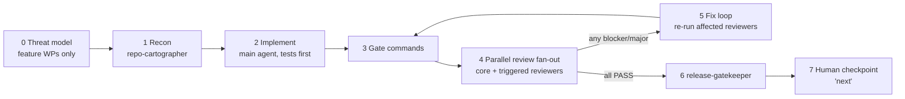
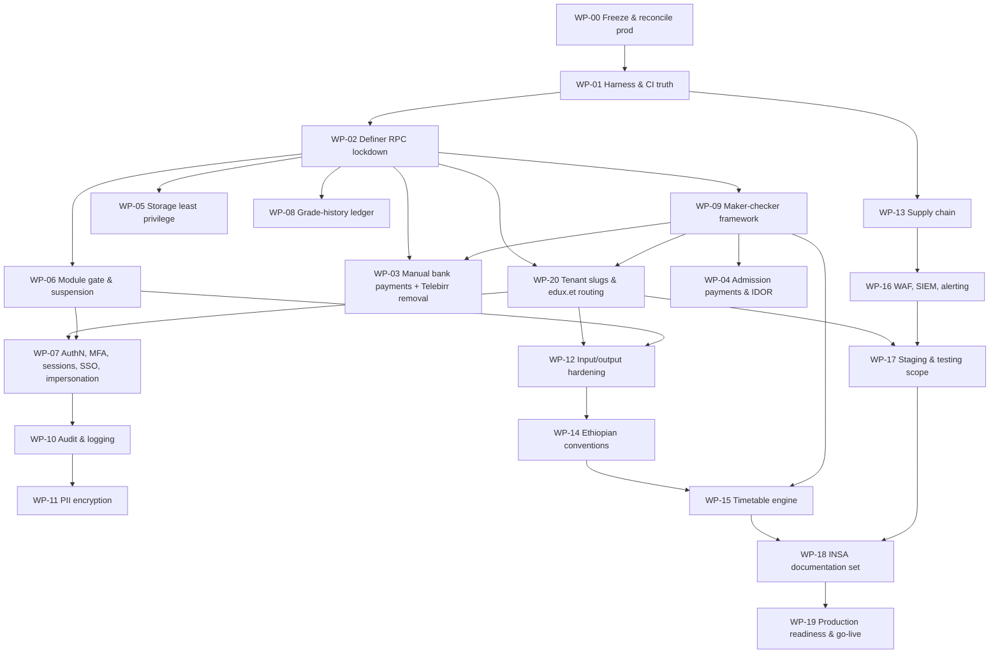
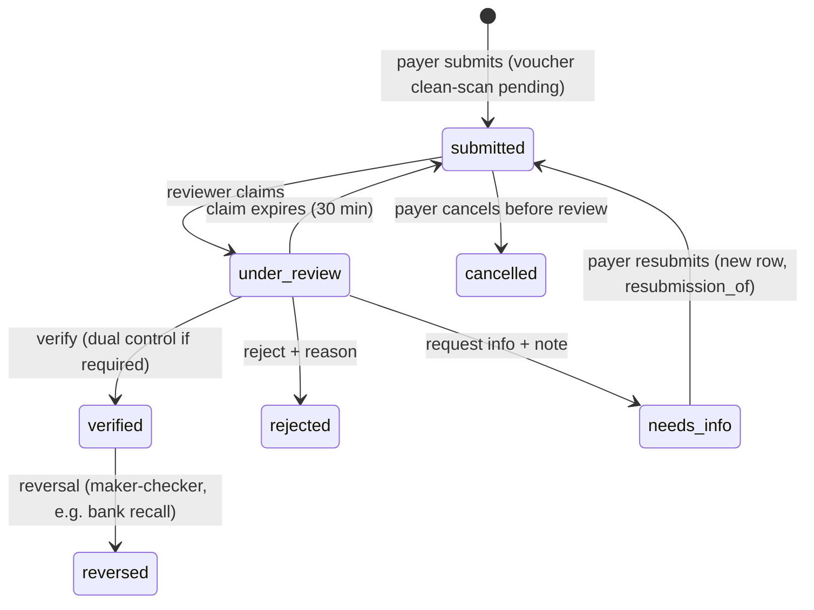
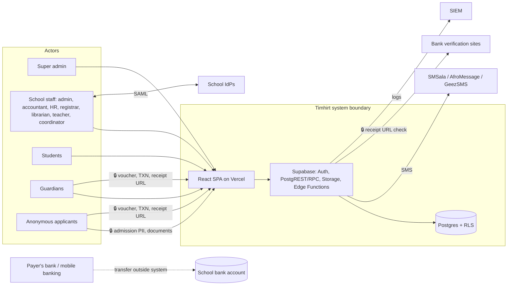

# Timhirt — Production Readiness Fix Plan (R6)

| | |
|---|---|
| **Repo** | `eskabdi/timhirt-school-saas` |
| **Inputs** | Report 1 (baseline, 32 findings), Report 2 (INSA assessment), Report 3 (consolidated, 36 findings), *INSA Technical Development Enforcer* (Phases 1–6) |
| **Audited commit** | `07262fc` |
| **This plan adds** | A review of the reports themselves (§1), 10 gaps the reports missed (G-01 … G-10), the Timetable Generation Engine (WP-15), and the production-readiness layer (WP-19), tenant slugs + domain routing on `edux.et` (WP-20), **manual bank-transfer payments with voucher verification** replacing Telebirr for this version (WP-03), and a **mandatory subagent verification workflow** for every task (§0A, Appendix B) |
| **Target state** | All Critical/High closed and verified **on production**, INSA documentation set true to the code, go-live gate (§6) green |
| **Executor** | Claude Code, one Work Package (WP) at a time, in the order in §3 |

---

## 0. Operating Rules for Claude Code (read first, apply to every WP)

1. **Read before you touch.** Start every WP by reading `CLAUDE.md`, the three audit reports under `docs/audits/`, and every file listed in the WP. Where this plan names a function, column, helper or path, **verify the real name/signature in the repo first** and adapt. This plan was written from the reports, not from the code.
2. **Branching.** Base branch `fix/production-readiness-r6`. One WP = one PR = one squash commit titled `R6/WP-xx: <title> (<finding ids>)`.
3. **Migrations.** New timestamped files only. Never edit an applied migration. Every migration must be re-runnable (`if exists` / `if not exists` / `create or replace`). Every table created gets `enable` **and** `force row level security` in the same file.
4. **Tests are part of the fix.** No finding is closed without a failing-then-passing test: pgTAP for DB, Vitest for TS, Deno test for Edge Functions. Put the test in the same PR.
5. **Gate after every WP:** `supabase/tests/run.sh` (all suites green) · `npm run typecheck` · `npm run lint` · `npm run test` · `deno test supabase/functions` · `deno check` on touched functions. Paste the summary into the PR.
6. **Secure by default (INSA Phase 3).** Parameterised access only (PostgREST/RPC/`format('%I')`), Zod allow-list on every input, generic client errors (`errors.*`), no secrets in `src/`, no `dangerouslySetInnerHTML`, least privilege on every grant.
7. **Documentation moves with code (INSA "Execution Rule").** Any WP that changes a control, table, endpoint or role updates the matching file in `docs/insa/` (created in WP-18) in the same PR. Until WP-18 lands, append the change to `docs/insa/_pending-changes.md`.
8. **Project conventions (non-negotiable):** ETB only · Arabic numerals only (no Ge'ez numerals anywhere, including EC dates; 0-9 by default, with Eastern Arabic ٠-٩ as a per-tenant opt-in per the owner's decision of 2026-09-25) · Tayitu.ttf primary / Jiret.ttf secondary for Amharic · Ethiopian names = First + Middle + Last, short = First + Middle · Ethiopian clock for Amharic time display · camelCase TS / snake_case SQL **and jsonb keys** · native Supabase Auth only · RLS on every table.
8a. **Tenant from the URL is never authorization.** The slug in `<slug>.edux.et` (or `edux.et/<slug>`) is for routing and branding only. Tenant access always comes from the JWT → `get_tenant_id_for_user(auth.uid())` → RLS (WP-20).
9. **Hard stops.** No online payment gateway in this version: Telebirr endpoints are removed, not fixed (WP-03.1). Do not merge the H-06 foreign-key fix without the manual-payment verification flow (WP-03/WP-04). Do not run or schedule the audit-log purge until WP-08's backfill is done.
10. **Record keeping.** After each WP, append to `audit/FIXES_VERIFIED_R6.md`: finding IDs, PR, test names, evidence (query output / test output), and whether it is verified on staging and on production.
11. **Subagent verification is mandatory.** Every WP (and every task inside it) runs the §0A pipeline: threat model (features) → recon → implement → gate → parallel specialist reviews → fix loop → gatekeeper → human "next". Use `/wp-run WP-xx` (Appendix B.22).

---

## 0A. Subagent Verification Workflow (mandatory for every WP and every task inside it)

No WP is "done" because the implementing agent says so. Every change passes through independent, read-only specialist subagents, then a gatekeeper. Agent definitions are in **Appendix B**; install them in WP-00 (`.claude/agents/*.md`, `.claude/commands/wp-run.md`).

### 0A.1 Pipeline



| Stage | Who | Output |
|---|---|---|
| 0 Threat model | `threat-modeler` (WP-03, WP-15, WP-20 and any new feature) | STRIDE table for new data flows, abuse cases → added to the WP's acceptance tests before coding |
| 1 Recon | `repo-cartographer` | Context brief: real names/signatures of every function, table, column, file the WP references; mismatches with this plan; blast radius |
| 2 Implement | main agent | Failing tests first, then code, migrations, docs (Rules 4 and 7) |
| 3 Gate | main agent | Output of all gate commands (Rule 5) |
| 4 Review | reviewers in parallel (0A.2, 0A.3) | One verdict per reviewer in the contract format (0A.4) |
| 5 Fix loop | main agent | Fix every blocker and major; re-run only the reviewers that failed plus `test-verifier` and `regression-guardian`. **Max 3 rounds** — then stop and escalate to the human with the open findings |
| 6 Gate | `release-gatekeeper` | Consolidated verdict; writes the WP entry in `audit/FIXES_VERIFIED_R6.md` |
| 7 Human | owner | Reviews summary, says "next" |

### 0A.2 Core reviewers (run on every WP)

| Agent | Checks |
|---|---|
| `security-reviewer` | OWASP Top 10, injection, XSS, CSRF, SSRF, secrets, error leakage, rate limits, crypto, upload safety |
| `tenant-isolation-auditor` | Tenant derived from `auth.uid()` only; RLS + FORCE on new tables; storage paths; views; definer functions; cross-tenant probe tests exist and pass |
| `authz-reviewer` | Role, resource permission, module gate, tenant status, `aal2`, impersonation read-only, maker-checker enforced in DB and Edge (parity) |
| `code-quality-reviewer` | Types (no `any`), error handling, dead code, duplication, camelCase TS / snake_case SQL & jsonb, patterns consistent with the codebase |
| `test-verifier` | Tests cover every acceptance criterion, fail before / pass after, gate output genuine, no skipped/`.only` tests, probes run as the real roles |
| `regression-guardian` | §7 regression table + previously closed findings still pass; no unrelated behaviour changes in the diff |
| `conventions-guardian` | ETB only · Arabic numerals only (no U+1369–U+137C) · EC dates · Ethiopian clock · First+Middle+Last names · Tayitu/Jiret · i18n keys present in every supported locale |
| `insa-docs-auditor` | `docs/insa/*` (or `_pending-changes.md`) updated for every changed control, table, endpoint, role; OpenAPI classification; clause mapping still true |

### 0A.3 Triggered reviewers (run when the diff touches the trigger)

| Agent | Trigger (paths / content) | Checks |
|---|---|---|
| `db-migration-reviewer` | `supabase/migrations/**`, `supabase/tests/**` | Idempotent, no edits to applied migrations, lock/timeout safety, backfill-before-constraint, grants/revokes, `search_path`, FORCE RLS, indexes for policy predicates, reversible plan |
| `api-contract-reviewer` | `supabase/functions/**`, new/changed RPCs | Zod allow-lists, Public/Private/Internal class, `requireAccess` options, status codes and generic errors, idempotency, CORS, OpenAPI path + examples |
| `payments-integrity-reviewer` | payment/invoice/submission/bank tables, fee or payroll functions | `numeric` money, ETB, single credit, state machine, duplicate detection, dual control, reversal instead of delete, reconciliation correctness |
| `state-concurrency-reviewer` | state machines, `for update`, revision/optimistic locking, queues, jobs (payments, approvals, timetable, generation runs) | Race conditions, double submit, deadlock order, idempotent retries, claim/lock expiry |
| `privacy-guardian` | PII columns, logs, exports, storage buckets, notifications | Data classification, minimisation, redaction, encryption/masking, retention, minors' data, consent |
| `frontend-security-reviewer` | `src/**/*.tsx`, `vercel.json`, `index.html` | No `dangerouslySetInnerHTML`/`innerHTML`, CSP/Trusted Types compliance, token handling, open redirects, safe links, host/tenant consistency (WP-20) |
| `i18n-a11y-reviewer` | UI components, `src/locales/**` | Keys in all locales, no hard-coded strings, keyboard operability, ARIA labels, focus management, contrast |
| `performance-reviewer` | policies, indexes, heavy queries, lists, solver code, bundles | `EXPLAIN` on hot RLS paths, N+1, pagination, memoisation, bundle size delta, solver budgets |
| `supply-chain-reviewer` | `package.json`, lockfiles, `deno.json`, `.github/workflows/**` | New deps justified, licence OK, exact pins, `npm audit`, SHA-pinned actions |
| `infra-config-reviewer` | `supabase/config.toml`, `vercel.json`, env templates, DNS/runbooks | Auth settings, headers (HSTS/CSP), redirects, env separation, no secrets committed, domain config |

### 0A.4 Reviewer output contract

```
REVIEWER: tenant-isolation-auditor
WP: WP-03
VERDICT: PASS | FAIL
FINDINGS:
  - id: TI-1
    severity: blocker | major | minor | info
    location: supabase/migrations/2026…_payments.sql:42
    evidence: <quoted code or query output>
    reference: OWASP A01 / INSA Phase 3 Access Control / finding H-02
    fix: <concrete change>
CHECKED:
  - <each thing verified, so a PASS with no findings is meaningful>
```

Severity rules: **blocker** = security hole, cross-tenant exposure, data loss, wrong money, broken build/tests → must be fixed. **major** = missing control, missing test for an acceptance criterion, doc/control mismatch → fixed, or explicitly accepted by the human and logged in the residual-risk register. **minor/info** → `audit/backlog.md`.

### 0A.5 Independence rules

- Reviewers are **read-only**: tools `Read, Grep, Glob, Bash`; Bash only for running tests, `git diff`, `psql` against the local test DB, and `EXPLAIN`. They never edit repository files (they may write only `/tmp/review-<agent>.md`).
- Reviewers get the diff (`git diff origin/fix/production-readiness-r6...HEAD`), the WP text and its acceptance criteria — **not** the implementer's explanation — so they judge the code, not the story.
- A reviewer that cannot verify something reports it as a finding ("not verifiable: …"), never as a pass.
- `release-gatekeeper` fails the WP if any required reviewer is missing, any blocker is open, any major is open without a recorded human acceptance, or the gate output is absent.

### 0A.6 Reviewer map per WP

| WP | Triggered reviewers expected (in addition to the 8 core) |
|---|---|
| WP-00 | db-migration, infra-config, api-contract |
| WP-01 | supply-chain, infra-config |
| WP-02 | db-migration, api-contract, performance |
| WP-20 | threat-modeler (stage 0), db-migration, api-contract, frontend-security, infra-config, i18n-a11y, state-concurrency |
| WP-03 | threat-modeler (stage 0), db-migration, api-contract, payments-integrity, state-concurrency, privacy, frontend-security, i18n-a11y, performance |
| WP-04 | db-migration, api-contract, payments-integrity |
| WP-05 | db-migration, privacy, performance |
| WP-06 | db-migration, api-contract, performance |
| WP-07 | db-migration, api-contract, frontend-security, infra-config, i18n-a11y |
| WP-08 | db-migration, state-concurrency, performance |
| WP-09 | db-migration, state-concurrency, frontend-security, i18n-a11y |
| WP-10 | db-migration, privacy, performance |
| WP-11 | db-migration, privacy, performance |
| WP-12 | api-contract, frontend-security, payments-integrity (bank export), privacy |
| WP-13 | supply-chain, infra-config |
| WP-14 | frontend-security, i18n-a11y |
| WP-15 | threat-modeler (stage 0), db-migration, api-contract, state-concurrency, performance, frontend-security, i18n-a11y |
| WP-16 | infra-config, privacy |
| WP-17 | db-migration, infra-config |
| WP-18 | api-contract, infra-config |
| WP-19 | infra-config, privacy, performance |

The table is a floor, not a ceiling: the path triggers in 0A.3 always apply.

---

## 1. Review of the Audit Reports

The reports are strong: the live-catalog method, exploit probes, and the RLS matrix are exactly what an INSA assessor expects. I checked their internal consistency and their remediation advice. The corrections below change how some fixes must be done.

| # | Observation on the reports | Impact | Resolution in this plan |
|---|---|---|---|
| RV-01 | `health_alerts` is flagged "No module gate (**clinic**)". It comes from `20260719000011_system_health.sql` and the probe injects a `security` alert. It is **platform system-health alerting**, not clinic data. | Gating it behind the clinic module would hide security alerts from schools that don't buy the clinic module. | WP-06: treat it as platform-owned. Writes service-role only, read school_admin (own tenant) and super_admin. No clinic gate. |
| RV-02 | H-04 says "5 feature tables" but lists 6 (`health_alerts`, `employee_emergency_contacts`, `employee_qualifications`, `employee_subjects`, `exam_seat_assignments`, `student_leave_requests`) plus `promotion_*` and `report_templates`. | A fix scoped to "5" would leave tables ungated. | WP-06 decides every tenant table explicitly via a catalog test: gated, or on a written allow-list. |
| RV-03 | Scope says **5 views**; the Views table lists **3**. | Two views were never assessed. | WP-06 step 1 inventories all views and adds each to the matrix. |
| RV-04 | "13 of them have no `search_path` pinned" — ambiguous whether it is the same 13 anon-callable functions or 13 of 42. | Partial pinning leaves search-path hijack risk. | WP-02 pins `search_path` on **every** `SECURITY DEFINER` function (54) and adds a catalog guard. |
| RV-05 | H-03's data source (`audit_logs`) is purged at 365 days, and the purge is anon-callable (H-01). The reports treat these as separate fixes. | Any purge before the H-03 ledger backfill **permanently destroys** grade history. | WP-00 disables the purge first; WP-08 backfills the ledger before any retention job runs again. |
| RV-06 | M-15 suggests moving to `@supabase/ssr` HttpOnly cookies. This silently invalidates the "CSRF N/A (Bearer tokens)" argument the same reports accept. | Adopting cookies without CSRF tokens creates a new CSRF hole. | WP-07 keeps Bearer tokens with compensating controls and a formal deviation record. If cookies are ever adopted, CSRF tokens + `SameSite=Strict` become mandatory (noted in the deviation record). |
| RV-07 | M-16's WAF fix (Vercel Firewall/Cloudflare) protects only the **frontend origin**. Every API call goes to `*.supabase.co` (PostgREST, RPC, Edge Functions, Auth), which that WAF never sees. | The WAF would cover static files and none of the attack surface. | New gap **G-05**, handled in WP-16. |
| RV-08 | M-08 recommends pgsodium TCE. Supabase no longer recommends pgsodium/TCE for new work. | Building on a discouraged extension creates migration debt. | WP-11 uses AES-256 with the key in Supabase Vault, plus masked columns and a blind index. |
| RV-09 | C-01 remediation omits idempotency/replay protection (the `webhook_events` table exists but isn't used for dedupe), amount/currency equality against the provider's `queryOrder`, and verification of `telebirr-query-order` responses (mentioned, never given an ID). | A signed-but-replayed notification could still double-settle. | **Superseded:** this version removes Telebirr (WP-03.1). The corrected design is kept in Appendix C for a future version. |
| RV-10 | The Ethiopian clock rule was never audited. Times appear in periods/timetables, attendance, visitor logs and notices. | Project-standard non-conformance. | New gap **G-01**, WP-14. |
| RV-11 | Ge'ez numerals were checked only in date output. The project rule bans Ge'ez numerals everywhere. | Toggle removal alone may leave Ge'ez digits in PDFs, IDs or ranks. | New gap **G-02**, WP-14: CI gate on the whole Ethiopic-digit range (U+1369–U+137C). |
| RV-12 | Regression item 6 notes "employees without an account export a blank field silently" but gives it no ID. | A blank bank account in a payroll transfer file is a payment failure or misdirected payment. | New gap **G-03**, WP-12. |
| RV-13 | Deterministic staff-document filenames (`{docType}.{ext}`) appear in the Phase-3 table with no ID. | INSA requires random names; predictable paths aid enumeration. | New gap **G-04**, WP-05. |
| RV-14 | No production-operations dimension was assessed: environment separation, backups/PITR, restore drills, RPO/RTO, observability, incident response, load, and the **undeployed Round 5**. | "Code is fixed" ≠ "production is safe". | New gaps **G-06** (ops) and **G-09** (deployment drift), WP-00 and WP-19. |
| RV-15 | No legal/privacy review. The system holds minors' records, health data and national IDs. | Ethiopia's Personal Data Protection Proclamation (No. 1321/2024) applies; confirm obligations with counsel. | New gap **G-08**, WP-19. |
| RV-16 | The INSA document asks for "RS256" as an example. Supabase's asymmetric signing keys default to ES256. | Not a gap if documented. | WP-07: migrate to asymmetric keys; record ES256 (or RS256) as a "strong algorithm" per the INSA wording. |
| RV-17 | Counts check out: 1 C + 7 H + 16 M + 12 L = 36 (L-11 promoted to M-15). | — | Ledger in §2 uses all 36 + G-01…G-10 + F-01. |

---

## 2. Finding Ledger → Work Packages

Status column is for Claude Code to fill: `open` → `fixed (PR #)` → `verified-staging` → `verified-prod`.

| ID | Sev | Title (short) | WP | Status |
|---|---|---|---|---|
| C-01 | Critical | Unsigned Telebirr webhook settles invoices — closed by decommission | WP-03.1 | open |
| H-01 | High | Anon-executable `SECURITY DEFINER` RPCs | WP-02 | open |
| H-02 | High | `documents` / `report-cards` readable by every tenant member | WP-05 | open |
| H-03 | High | GRADE_TABS shows unreached grades; history lost after 365 d | WP-08 | open |
| H-04 | High | Module gating + suspension not end-to-end | WP-06 | open |
| H-05 | High | No MFA enforcement | WP-07 | open |
| H-06 | High | Applicant-declared payment credited; admission receipts broken | WP-04 | open |
| H-07 | High | INSA documentation misstates controls | WP-18 | open |
| M-01 | Medium | SSO domain squatting; direct table write | WP-07 | open |
| M-02 | Medium | Advisory-only login lockout; spoofable IP | WP-07 | open |
| M-03 | Medium | Client-only password policy | WP-07 | open |
| M-04 | Medium | Impersonation unscoped/unrevoked/misattributed | WP-07 | open |
| M-05 | Medium | CSV/formula injection | WP-12 | open |
| M-06 | Medium | No maker-checker on money/grades/transfers | WP-09 | open |
| M-07 | Medium | Audit gaps, weak retention | WP-10 | open |
| M-08 | Medium | Plaintext PII; redaction gaps | WP-10, WP-11 | open |
| M-09 | Medium | Client MIME trusted; no AV; no CAPTCHA | WP-12 | open |
| M-10 | Medium | Cross-tenant IDOR `fee_structure_id` | WP-04 | open |
| M-11 | Medium | Ge'ez numerals in EC dates | WP-14 | open |
| M-12 | Medium | Ethiopian name format | WP-14 | open |
| M-13 | Medium | Vulnerable/unpinned components | WP-13 | open |
| M-14 | Medium | No OpenAPI / sample payloads | WP-18 | open |
| M-15 | Medium | Session management vs INSA Phase 3 | WP-07 | open |
| M-16 | Medium | WAF/IDS/SIEM unevidenced | WP-16 | open |
| L-01 | Low | Tayitu/Jiret not applied | WP-14 | open |
| L-02 | Low | FORCE RLS missing on 11 tables | WP-06 | open |
| L-03 | Low | CORS `*` | WP-12 | open |
| L-04 | Low | Editor `innerHTML` | WP-12 | open |
| L-05 | Low | SVG in public bucket | WP-05 | open |
| L-06 | Low | Redirect URL from `Origin` | WP-03 | open |
| L-07 | Low | Cross-tenant oracles | WP-02 | open |
| L-08 | Low | Harness/CI blind spots | WP-01 | open |
| L-09 | Low | camelCase jsonb keys | WP-14 | open |
| L-10 | Low | Repo doc drift | WP-18 | open |
| L-12 | Low | PostgREST filter interpolation | WP-12 | open |
| L-13 | Low | Staging seed guard fails open | WP-17 | open |
| G-01 | Medium | Ethiopian clock not implemented for time display | WP-14 | open |
| G-02 | Medium | Ge'ez digits possible outside dates | WP-14 | open |
| G-03 | Medium | Bank-transfer file silently exports blank accounts | WP-12 | open |
| G-04 | Low | Deterministic staff-document filenames | WP-05 | open |
| G-05 | High | WAF does not cover the Supabase API origin | WP-16 | open |
| G-06 | High | No backup/DR/observability/incident baseline | WP-19 | open |
| G-07 | Medium | 2 of 5 views never assessed | WP-06 | open |
| G-08 | Medium | No data-protection/consent baseline for minors' data | WP-19 | open |
| G-09 | High | Repo ≠ production (Round 5 undeployed) | WP-00 | open |
| G-10 | Medium | `SECURITY DEFINER` search_path pinning incomplete | WP-02 | open |
| F-01 | Feature | Timetable generation engine + manual adjustment | WP-15 | open |
| F-03 | Feature | Manual bank-transfer payments: bank list, voucher + TXN + receipt URL, school verification, notifications, reconciliation | WP-03 | open |
| F-02 | Feature | Tenant slug at registration + `<slug>.edux.et` routing (path fallback) | WP-20 | open |

---

## 3. Execution Order

Order is chosen so each WP is proven by the harness built before it, and documentation is written last (after the controls it describes exist).



| Priority | WPs | Target |
|---|---|---|
| P0 (days) | WP-00 (incl. Telebirr removal WP-03.1), WP-01, WP-02 | Before any real payment or tenant data |
| P1 (sprint 1) | WP-09, WP-20, WP-03, WP-04 … WP-08 | All High closed; tenant URLs live (DNS check starts in WP-00) |
| P2 (sprint 2) | WP-10 … WP-14, WP-16, WP-17 | All Medium closed |
| P3 (sprint 3) | WP-15, WP-18, WP-19 | Feature + documentation + go-live |

---

## 4. Work Packages

Each WP lists: **Findings · Files · Changes · Tests (acceptance) · Docs to update**. Code blocks are reference implementations — adapt names to the repo (Rule 1).

---

### WP-00 — Freeze, protect, and reconcile production (G-09, RV-05, C-01 containment)

**Why first:** Round 5 and the EC-"today" fix are undeployed, so production may differ from the audited code. Two live risks need containment before any code change: the anon-callable audit purge (destroys H-03's data source) and the unsigned Telebirr webhook (removed in this WP).

**Changes**
0. **`edux.et` DNS — nameservers already delegated to Vercel (owner, 2026-09-24).** Subdomain mode is confirmed. Run the verification checklist in WP-20.6 now and record the output in `audit/FIXES_VERIFIED_R6.md`; restore any missing mail records immediately.
1. **Snapshot:** confirm Point-in-Time Recovery is on for production; take a manual backup; record the backup id in `audit/FIXES_VERIFIED_R6.md`.
2. **Contain the purge (hotfix migration, deploy immediately):**
   ```sql
   -- 2026xxxx000001_r6_hotfix_contain.sql
   revoke execute on function public.cleanup_old_audit_logs() from public, anon, authenticated;
   -- unschedule any pg_cron job that calls it
   do $$ begin
     perform cron.unschedule(jobid) from cron.job where command ilike '%cleanup_old_audit_logs%';
   exception when undefined_table or invalid_schema_name then null; end $$;
   ```
3. **Remove Telebirr (closes C-01):** execute WP-03.1 in this PR — undeploy `telebirr-notify` and `telebirr-query-order`, remove the gateway branch of `process-fee-payment`, delete Telebirr integration rows and secrets.
4. **Reconcile:** run `supabase db diff --linked` (read-only) against production and `supabase functions list`. Produce `audit/prod-drift-2026-xx.md` listing: migrations present in repo but not prod, functions whose deployed version ≠ repo, and config differences (auth settings, storage buckets).
5. **Deploy Round 5 + EC-today fix** to staging, run the full gate, then to production. Every later WP assumes repo = prod.

6. **Install the subagent workflow:** create every file from Appendix B under `.claude/agents/` and `.claude/commands/wp-run.md`; confirm `/agents` lists them. From WP-01 onward every WP runs through `/wp-run`; WP-00 itself is reviewed by `security-reviewer`, `db-migration-reviewer`, `infra-config-reviewer` and `release-gatekeeper`.

**Tests:** pgTAP `r6_hotfix.sql`: `has_function_privilege('anon','public.cleanup_old_audit_logs()','execute') = false` (also for `authenticated`). HTTP check: `POST /functions/v1/telebirr-notify` returns 404 on staging and production.

**Docs:** `docs/insa/_pending-changes.md` → "Audit purge disabled pending ledger backfill; Telebirr removed (manual bank payments only in this version)."

---

### WP-01 — Make the harness and CI tell the truth (L-08, prerequisite for everything)

**Why:** H-01 stayed invisible to 55 green suites because the shim lacks Supabase's real role grants.

**Changes**
1. `supabase/tests/shim.sql`: mirror Supabase defaults — `grant usage on schema public to anon, authenticated, service_role;` plus default table/function privileges as Supabase sets them. Probes must run as `anon` without the in-transaction grant from Appendix A.
2. Add **catalog guard suites** (they will fail until WP-02/WP-06 land — mark them `todo` with the WP id, then flip to hard failures in those WPs):
   - `catalog_definer_security.sql` — no definer function executable by `anon`; every definer function has `search_path` set.
   - `catalog_rls_coverage.sql` — every table in `public` has RLS **and** FORCE.
   - `catalog_module_gate.sql` — every table with `tenant_id` has a restrictive `*_module_gate` policy or is in `supabase/security/module_gate_allowlist.sql` (a `.sql` file so pgTAP can `\ir` it).
   - `catalog_storage_policies.sql` — no `storage.objects` SELECT policy whose only predicate is the tenant folder.
3. CI (`.github/workflows/ci.yml`):
   - Pin every action by **commit SHA** (comment the tag next to it).
   - Add jobs: `gitleaks` (secret scan), `semgrep --config p/owasp-top-ten --config p/typescript --config p/react` (SAST), `npm audit --omit=dev --audit-level=high`, `deno check supabase/functions/**/index.ts`.
   - Add `.github/dependabot.yml` for `npm` and `github-actions` (weekly).
   - Add a **conventions gate** script `scripts/ci/conventions.py` (filled in WP-14): no `$`/`USD` currency, no Ge'ez digits U+1369–U+137C in `src/`, `supabase/functions/`, PDF templates; no `first_name} ${…last_name` concatenations.

**Tests:** CI runs on the PR and fails on a planted secret and a planted `dangerouslySetInnerHTML` (then remove them).

**Docs:** `docs/insa/_pending-changes.md` → Secure development pipeline (SAST, secret scan, dependency audit, SHA-pinned actions).

---

### WP-02 — Lock down `SECURITY DEFINER` RPCs (H-01, L-07, G-10)

**Changes**
1. **Inventory:** generate `supabase/security/definer_inventory.md` from the catalog: function signature, callers (policy / trigger / RPC / Edge), intended grantee (`authenticated` | `service_role` | none).
2. **Allow-list file** `supabase/security/definer_allowlist.sql` — the single source of re-grants (RLS helpers such as `get_tenant_id_for_user`, `has_module`, `has_resource_permission`, `get_student_grade_history`, `get_class_rank`, …). Trigger functions need **no** EXECUTE grant (privilege is checked at `CREATE TRIGGER`, not at fire time).
3. **Migration:**
   ```sql
   -- 2026xxxx000010_r6_definer_lockdown.sql
   do $$
   declare r record;
   begin
     for r in
       select p.oid::regprocedure as sig
       from pg_proc p join pg_namespace n on n.oid = p.pronamespace
       where n.nspname = 'public' and p.prosecdef
     loop
       execute format('revoke execute on function %s from public, anon', r.sig);
       execute format('alter function %s set search_path = public, pg_temp', r.sig);
     end loop;
   end $$;

   -- future functions start closed
   alter default privileges in schema public revoke execute on functions from public;
   alter default privileges for role postgres in schema public revoke execute on functions from public;

   -- job / health / maintenance functions: service_role or pg_cron only
   revoke execute on function
     public.create_import_job(uuid, text), public.create_export_job(uuid, text),
     public.update_job_progress(uuid, integer), public.complete_job(uuid, integer, text),
     public.fail_job(uuid, text), public.record_health_metric(uuid, text, numeric),
     public.create_health_alert(uuid, text, text, text), public.acknowledge_alert(uuid),
     public.cleanup_old_audit_logs(), public.cleanup_expired_backups(), public.timeout_stalled_backups()
   from authenticated;                              -- adjust signatures to the real ones
   grant execute on function public.get_email_for_user(uuid) to service_role;
   revoke execute on function public.get_email_for_user(uuid) from authenticated;

   -- re-grants: inline the explicit GRANT statements from supabase/security/definer_allowlist.sql
   -- (migrations cannot use psql meta-commands such as \ir)
   ```
4. **Derive tenant internally** in every function that still needs a `p_tenant_id` parameter for `authenticated` callers. Pattern:
   ```sql
   create or replace function public.has_module(p_module text)   -- drop the tenant param
   returns boolean language sql stable security definer
   set search_path = public, pg_temp as $$
     select public.tenant_has_module(public.get_tenant_id_for_user(auth.uid()), p_module)
   $$;
   ```
   Keep a separate service-role-only `tenant_has_module(p_tenant_id, p_module)` for Edge Functions. Update every policy and frontend call (`grep -rn "has_module" supabase src`).
5. `get_config()`: split into `get_public_config(key)` (allow-listed display keys only, `authenticated`) and a service-role-only reader for security thresholds.

**Tests (pgTAP `definer_lockdown.sql`):**
- The catalog guard from WP-01 becomes a hard failure: `0` anon-executable definer functions; `0` definer functions without `search_path`.
- Re-run Appendix A-1 probes as `anon` → each call raises `42501 permission denied`.
- As tenant-A admin: `create_export_job` for tenant B → permission denied; `has_module('hr_payroll')` answers only for tenant A.
- Full existing suite still green (proves the allow-list is complete).

**Docs:** Security Functionality Document → "Database function privilege model"; API inventory → RPCs classified (Private / Internal / Trigger-only).

---

### WP-20 — Tenant slugs and domain routing on `edux.et` (F-02)

> Numbered 20 because it was added after the plan was written. **It runs right after WP-02 and WP-09** (see §3; it uses the `approval_requests` table from WP-09), because WP-07 (auth redirect URLs), WP-12 (CORS) and WP-17 (staging URLs) depend on it. WP-03 stays in P0: its return URL only needs `tenants.slug` (already present, since `submit-admission` accepts `tenant_slug`) and `APP_BASE_DOMAIN`. The DNS feasibility check starts in WP-00 because registrar changes can take days.

#### 20.1 Decision record (ADR-001: tenant URL strategy)

**Decision: Option 1 — one subdomain per tenant, `https://<slug>.edux.et`** (e.g. `https://abadir.edux.et`). Option 2 (`https://edux.et/<slug>`) is built in as a fallback mode behind one flag and, in Option-1 mode, `edux.et/<slug>` permanently redirects to `<slug>.edux.et`, so both URL shapes always work for users.

| Criterion | Option 1 `abadir.edux.et` | Option 2 `edux.et/abadir` |
|---|---|---|
| **Browser isolation between schools** | ✅ Each school is a separate origin, so `localStorage`/`sessionStorage` (where Supabase tokens live, see WP-07.3) are separated per school. An XSS bug on one school's page cannot read another school's session. | ❌ All schools share one origin and one token store. A user switching schools in one browser mixes sessions; an XSS affects every tenant. |
| INSA / security narrative | Tenant boundary visible at the network, TLS and browser layer, on top of RLS | Tenant boundary only in the app and RLS |
| Branding & trust | School's own address, easy to print on letters, ID cards, SMS | Looks like a page of a shared site |
| Future custom domains (`portal.abadirschool.edu.et`) | Natural next step (same host-based resolution) | Needs a second routing model |
| Routing code | Host-based; routes stay clean (`/students`, not `/abadir/students`) | Every route and link carries the slug prefix |
| Setup cost | Wildcard DNS + wildcard TLS; auth redirect wildcards; CORS pattern | None beyond the app |
| **Hard requirement** | Vercel issues wildcard certificates only when the domain uses **Vercel nameservers** | None |

**Status: gate passed.** The owner delegated `edux.et` to Vercel nameservers on 2026-09-24, so the build uses `VITE_TENANT_ROUTING=subdomain`. Path mode stays in the code only as a documented fallback.

**Feasibility gate (the only reason to fall back):** Option 1 needs `edux.et` delegated to `ns1.vercel-dns.com` / `ns2.vercel-dns.com` at the `.et` registrar. If the registrar refuses NS delegation (or the owner can't move DNS), use Option 2 until delegation is possible; the flag switch then requires no code change.

**Non-negotiable rule for both options:** the slug in the URL is for **routing and branding only**. Authorization always comes from the JWT → `get_tenant_id_for_user(auth.uid())` → RLS. No Edge Function or policy may derive tenant access from `Host`, `Origin`, the path, or a client-sent slug.

#### 20.2 Host map

| Host | Purpose |
|---|---|
| `edux.et` | Marketing, pricing, **tenant registration/subscription**, public `/verify/<code>` for ID cards and certificates, legal pages, and (Option-2 mode) `/<slug>/…` tenant apps |
| `www.edux.et` | 308 → `edux.et` |
| `<slug>.edux.et` | Tenant app (staff, students, guardians, public admission form) |
| `admin.edux.et` | Platform console (super_admin only; tenant users are redirected away) |
| `api.edux.et` | Reserved for the optional API reverse proxy (WP-16 option A) |
| `*.staging.edux.et`, `staging.edux.et` | Staging (separate Vercel project/environment and Supabase project, WP-17) |

**Printed or long-lived artefacts** (ID-card QR codes, leaving certificates, receipts, SMS links) use slug-independent apex URLs such as `https://edux.et/verify/<code>`, so a later slug change never breaks a printed card.

#### 20.3 Slug rules

- Lowercase ASCII letters, digits and single hyphens; 3–30 characters; must start and end with a letter or digit; no `--` (this also blocks `xn--` punycode).
- Globally unique (case-insensitive by construction).
- Not in the reserved list: `www, api, app, admin, auth, login, logout, signin, signup, register, account, dashboard, billing, pay, payment, telebirr, bank, secure, verify, support, help, docs, status, blog, mail, email, smtp, imap, pop, webmail, ftp, cdn, static, assets, media, files, storage, staging, stage, dev, test, demo, sandbox, preview, edux, timhirt, platform, system, root, security, abuse, postmaster, hostmaster, ns1, ns2, m, mobile, moe, gov, insa, police`, plus any existing top-level route segment on `edux.et` (`pricing`, `legal`, `privacy`, `terms`, `verify`, …).
- Review list (allowed, but flagged for super_admin approval because of phishing risk): slugs containing `login`, `secure`, `verify`, `pay`, `bank`, `telebirr`, `official`, `gov`, `moe`.
- Suggested automatically from the school's English/Latin name (lowercase, spaces → hyphens, strip other characters, trim to 30). For Amharic-only names, the admin types the slug; show a live preview `https://<slug>.edux.et`.
- **Immutable after activation**, except through `change-tenant-slug` (super_admin + maker-checker). Old slugs redirect for 90 days and cannot be reused by another tenant for 365 days (prevents takeover of printed or bookmarked links).

#### 20.4 Database (inspect first: `submit-admission` already accepts `tenant_slug`, so `tenants.slug` likely exists)

```sql
-- 2026xxxx000020_r6_tenant_slugs.sql
alter table public.tenants add column if not exists slug text;

-- Backfill any NULL/invalid slugs into a review table before adding constraints:
--   create table r6_slug_backfill_review as select id, name, slug from public.tenants
--   where slug is null or slug !~ '^[a-z0-9][a-z0-9-]{1,28}[a-z0-9]$' or slug ~ '--';
-- then assign valid slugs (script + super_admin review) and continue.

alter table public.tenants
  alter column slug set not null,
  add constraint tenants_slug_format check (slug ~ '^[a-z0-9][a-z0-9-]{1,28}[a-z0-9]$' and slug !~ '--');
create unique index if not exists tenants_slug_key on public.tenants (slug);

create table if not exists public.reserved_slugs (
  slug text primary key check (slug ~ '^[a-z0-9-]{1,63}$'),
  kind text not null check (kind in ('reserved','review')),
  note text
);
alter table public.reserved_slugs enable row level security;
alter table public.reserved_slugs force row level security;
-- read: super_admin only (the public check-slug endpoint reads it with service role); write: super_admin

create table if not exists public.tenant_slug_history (
  id uuid primary key default gen_random_uuid(),
  tenant_id uuid not null references public.tenants(id) on delete cascade,
  old_slug text not null,
  new_slug text not null,
  changed_by uuid not null references public.users(id),
  approval_request_id uuid references public.approval_requests(id),
  changed_at timestamptz not null default now(),
  redirect_until timestamptz not null default now() + interval '90 days',
  reusable_after timestamptz not null default now() + interval '365 days'
);
alter table public.tenant_slug_history enable row level security;
alter table public.tenant_slug_history force row level security;
-- read: own-tenant school_admin + super_admin; no client writes (service role only)

create or replace function public.slug_unavailable_reason(p_slug text)
returns text language sql stable security definer set search_path = public, pg_temp as $$
  select case
    when p_slug !~ '^[a-z0-9][a-z0-9-]{1,28}[a-z0-9]$' or p_slug ~ '--' then 'invalid'
    when exists (select 1 from public.reserved_slugs r where r.slug = p_slug and r.kind = 'reserved') then 'reserved'
    when exists (select 1 from public.tenants t where t.slug = p_slug) then 'taken'
    when exists (select 1 from public.tenant_slug_history h
                 where h.old_slug = p_slug and h.reusable_after > now()) then 'taken'
    else null end
$$;
revoke execute on function public.slug_unavailable_reason(text) from public, anon, authenticated;
grant execute on function public.slug_unavailable_reason(text) to service_role;

-- Trigger on tenants(slug) insert/update: take pg_advisory_xact_lock(hashtext(new.slug)),
-- reject if slug_unavailable_reason(new.slug) is not null (ignoring the row itself),
-- and reject UPDATE of slug unless the transaction-local setting app.slug_change_via_rpc = 'on'.
```

Tenant status: registrations create `tenants.status = 'pending_verification'` (add the value if the enum/check lacks it). Everything that checks `status = 'active'` (RLS via `get_tenant_id_for_user`, `requireAccess`, WP-06) already blocks pending tenants. A daily job deletes pending tenants that never verified after 7 days, releasing their slug (no history row for tenants that were never active).

Add `'tenant_activation'` and `'tenant_slug_change'` to the `approval_requests.action` list (WP-09).

#### 20.5 Endpoints (all Zod-validated; add to OpenAPI in WP-18)

| Endpoint | Class | Auth | Behaviour |
|---|---|---|---|
| `POST /functions/v1/check-slug` | **Public** | none; rate limit 30/min per trusted IP (WP-07.2) | Body `{ slug }` → `{ available: boolean, reason?: "invalid"\|"reserved"\|"taken", suggestions: string[] }` (up to 3 available variants, e.g. `abadir-school`, `abadir-harar`). Normalises input (trim, lowercase) before checking. |
| `POST /functions/v1/register-tenant` | **Public** | Turnstile (server-verified); rate limit 5/hour per IP | Body: school name (Latin + optional Amharic), slug, school type, region → zone → woreda → kebele, plan/tier, admin's first/middle/last name, email, phone. Creates the tenant as `pending_verification` holding the slug, sends an email verification to the admin, and creates an `approval_requests` row (`tenant_activation`). Returns `202 { registrationId }`. Generic errors; a slug race returns `409 {"error":"slug_taken"}`. |
| `POST /functions/v1/verify-tenant-registration` | **Public** | single-use token (hashed at rest, 24 h expiry) | Marks the admin email verified. The tenant becomes active only after super_admin approval (and payment, if the plan requires it); then `invite-tenant-admin` sends the invite to `https://<slug>.edux.et/auth/callback`. |
| `POST /functions/v1/resolve-tenant` | **Public** | none; rate limit 60/min per IP; `Cache-Control: public, max-age=60` | Body `{ slug }` → `{ status: "active", name, nameAm, logoUrl, defaultLocale, ssoEnabled }`, or `{ status: "redirect", slug: "<new>" }` for a history slug inside `redirect_until`, or `{ status: "unavailable" }` for unknown, pending **and** suspended tenants (one generic answer, no enumeration of states). No tenant UUID in the response. |
| `POST /functions/v1/change-tenant-slug` | **Internal** | JWT; super_admin; `aal2`; approved `tenant_slug_change` (checker ≠ maker) | Sets `app.slug_change_via_rpc`, updates the slug, writes `tenant_slug_history`, audits, notifies the school_admin. |
| `onboard-tenant` (existing) | Internal | super_admin | Now requires a valid slug (same validation and availability check). |

`submit-admission`, `check-admission-status` and `upload-admission-document` keep accepting `tenant_slug`; they resolve it server-side (service role) and require `status = 'active'` and the `admissions` module (WP-06).

#### 20.6 Vercel and DNS (runbook — `docs/runbooks/domain-edux-et.md`)

1. **Inventory existing DNS** for `edux.et` (A/CNAME, **MX and mail TXT/SPF/DKIM/DMARC**, verification TXT records). Recreate every record in Vercel DNS first; losing MX breaks school email.
2. Add to the production Vercel project: `edux.et`, `www.edux.et` (redirect to apex), `*.edux.et`. Add `staging.edux.et` and `*.staging.edux.et` to the staging project.
3. ✅ **Done (2026-09-24):** nameservers changed to `ns1.vercel-dns.com` / `ns2.vercel-dns.com`. `.et` delegation can take up to 48 h to propagate everywhere. Verify:
   ```bash
   dig NS edux.et +short                      # expect ns1/ns2.vercel-dns.com only
   dig @1.1.1.1 NS edux.et +short             # and from a public resolver
   dig MX edux.et +short                      # mail still routed (if the domain has email)
   dig TXT edux.et +short                     # SPF / verification records present
   dig TXT _dmarc.edux.et +short              # DMARC present (if used before)
   dig A edux.et +short; dig CNAME www.edux.et +short
   dig A test-$RANDOM.edux.et +short          # resolves once *.edux.et is added to the project
   echo | openssl s_client -connect probe.edux.et:443 -servername probe.edux.et 2>/dev/null \
     | openssl x509 -noout -subject -ext subjectAltName   # expect DNS:*.edux.et
   curl -sI https://edux.et | grep -i strict-transport-security
   ```
   If any mail/TXT record from the old zone is missing in Vercel DNS, add it now (Vercel → Domains → edux.et → DNS Records); every hour without MX loses email.
   Until WP-20's frontend ships, any `*.edux.et` host shows the current app without tenant resolution. That is harmless, but don't share tenant links until WP-20 is deployed.
4. **HSTS:** `Strict-Transport-Security: max-age=63072000; includeSubDomains; preload` in `vercel.json` (every subdomain must be HTTPS-only), then submit `edux.et` to the HSTS preload list once all subdomains are confirmed HTTPS.
5. **Subdomain-takeover hygiene:** the wildcard resolves only to this Vercel project; unknown slugs render a "school not found" page from the app. Never create per-tenant CNAMEs to third-party services.
6. **Fallback:** if step 3 is impossible, keep only `edux.et` + `www`, set `VITE_TENANT_ROUTING=path`, and record the reason in `docs/insa/10-residual-risk-register.md` (loss of per-tenant origin isolation, with compensating controls: host/tenant mismatch sign-out below, strict CSP, Trusted Types).

#### 20.7 Supabase Auth configuration

- Site URL: `https://edux.et`.
- Additional redirect URLs: `https://*.edux.et/**`, `https://edux.et/**`, `https://*.staging.edux.et/**` (staging project only), `http://*.localhost:5173/**` (local only).
- Every server-generated link (invites, password reset, magic links, impersonation, portal provisioning, SSO completion) builds `redirectTo` from `APP_BASE_DOMAIN` + the tenant slug **loaded from the database**: `https://${slug}.${APP_BASE_DOMAIN}/auth/callback`. Update `invite-staff`, `invite-tenant-admin`, `provision-portal-accounts`, `impersonate-user`, `complete-sso-login`, `activate-sso-user`, and the auth email templates (use `{{ .RedirectTo }}`, not the Site URL).
- Super_admin flows redirect to `https://admin.edux.et`.

#### 20.8 Frontend

1. **Env:** `VITE_APP_BASE_DOMAIN=edux.et` (staging `staging.edux.et`, local `localhost`), `VITE_TENANT_ROUTING=subdomain|path`.
2. **Host parser** `src/lib/tenant-host.ts`:
   ```ts
   export type HostContext =
     | { kind: "marketing" }
     | { kind: "platform" }                      // admin.<base>
     | { kind: "tenant"; slug: string }
     | { kind: "invalid" };

   const SLUG_RE = /^[a-z0-9][a-z0-9-]{1,28}[a-z0-9]$/;
   const NON_TENANT_LABELS = new Set(["www", "admin", "api", "staging"]);

   export function parseHost(
     hostname: string, pathname: string, base: string, mode: "subdomain" | "path",
   ): HostContext {
     const host = hostname.toLowerCase().replace(/\.$/, "");
     if (host === base || host === `www.${base}`) {
       if (mode === "path") {
         const first = pathname.split("/")[1] ?? "";
         if (SLUG_RE.test(first) && !first.includes("--") && !MARKETING_ROUTES.has(first)) {
           return { kind: "tenant", slug: first };
         }
       }
       return { kind: "marketing" };
     }
     if (!host.endsWith(`.${base}`)) return { kind: "invalid" };
     const label = host.slice(0, -(base.length + 1));
     if (label === "admin") return { kind: "platform" };
     if (label.includes(".") || NON_TENANT_LABELS.has(label)) return { kind: "invalid" };
     return SLUG_RE.test(label) && !label.includes("--") ? { kind: "tenant", slug: label } : { kind: "invalid" };
   }
   ```
   `MARKETING_ROUTES` is exported from the same file and mirrors the reserved-route part of `reserved_slugs`; a unit test keeps them in sync.
3. **Bootstrap:** `main.tsx` parses the host once and mounts one of three apps: `MarketingApp` (registration, pricing, verify), `PlatformApp` (super_admin), `TenantApp`. `TenantApp` calls `resolve-tenant`: `active` → load branding (logo, name in Tayitu/Jiret for Amharic), `redirect` → `location.replace` to the new slug preserving path and query, `unavailable` → "School not found" page.
4. **Router:** TanStack Router with `basepath` = `""` in subdomain mode, `/${slug}` in path mode. All links use the router (`<Link to="/students">`), never hand-built absolute URLs; a helper `tenantUrl(slug, path)` builds absolute links where needed (emails previews, share buttons).
5. **Host ⇄ tenant consistency (defence in depth):** after sign-in and on every session restore, compare the user's tenant slug (from `users` → `tenants`) with the host slug. Mismatch → sign out locally, show "You belong to <school>", and link to the correct URL. super_admin on a tenant host (outside impersonation) → redirect to `admin.edux.et`; tenant users on `admin.edux.et` → redirect to their school.
6. **Registration wizard (subscription step)** on `edux.et/register`: school details → slug step with live availability (debounced 400 ms `check-slug`, shows `https://<slug>.edux.et` preview, suggestions on conflict) → plan → admin person (First, Middle, Last name fields per Ethiopian convention) → Turnstile → submit → "check your email". React Hook Form + Zod schema shared with the Edge Function (`src/features/registration/schema.ts` duplicated into `_shared/` or generated).
7. **Path → subdomain redirect** (Option-1 mode): Vercel Routing Middleware (`middleware.ts` at the project root — confirm support for this Vite project on the current Vercel plan; otherwise do it client-side in `MarketingApp`) issues `308` from `edux.et/<slug>/<path>` to `https://<slug>.edux.et/<path>` when `<slug>` matches the slug pattern and is not a marketing route. Also `www` → apex.
8. **Local development:** browsers resolve `*.localhost`, so `http://abadir.localhost:5173` works without hosts-file edits. Vite: `server.allowedHosts: [".localhost"]`.

#### 20.9 Cross-cutting updates this WP makes to other WPs

- **WP-03:** payment status notifications, receipt links and invoice "Pay by bank transfer" links use `https://${tenant.slug}.${APP_BASE_DOMAIN}/…` with the slug read from the DB; receipt QR codes use apex `/verify`.
- **WP-07:** auth redirect URLs per 20.7; SSO login starts from the tenant host; impersonation opens the target tenant's host.
- **WP-12.4 (CORS):** allow-list = exact apex/admin origins plus an **anchored** pattern for tenant hosts:
  ```ts
  const TENANT_ORIGIN = new RegExp(`^https://[a-z0-9](?:[a-z0-9-]{1,28})[a-z0-9]\\.${BASE.replace(/\./g, "\\.")}$`);
  const allowed = EXACT_ORIGINS.has(origin) || (TENANT_ORIGIN.test(origin) && !origin.includes("--"));
  ```
  Echo only allowed origins, `Vary: Origin`, no credentials. CORS is not authorization; RLS still decides.
- **WP-10:** audit `tenants.slug` changes, registrations, activations.
- **WP-15:** timetable PDFs and notifications link to the tenant host; printed QR codes use apex `/verify` URLs.
- **WP-16:** alert on registration spikes, `check-slug` rate-limit trips, and review-list slugs.
- **WP-17:** staging tenants at `https://<slug>.staging.edux.et`; testing scope lists apex, `admin`, and two tenant hosts (tenant A and B).
- **WP-18:** architecture diagram shows DNS (Vercel NS), wildcard TLS, host map; DFD L2 "Tenant registration & activation"; OpenAPI for the new endpoints; residual-risk entry if the path fallback is used.

#### 20.10 Tests (acceptance)

- **Vitest:** `parseHost` table tests (apex, www, admin, valid/invalid labels, nested labels like `a.b.edux.et`, `xn--` rejected, uppercase host normalised, path mode, marketing routes); slug suggestion generator; `MARKETING_ROUTES` ⇄ reserved list sync.
- **pgTAP:** format check; reserved slug rejected; duplicate rejected; slug held in history cannot be taken by another tenant within 365 days; direct slug `UPDATE` from a client rejected; `slug_unavailable_reason` not executable by `anon`/`authenticated`; pending tenant users get no data (status gate).
- **Deno:** `check-slug` (invalid/reserved/taken/available + suggestions, rate limit); `register-tenant` requires Turnstile, handles the slug race with 409, creates a pending tenant; `resolve-tenant` returns the same `unavailable` for unknown/pending/suspended; `change-tenant-slug` requires an approved request from a different super_admin.
- **E2E (Playwright, `*.localhost`):** register a school end to end → approve → invite → admin signs in at `abadir.localhost` → user of tenant B signing in at `abadir.localhost` is signed out and pointed to their school → `localhost/abadir/students` redirects to `abadir.localhost/students` → renamed slug redirects for old URL.
- **Production smoke:** valid wildcard certificate on a random subdomain; HSTS header with `includeSubDomains`; MX records resolve after the NS switch.

**Docs:** ADR-001 copied to `docs/adr/001-tenant-url-strategy.md`; runbook `docs/runbooks/domain-edux-et.md`; INSA set updates listed in 20.9.

---

### WP-03 — Manual bank-transfer payments with voucher verification (F-03) + Telebirr decommission (C-01, L-06)

> **Scope decision (owner, 2026-09-24):** this version uses **manual bank-transfer payments only**. Online gateways (Telebirr) are out of scope. C-01 is closed by **removing** the unsigned webhook, not by fixing it. The full Telebirr design is kept in **Appendix C** for a later version.

#### 3.1 Telebirr decommission (closes C-01, L-06; P0 — do it in the WP-00 PR)

1. Undeploy `telebirr-notify`, `telebirr-query-order` and the Telebirr branch of `process-fee-payment`: `supabase functions delete telebirr-notify` / `telebirr-query-order` on staging and production, and delete the directories from the repo (Appendix C keeps the design). An endpoint that isn't used must not stay reachable.
2. Revoke `settle_gateway_payment` from every client role and drop it (or keep it service-role-only and unused, with a comment pointing to Appendix C).
3. `platform_integrations`: delete Telebirr rows and their Vault secrets (`manage-integration-credentials`); remove the Telebirr option from the integrations UI.
4. Remove the "Pay online" button and any code that reads `merch_order_id`; remove the `Origin`-based redirect code (L-06 disappears with it).
5. **Tests:** Deno/HTTP check that `POST /functions/v1/telebirr-notify` returns 404 on staging and production; grep gate in CI: no `telebirr` identifiers in `src/` or `supabase/functions/` (except Appendix-C docs).

#### 3.2 Design goals for manual payments

- A payer can pay any school invoice at **any bank the school lists**, then prove it with a voucher, the bank's transaction reference (TXN) and, where the bank provides one, the receipt URL.
- The school verifies each submission in a fast, evidence-rich queue; the payer is notified of every status change.
- Money is credited **only** by a verification decision from school staff (never by the payer's own declaration), with fraud checks the reviewer can see, and dual control for risky cases.
- Everything is tenant-isolated, audited, and INSA-compliant (secure upload, least privilege, maker-checker, logging).

**Improvements over the basic idea (all included below):** a unique **payment reference code** per invoice for the transfer remark (makes matching almost automatic) · **global duplicate detection** of TXN numbers and voucher files across all schools (stops reusing one voucher for several invoices or schools) · **bank-statement import and auto-matching** so the accountant can verify in bulk from the school's own statement · **receipt-URL checks** limited to each bank's official domains (SSRF-safe) · **account-change protection** (the classic fraud: changing the school's account number) with maker-checker, cooling-off period and alerts · a clear **state machine** enforced in the database · official **receipt PDF** with QR verification · **SLA escalation** when submissions wait too long · partial payments and overpayment credit handled explicitly.

#### 3.3 Actors

| Actor | Can |
|---|---|
| Guardian / student (payer) | See own invoices, the school's active bank accounts and reference code; submit/resubmit payment proof; see status and receipts |
| Anonymous applicant | Same as payer but for the admission invoice only, through the application access token (WP-04) |
| Accountant | Verify / reject / request info; import bank statements; confirm auto-matches |
| School admin | All of the above; manage school bank accounts (maker); approve account changes and overrides (checker) |
| Second approver (school_admin or accountant with `payments:approve`) | Checker for amounts above threshold, overrides, reversals, account changes |
| super_admin | Maintain the platform bank catalogue; read-only support |

#### 3.4 Data model

First inspect what already exists: `bank_payment_verifications`, `payments`, `invoice_headers`/`fee_invoices`, the bank-verification-URL integration and `apply_manual_payment_trg`. Reuse and migrate where it fits; otherwise create the following.

```sql
-- Platform bank catalogue (super_admin maintained)
create table if not exists public.banks (
  id uuid primary key default gen_random_uuid(),
  code text not null unique check (code ~ '^[A-Z0-9_]{2,20}$'),      -- e.g. CBE, AWASH, DASHEN, BOA, ABYSSINIA
  name_en text not null, name_am text not null,
  txn_ref_pattern text,                -- optional regex for the bank's TXN format (configured, not hard-coded)
  receipt_url_hosts text[] not null default '{}',   -- official receipt hosts, exact match, https only
  is_active boolean not null default true
);

-- A school's receiving accounts
create table if not exists public.school_bank_accounts (
  id uuid primary key default gen_random_uuid(),
  tenant_id uuid not null references public.tenants(id),
  bank_id uuid not null references public.banks(id),
  account_name text not null check (char_length(account_name) between 2 and 120),
  account_number text not null check (account_number ~ '^[0-9]{6,20}$'),
  branch text check (char_length(branch) <= 80),
  status text not null default 'pending_approval'
    check (status in ('pending_approval','cooling_off','active','inactive')),
  active_from timestamptz,             -- approval time + cooling-off (default 24 h)
  created_by uuid not null references public.users(id),
  approved_by uuid references public.users(id),
  constraint sba_checker_not_maker check (approved_by is null or approved_by <> created_by),
  unique (tenant_id, bank_id, account_number)
);

-- One submission per payment attempt
create table if not exists public.payment_submissions (
  id uuid primary key default gen_random_uuid(),
  tenant_id uuid not null references public.tenants(id),
  invoice_header_id uuid not null references public.invoice_headers(id),
  payer_user_id uuid references public.users(id),            -- null for anonymous applicants
  application_id uuid references public.admission_applications(id),
  school_bank_account_id uuid not null references public.school_bank_accounts(id),
  bank_id uuid not null references public.banks(id),
  reference_code text not null,                              -- the invoice's payment reference shown to the payer
  txn_ref text not null check (char_length(txn_ref) between 4 and 40),
  txn_ref_normalized text generated always as (upper(regexp_replace(txn_ref, '[^A-Za-z0-9]', '', 'g'))) stored,
  amount_etb numeric(12,2) not null check (amount_etb > 0 and amount_etb <= 10000000),
  paid_on date not null,                                     -- Gregorian stored; EC picker in UI (Arabic numerals)
  receipt_url text check (receipt_url is null or (receipt_url ~ '^https://' and char_length(receipt_url) <= 500)),
  voucher_path text not null,                                -- payment-vouchers/{tenant}/{invoice}/{uuid}.{ext}
  voucher_sha256 text not null check (voucher_sha256 ~ '^[a-f0-9]{64}$'),
  scan_status text not null default 'pending' check (scan_status in ('pending','clean','infected')),
  status text not null default 'submitted'
    check (status in ('submitted','under_review','needs_info','verified','rejected','reversed','cancelled')),
  auto_checks jsonb not null default '{}'::jsonb,            -- results of 3.6 checks, shown to the reviewer
  risk_flags text[] not null default '{}',
  reject_reason text check (reject_reason in
    ('unreadable_voucher','amount_mismatch','duplicate_txn','duplicate_voucher','not_received',
     'wrong_account','wrong_invoice','date_out_of_range','other')),
  reviewer_note text check (char_length(reviewer_note) <= 500),   -- shown to payer on reject / needs_info
  resubmission_of uuid references public.payment_submissions(id),
  claimed_by uuid references public.users(id),               -- reviewer who opened it (soft lock)
  claimed_at timestamptz,
  verified_by uuid references public.users(id),
  verified_at timestamptz,
  approval_request_id uuid references public.approval_requests(id),   -- when dual control is required
  payment_id uuid references public.payments(id),            -- set when credited
  submitted_at timestamptz not null default now(),
  constraint ps_payer_present check (payer_user_id is not null or application_id is not null),
  constraint ps_reviewer_not_payer check (verified_by is null or verified_by is distinct from payer_user_id)
);

-- Global duplicate protection (across ALL tenants) for live submissions
create unique index if not exists ps_txn_unique_live on public.payment_submissions (bank_id, txn_ref_normalized)
  where status in ('submitted','under_review','needs_info','verified');
create unique index if not exists ps_voucher_unique_live on public.payment_submissions (voucher_sha256)
  where status in ('submitted','under_review','needs_info','verified');
create index if not exists ps_queue on public.payment_submissions (tenant_id, status, submitted_at);

-- Payment reference code per invoice (short, unambiguous, printed on the invoice)
alter table public.invoice_headers add column if not exists payment_reference text;
create unique index if not exists invoice_payment_reference_key on public.invoice_headers (tenant_id, payment_reference);
-- format: <TENANT-PREFIX>-<5 digits>-<4 chars from 23456789ABCDEFGHJKMNPQRSTUVWXYZ>, e.g. ABD-24017-7Q3K

-- Bank statement reconciliation
create table if not exists public.bank_statement_imports (
  id uuid primary key default gen_random_uuid(),
  tenant_id uuid not null references public.tenants(id),
  school_bank_account_id uuid not null references public.school_bank_accounts(id),
  file_sha256 text not null, period_from date not null, period_to date not null,
  imported_by uuid not null references public.users(id), imported_at timestamptz not null default now(),
  unique (tenant_id, file_sha256)
);
create table if not exists public.bank_statement_lines (
  id uuid primary key default gen_random_uuid(),
  tenant_id uuid not null references public.tenants(id),
  import_id uuid not null references public.bank_statement_imports(id) on delete cascade,
  value_date date not null, amount_etb numeric(12,2) not null,
  txn_ref_normalized text, narration text check (char_length(narration) <= 500),
  matched_submission_id uuid references public.payment_submissions(id),
  match_confidence text check (match_confidence in ('exact','probable','manual'))
);
```

For every table: `enable` + `force row level security`, tenant-scoped policies, restrictive module gate (`fees`), MFA gate on staff writes (WP-07.1), `audit_trigger` (WP-10). `banks` is readable by all authenticated users, writable by super_admin only.

**RLS summary**
- `school_bank_accounts`: payers read `status='active'` rows of their tenant (only `bank name, account_name, account_number, branch`); staff with `payments:read` read all; writes only through RPCs.
- `payment_submissions`: payer reads own (`payer_user_id = auth.uid()` or guardian of the invoice's student); accountant/school_admin read tenant rows; **no direct INSERT/UPDATE from clients** — only through RPCs/Edge Functions below. Applicants have no DB session; they use the Edge Function with the application token.

**State machine (enforced by a trigger; any other transition raises):**

`verified` creates exactly one `payments` row (`source='bank_transfer'`, `status='succeeded'`) in the same transaction and sets `payment_id`; `reversed` creates a reversing entry, never deletes. Rows in `verified`/`rejected`/`reversed`/`cancelled` are immutable except for the allowed next transition.

#### 3.5 Payer flow (UI)

1. **Invoice page** → "Pay by bank transfer" shows: amount due in ETB, the **payment reference code** (copy button) with the instruction "write this code in the transfer reason/remark", and the school's active bank accounts as cards (bank logo, Amharic + English bank name, account name, account number with copy button, branch).
2. Payer pays at the bank / mobile banking app.
3. **"I have paid"** form (React Hook Form + Zod, same schema as the server):
   - Bank account paid into (select from the school's list).
   - Amount paid (ETB, 2 dp; partial allowed if the tenant enables it; warning if different from the balance).
   - Payment date (EC date picker, Arabic numerals; not in the future; not older than the tenant's window, default 30 days).
   - TXN / transaction reference (validated against the bank's `txn_ref_pattern` when configured; normalised preview shown).
   - Voucher upload (JPEG/PNG/WebP/PDF, ≤ 5 MB; camera capture on mobile).
   - Receipt URL (optional; must be `https://` on one of the bank's `receipt_url_hosts`; otherwise the field explains which hosts are accepted).
4. Submit → status timeline: *Submitted → Under review → Verified / Needs info / Rejected*. Portal notification + SMS (and email if present) on every change, with the reason and a "Resubmit" button for `needs_info`/`rejected`.
5. On `verified`: official receipt PDF (tenant receipt number sequence, Tayitu/Jiret, EC date in Arabic numerals, payer short name for display and full name on the receipt, QR to `https://edux.et/verify/<code>`) available in the portal.

#### 3.6 Automatic checks (assistive — a human still decides)

Run in `submit-payment-proof` and stored in `auto_checks` / `risk_flags`:

| Check | Flag |
|---|---|
| Same bank + TXN already live anywhere on the platform | block submission (`duplicate_txn`), alert |
| Same voucher file hash already live anywhere | block (`duplicate_voucher`), alert |
| Amount ≠ invoice balance | `amount_mismatch` (partial/over) |
| Paid date outside window or before invoice issue date | `date_out_of_range` |
| TXN doesn't match the bank's pattern | `txn_format` |
| Receipt URL host not allow-listed | block submission |
| Receipt URL fetched (server-side, allow-listed host only, HTTPS, 5 s timeout, 512 KB limit, no redirects to other hosts, no private IPs) and the page text contains the TXN / amount / beneficiary account | `receipt_confirms` or `receipt_mismatch` (informational; banks change pages, so never auto-verify from it) |
| Payer has ≥ 2 rejected submissions in 30 days | `repeat_rejections` |
| Matched to an imported bank-statement line (3.8) | `statement_match_exact` / `statement_match_probable` |

#### 3.7 Verification queue (accountant)

- Queue sorted by age with SLA badges (default target 24 h; escalation notification to school_admin at 48 h), filters by bank, flag, amount, class.
- **Claim** a submission (soft lock 30 min, prevents two reviewers working the same item).
- Review screen: voucher viewer (zoom/rotate, PDF inline; served by 60-second signed URL, only after `scan_status='clean'`), invoice summary and balance, payer, reference code, TXN, receipt-URL result, statement match, flags, and the payer's previous submissions.
- Actions: **Verify** (credits the invoice), **Request info** (note to payer), **Reject** (reason code + note). Keyboard shortcuts for speed.
- **Dual control (WP-09)** is required when: amount > `tenant_configs.settings.approvals.payment_verify_threshold_etb`, or any blocking-class flag was overridden, or the reviewer is related to the payer (staff paying their own child's fees), or for any **reversal**. The first reviewer's decision becomes an `approval_requests` row; a second user approves; only then the credit happens.
- Bulk verify is allowed only for `statement_match_exact` rows with no other flags.

#### 3.8 Bank statement reconciliation

- Accountant uploads the school's bank statement (CSV or XLSX export from the bank) per account; parsed server-side in `import-bank-statement` (Private; `payments:reconcile`; file through the WP-12 upload pipeline; column mapping saved per bank).
- Matching: exact = same normalised TXN **or** (reference code in the narration **and** same amount); probable = same amount ± date window and payer name similarity. Exact matches pre-fill "Verify" in the queue; unmatched statement lines appear in an "Unclaimed receipts" list (money received without a submission) that the accountant can assign to an invoice (dual control).

#### 3.9 Account-change fraud protection

- Adding or editing a `school_bank_accounts` row creates `pending_approval`; a second user approves (WP-09 action `school_bank_account_change`); the account then sits in `cooling_off` for 24 h (configurable, platform minimum 12 h) before payers see it.
- Every change notifies all school_admins and accountants (portal + email + SMS) and raises a `health_alerts` security event (WP-16).
- Payers see a banner for 7 days when a school's account list changes ("The school's bank accounts were updated on <EC date>").
- Existing invoices keep showing the account list current at view time; submissions reference the exact account row used.

#### 3.10 Endpoints (add to OpenAPI in WP-18)

| Endpoint | Class | Auth | Notes |
|---|---|---|---|
| `POST /functions/v1/submit-payment-proof` | Private | JWT (payer); guardian/student must own the invoice; rate limit 10/hour/user | multipart: fields + voucher; runs 3.6; returns `201 {submissionId, status}`; `409 duplicate_txn/duplicate_voucher` |
| `POST /functions/v1/submit-admission-payment-proof` | Public (token) | application access token + Turnstile; rate limit 5/hour/application | same checks; admission invoice only (WP-04) |
| `POST /rest/v1/rpc/payment_claim_submission` | Private | JWT, `payments:verify` | soft lock |
| `POST /rest/v1/rpc/payment_decide_submission` | Private | JWT, `payments:verify`, aal2 | `verify` / `reject` / `needs_info`; creates approval request when dual control applies |
| `POST /rest/v1/rpc/payment_reverse` | Private | JWT, `payments:approve`, aal2, maker-checker | reversal entry |
| `POST /functions/v1/import-bank-statement` | Private | JWT, `payments:reconcile`, aal2 | server-side parse + match |
| `POST /rest/v1/rpc/school_bank_account_upsert` / `_approve` | Private | JWT, school_admin, aal2, maker-checker | cooling-off |
| `POST /functions/v1/payment-voucher-url` | Private | JWT + RLS read of the submission | 60 s signed URL, audited |

#### 3.11 Security controls checklist

- Vouchers: WP-12.3 pipeline (magic bytes, image re-encode, quarantine, ClamAV). WP-03 runs before WP-12, so **build `_shared/file-type.ts`, the quarantine prefix and the scan hook in WP-03**; WP-12 then reuses them for every other upload. private bucket `payment-vouchers` with path `{tenant}/{invoice}/{uuid}.{ext}`; storage policies: payer own, staff `payments:read`; never public.
- Money: `numeric(12,2)`, ETB only, server-side balance computation, one credit per submission (unique `payment_id`), idempotency key on submit (client UUID header stored with the row).
- Receipt-URL fetch: SSRF controls in 3.6; the URL is never rendered as a clickable link for staff unless it is on the allow-list (`rel="noopener noreferrer"`).
- No payer can change amount/TXN after submission; corrections are a new submission.
- Audit every transition, voucher view (signed-URL issuance), statement import and account change.
- Logs never contain account numbers or voucher contents (WP-10 redaction adds `account_number`, `txn_ref`).

#### 3.12 Tests (acceptance)

- **pgTAP:** state machine rejects illegal transitions; payer cannot insert/update directly; payer A cannot read payer B's submission; cross-tenant read denied; duplicate TXN/voucher across two tenants blocked; verify creates exactly one payment and updates the balance; reviewer = payer blocked; above-threshold verify requires an approved second decision; account change needs a second approver and respects cooling-off; reversed payment restores the balance.
- **Deno:** submit with forged MIME / oversized file / disallowed receipt host → 400; duplicate → 409; applicant token for another application → 404; statement import matches exact rows.
- **E2E:** guardian pays → submits → accountant verifies → guardian sees *Verified* + receipt; reject → resubmit → verify; account change flow with cooling-off banner.
- **Conventions:** ETB formatting, EC date picker in Arabic numerals, Amharic receipt in Tayitu, names per convention.

**Docs:** DFD L2 "Manual bank-transfer payment & verification"; ERD; maker-checker register rows (`payment_verify`, `payment_reversal`, `school_bank_account_change`, `unclaimed_receipt_assign`); SFD business-logic and file-upload sections; OpenAPI; data classification (vouchers = Confidential, account numbers = Confidential).

---

### WP-04 — Admission payments and cross-tenant fee structures (H-06, M-10)

**Depends on:** WP-03 (manual payment flow) and WP-09 (approval framework).

**Changes**
1. `enroll-finalize-billing` no longer creates any payment from the applicant's declaration. It creates the admission invoice (FK fixed in the **same PR**: `invoice_id: invoiceHeader.id`, referencing `invoice_headers`) and returns the invoice's payment reference code.
2. The applicant pays by bank transfer and submits proof through `submit-admission-payment-proof` (WP-03.10); the payment is credited only when the school verifies it in the normal queue (WP-03.7). Existing `bank_payment_verifications` rows are migrated into `payment_submissions`.
3. **M-10:** load the fee structure with `.eq("tenant_id", application.tenant_id)` or through `ctx.userClient` (RLS). Reject on mismatch with generic 404.
4. DB guard: no `payments` row can be created for an admission invoice except by the WP-03 verification RPC (trigger checks `source='bank_transfer'` and a linked `verified` submission).
5. Admission receipt PDF generated only after verification.

**Tests:** pgTAP: inserting a succeeded payment for an admission invoice outside the verification RPC → exception. Deno: enrollment creates a working admission invoice with a reference code (receipt regression fixed); cross-tenant `fee_structure_id` → 404; applicant proof → verified by accountant → receipt.

**Docs:** DFD L2 "Admission & enrollment"; SFD → business-logic controls; maker-checker register.

---

### WP-05 — Storage least privilege (H-02, L-05, G-04)

**Changes**
1. **Helpers** (definer, `search_path` pinned, EXECUTE to `authenticated`):
   ```sql
   create or replace function public.storage_can_read_employee_folder(p_employee_id text)
   returns boolean language sql stable security definer set search_path = public, pg_temp as $$
     select exists (
       select 1 from public.employees e
       where e.id::text = p_employee_id
         and e.tenant_id = public.get_tenant_id_for_user(auth.uid())
         and (
           e.user_id = auth.uid()
           or public.has_resource_permission(auth.uid(), 'hr_documents', 'read')  -- verify signature
         )
     )
   $$;

   create or replace function public.storage_can_read_student_folder(p_student_id text)
   returns boolean language sql stable security definer set search_path = public, pg_temp as $$
     select exists (
       select 1 from public.students s
       where s.id::text = p_student_id
         and s.tenant_id = public.get_tenant_id_for_user(auth.uid())
         and (
           s.user_id = auth.uid()
           or public.is_guardian_of(auth.uid(), s.id)                           -- mirror `submissions` policy
           or public.has_resource_permission(auth.uid(), 'grades', 'read')
         )
     )
   $$;
   ```
2. **Policies:**
   ```sql
   drop policy if exists "tenant read documents" on storage.objects;
   create policy documents_read_scoped on storage.objects for select to authenticated using (
     bucket_id = 'documents'
     and (storage.foldername(name))[1] = public.get_tenant_id_for_user(auth.uid())::text
     and (
       ((storage.foldername(name))[2] = 'staff'
         and public.storage_can_read_employee_folder((storage.foldername(name))[3]))
       or ((storage.foldername(name))[2] <> 'staff'
         and public.has_resource_permission(auth.uid(), 'documents', 'read'))
     )
   );

   drop policy if exists "tenant read report cards" on storage.objects;
   create policy report_cards_read_scoped on storage.objects for select to authenticated using (
     bucket_id = 'report-cards'
     and (storage.foldername(name))[1] = public.get_tenant_id_for_user(auth.uid())::text
     and public.storage_can_read_student_folder((storage.foldername(name))[2])
   );
   ```
   Review `avatars` and `assignment-attachments` the same way (avatars: tenant read is acceptable; attachments: class membership).
3. **L-05:** remove `image/svg+xml` from `branding.allowed_mime_types`; rasterise existing SVG logos to PNG in a one-off script.
4. **G-04:** staff registration uploads use `{tenant}/staff/{employee}/{docType}/{uuid}.{ext}`; keep `docType` in `employee_documents.doc_type`, not in the filename. Migrate existing objects with a script (copy → update row → delete old).

**Tests:** pgTAP `storage_policies.sql`: student cannot list/read `documents/<tenant>/staff/*` or another student's report card; the employee reads own folder; hr_officer reads all staff; guardian reads own child's report card only; cross-tenant always denied. Upload of SVG to `branding` rejected.

**Docs:** SFD → storage access matrix per bucket; data-classification register (bucket rows).

---

### WP-06 — Module gating, suspension, and authorization parity end-to-end (H-04, L-02, RV-01/02/03, G-07)

**Changes**
1. **Inventory all 5 views** (G-07): owner, `security_invoker`, `security_barrier`, policies. Add every view to the isolation matrix.
2. **Tables:** add restrictive module gates:
   | Table | Module |
   |---|---|
   | `employee_emergency_contacts`, `employee_qualifications`, `employee_subjects` | `hr_payroll` |
   | `exam_seat_assignments` | `gradebook` (or `exams` — use the module that owns the page) |
   | `student_leave_requests` | `attendance` (verify owning module) |
   | `promotion_runs`, `promotion_run_students`, `report_templates` | `academics` or allow-list with written reason |
   | `health_alerts` | **none** (RV-01) — platform-owned: writes service-role only, read own-tenant school_admin + super_admin |
   Pattern:
   ```sql
   create policy employee_subjects_module_gate on public.employee_subjects
     as restrictive for all to authenticated
     using (public.has_module('hr_payroll')) with check (public.has_module('hr_payroll'));
   ```
3. **Views bypassing the gate:** add `and public.has_module('hr_payroll')` to `hr_sensitive_view_read`, and `and public.has_module('clinic')` to `clinic_detail_view_read` (the view-owner policies). `has_module` derives tenant from `auth.uid()` (WP-02), which still resolves inside the view because `auth.uid()` reads the request JWT.
4. **L-02:** `alter table … force row level security` on the 11 tables.
5. **`requireAccess()` v2** in `_shared/security.ts` (replace `requireRole` call sites):
   ```ts
   const PRIVILEGED = new Set<Role>(["super_admin", "school_admin", "accountant", "hr_officer"]);

   export async function requireAccess(req: Request, opts: {
     roles: Role[];
     module?: ModuleKey;
     permission?: { resource: string; action: "read" | "create" | "update" | "delete" | "approve" };
     requireAal2?: boolean;
   }): Promise<AccessContext> {
     const auth = await authenticate(req);                       // JWT verified (asymmetric keys, WP-07)
     const { data: u, error } = await adminClient
       .from("users").select("id, role, tenant_id, tenants!inner(status)")
       .eq("id", auth.userId).maybeSingle();
     if (error || !u) throw errors.unauthorized();
     if (u.role !== "super_admin" && u.tenants.status !== "active") throw errors.forbidden();
     if (!opts.roles.includes(u.role)) throw errors.forbidden();
     const needAal2 = opts.requireAal2 ?? PRIVILEGED.has(u.role);
     if (needAal2 && auth.claims.aal !== "aal2") throw errors.mfaRequired();
     if (opts.module) {
       const { data: ok } = await adminClient.rpc("tenant_has_module", { p_tenant_id: u.tenant_id, p_module: opts.module });
       if (!ok) throw errors.forbidden();
     }
     if (opts.permission) {
       const { data: ok } = await adminClient.rpc("user_has_resource_permission", {
         p_user_id: u.id, p_resource: opts.permission.resource, p_action: opts.permission.action });
       if (!ok) throw errors.forbidden();
     }
     return { ...auth, role: u.role, tenantId: u.tenant_id, userClient: userClientFor(req) };
   }
   ```
   Apply to all Private/Internal functions. Required module per function: `run-payroll`/`generate-payslip-pdf`/`invite-staff`/`issue-staff-id` → `hr_payroll`; `process-library-circulation` → `library`; fee functions → `fees`; `submit-admission` (public) → look up tenant by slug and reject unless `status='active'` and `tenant_has_module(…,'admissions')`.
6. **Parity test:** a Deno test table that, for each Edge Function, asserts the same role/module decision as the RLS path for the same user.

**Tests:** `catalog_module_gate.sql` becomes a hard failure. pgTAP: with `hr_payroll` disabled, `select from hr_employee_sensitive` returns 0 rows. Deno: suspended tenant → 403 on `run-payroll`, `process-library-circulation`, `submit-admission`, `invite-staff`, `activate-sso-user`, `manage-sso-provider`.

**Docs:** SFD → Access control (RBAC + custom roles + resource permissions + module entitlement + tenant status), one row per endpoint naming the middleware call.

---
### WP-07 — Authentication, MFA, sessions, SSO, impersonation (H-05, M-01, M-02, M-03, M-04, M-15, RV-06, RV-16)

Several Supabase Auth features below depend on the plan tier (hooks, session timebox/inactivity, leaked-password protection, log drains). **Confirm the production plan supports each one before starting**; where it doesn't, record the compensating control in the residual-risk register (WP-18).

**7.1 MFA (H-05)**
- UI: `src/features/auth/mfa/` — enrolment (`supabase.auth.mfa.enroll({ factorType: "totp" })`, QR + manual secret), challenge/verify screen, factor list with "add second authenticator" (Supabase TOTP has no recovery codes; require **two** factors for super_admin, or an admin-reset flow through WP-09 maker-checker).
- Route guard: after login, `mfa.getAuthenticatorAssuranceLevel()`; privileged roles with `nextLevel === "aal2"` and `currentLevel === "aal1"` → challenge screen; privileged roles with no factor → forced enrolment (grace window from `tenant_configs.settings.security.mfa_enforced_from`, max 14 days; super_admin: no grace).
- DB enforcement:
  ```sql
  create or replace function public.mfa_satisfied() returns boolean
  language sql stable security definer set search_path = public, pg_temp as $$
    select coalesce(
      (select u.role not in ('super_admin','school_admin','accountant','hr_officer')
       from public.users u where u.id = auth.uid()), false)
      or coalesce(auth.jwt() ->> 'aal', 'aal1') = 'aal2'
  $$;
  -- Restrictive policy on every financial / HR / grades / permission / config table:
  create policy payments_mfa_gate on public.payments as restrictive for all to authenticated
    using (public.mfa_satisfied()) with check (public.mfa_satisfied());
  ```
  Generate these policies in one migration from a list; add them to `catalog_mfa_gate.sql`.
- Edge: `requireAccess` already enforces `aal2` for privileged roles (WP-06). Impersonation and `manage-integration-credentials` require a **fresh** challenge (verify within the last 5 minutes; check `amr` timestamp in the JWT).

**7.2 Password policy (M-03) and brute force (M-02)** — `supabase/config.toml` (mirror in the hosted dashboard):
```toml
[auth]
jwt_expiry = 900                      # 15 min access tokens
enable_refresh_token_rotation = true
refresh_token_reuse_interval = 10
minimum_password_length = 12
password_requirements = "lower_upper_letters_digits_symbols"

[auth.sessions]
timebox = "12h"
inactivity_timeout = "30m"

[auth.captcha]
enabled = true
provider = "turnstile"
secret = "env(TURNSTILE_SECRET)"

[auth.mfa]
max_enrolled_factors = 10
[auth.mfa.totp]
enroll_enabled = true
verify_enabled = true
```
- Enable leaked-password protection (dashboard).
- CAPTCHA is enforced **server-side by GoTrue** on sign-in/sign-up/reset, so direct calls to `/auth/v1/token` are covered. Show the Turnstile widget on the login page always, or after 3 failures if the UX needs it (GoTrue still requires a token).
- Per-account lockout: if the plan supports the **password-verification-attempt Auth Hook**, implement `hook_password_verification_attempt` (Postgres function) to lock after N failures in M minutes from `system_config`. Otherwise keep `check-login-attempt` for UX only and rely on CAPTCHA + GoTrue rate limits (record as compensating control).
- Trusted client IP in all rate-limited Edge Functions: stop using the first `X-Forwarded-For` entry. In staging, log all request headers once with a spoofed XFF, identify the gateway-appended value, and centralise it in `_shared/client-ip.ts`. Key public-form limits by IP **and** by target (application id / tenant slug).
- `system_config.password_*` becomes display-only; add a CHECK so it cannot be set weaker than the GoTrue policy.

**7.3 Sessions (M-15, RV-06)**
- Server-side: `timebox = 12h`, `inactivity_timeout = 30m`, `jwt_expiry = 900` (above).
- `system_config.session_timeout_minutes`: `check (session_timeout_minutes between 5 and 30)`; migrate current value to 30. `useIdleLogout` reads it (UX), but GoTrue is now authoritative.
- Token storage decision (record in `docs/insa/10-residual-risk-register.md`): **Bearer tokens in Web Storage are kept** because (a) it makes CSRF structurally impossible (no ambient credentials), (b) a Vite SPA + Supabase has no same-origin backend to set HttpOnly cookies without adding a BFF. Compensating controls: CSP `script-src 'self'` (no inline), **Trusted Types** (`require-trusted-types-for 'script'`), no `dangerouslySetInnerHTML`, 15-minute access tokens, refresh rotation with reuse detection, server-side inactivity/timebox. **If a BFF with HttpOnly cookies is ever adopted, CSRF tokens (double-submit) and `SameSite=Strict` become mandatory in the same change.**
- Add `require-trusted-types-for 'script'` to the CSP in `vercel.json` and fix any violation (the RichTextEditor fix in WP-12 is one).

**7.4 JWT signing (RV-16)**
- Migrate the project to **asymmetric JWT signing keys** (Supabase "JWT Signing Keys"). Edge Functions verify with `supabase.auth.getClaims()` (JWKS) instead of the shared secret. Rotate the legacy HS256 secret after migration. Document the algorithm (ES256 or RS256) in the SFD: `exp`, `iat`, `aal`, `session_id` claims present.

**7.5 SSO (M-01)**
- Drop INSERT/UPDATE/DELETE policies on `tenant_sso_providers` for `authenticated`; keep SELECT for school_admin. All writes via `manage-sso-provider` (service role).
- Domain ownership: `manage-sso-provider` issues a token; the admin publishes `TXT _timhirt-verify.<domain> "timhirt-verify=<token>"`; the function checks via DNS-over-HTTPS (`https://cloudflare-dns.com/dns-query?name=…&type=TXT`, `accept: application/dns-json`) before `verified_at` is set. `enabled=true` requires `verified_at is not null` (CHECK).
- Block public mail domains (`gmail.com`, `yahoo.com`, `outlook.com`, `hotmail.com`, `icloud.com`, `proton.me`, `ethionet.et`, … in `supabase/security/public_mail_domains.txt`).
- `complete-sso-login`: resolve the tenant from the SSO provider id in `user.identities[].provider` (`sso:<provider_id>`) → `tenant_sso_providers.provider_id`, never from the email domain.

**7.6 Impersonation (M-04)**
- Targets: staff roles only. Parent/student targets require an `approval_requests` row (WP-09, action `impersonate_minor_account`) approved by a second super_admin.
- Fresh MFA challenge (7.1) before starting. Time box: 30 minutes (`impersonation_sessions.expires_at`).
- Read-only by default via a **Custom Access Token Hook**: when an active `impersonation_sessions` row exists for the user and the token's `session_id` equals the row's bound `auth_session_id` (bind on first token after `started_at`, for a magic-link authentication), add claims `impersonator_id` and `imp_mode` (`read` | `write`). Restrictive policy on all tenant tables:
  ```sql
  -- Postgres allows one command per policy; INSERT uses WITH CHECK only.
  create policy <table>_imp_ro_ins on public.<table> as restrictive for insert to authenticated
    with check (coalesce(auth.jwt() ->> 'imp_mode', 'none') <> 'read');
  create policy <table>_imp_ro_upd on public.<table> as restrictive for update to authenticated
    using (coalesce(auth.jwt() ->> 'imp_mode', 'none') <> 'read');
  create policy <table>_imp_ro_del on public.<table> as restrictive for delete to authenticated
    using (coalesce(auth.jwt() ->> 'imp_mode', 'none') <> 'read');
  ```
  (Generate the three policies for every tenant table in one migration with a `DO` loop over the catalog.)
- Attribution: `audit_trigger` records `actor_id = coalesce(auth.jwt()->>'impersonator_id', auth.uid())` and `on_behalf_of = auth.uid()`.
- Revocation: `end-impersonation` and a pg_cron sweep on `expires_at` delete the bound row from `auth.sessions` via a service-role-only definer function; refresh then fails.
- Notify the tenant's school_admin (portal notification + email) at start and end.
- Super_admin's own session is not stashed in `sessionStorage`; after ending, the super_admin signs in again (with MFA).

**Tests:** pgTAP: privileged role with `aal1` claim cannot read `payments`; `aal2` can. SSO table insert as school_admin → denied. Impersonation token with `imp_mode=read` cannot update `grades`; audit row shows actor + on_behalf_of. Deno: SSO enable without TXT verification → 400; `complete-sso-login` ignores email domain. E2E (Playwright): forced MFA enrolment for school_admin; idle 30 min → signed out server-side (refresh fails).

**Docs:** SFD → Authentication, Session & Cookie Logic (with the deviation record), Impersonation; OpenAPI → MFA-required error `401 {"error":"mfa_required"}`.

---

### WP-08 — Authoritative grade-history ledger (H-03, RV-05)

**Changes**
1. **Ledger table**
   ```sql
   create table if not exists public.student_class_enrollments (
     id uuid primary key default gen_random_uuid(),
     tenant_id uuid not null references public.tenants(id),
     student_id uuid not null references public.students(id) on delete cascade,
     class_id uuid not null references public.classes(id),
     grade_level smallint not null check (grade_level between 0 and 12),   -- KG = 0
     academic_year_id uuid references public.academic_years(id),
     reason text not null check (reason in ('admission','promotion','repeat','transfer_in','correction','backfill')),
     promotion_run_id uuid references public.promotion_runs(id),
     started_on date not null default current_date,
     ended_on date,
     voided_at timestamptz,
     voided_reason text check (voided_reason in ('promotion_undone','data_correction')),
     created_by uuid references public.users(id),
     created_at timestamptz not null default now(),
     check (ended_on is null or ended_on >= started_on)
   );
   create unique index if not exists sce_one_open_per_student
     on public.student_class_enrollments(student_id) where ended_on is null and voided_at is null;
   alter table public.student_class_enrollments enable row level security;
   alter table public.student_class_enrollments force row level security;
   -- RLS: tenant-scoped read for staff with students:read, own row for student, own child for guardian; no client writes.
   ```
2. **Single write path:** RPC `change_student_class(p_student_id, p_class_id, p_reason)` (definer, tenant derived, permission checked) closes the open row and opens a new one, then updates `students.class_id`. A trigger on `students` rejects `class_id` changes unless the transaction-local setting `app.class_change_via_rpc = 'on'` (set by the RPC). Promotion runs call the RPC; **undo** sets `voided_at`/`voided_reason='promotion_undone'` on the rows it created and reopens the previous row. A "correction" voids the wrong row (`data_correction`).
3. **Backfill (one migration, run before any retention job):** rows from `promotion_run_students` (excluding reversed runs) + class transitions reconstructed from `audit_logs` (`old_data->>'class_id'` → `new_data->>'class_id'`) + the current class; reason `backfill`; where a later reversal is detectable, mark voided. Emit a report table `r6_grade_backfill_report` listing students whose reconstructed history has gaps, for registrar review.
4. **Rewrite `get_student_grade_history(p_student_id)`:**
   ```sql
   select coalesce(array_agg(distinct e.grade_level order by e.grade_level), '{}')
   from public.student_class_enrollments e
   where e.student_id = p_student_id
     and e.voided_at is null
     and e.grade_level <= (select c.grade_level from public.students s
                           join public.classes c on c.id = s.class_id where s.id = p_student_id);
   ```
   Keep the existing tenant/relationship checks. Both `AcademicRecordTab.tsx` and the transcript PDF call only this RPC (no client-side derivation, no hard-coded tabs).
5. Retention job re-enabled only after WP-10 (append-only + archival), never as a delete of academic history.

**Tests (pgTAP `grade_history_ledger.sql`):** promote G10→G11 then undo → `{10}` (Appendix A-3 now passes); correction to a wrong class then fix → the wrong grade never appears; repeat year → `{…,10}` once; history older than 365 days survives an `audit_logs` purge; direct `update students set class_id` from a client → exception. Vitest: profile tabs and transcript render exactly the RPC's grades.

**Docs:** ERD update; SFD business-logic rule "Grade tabs = past + current only, from the enrollment ledger".

---

### WP-09 — Maker-checker (dual control) framework (M-06)

**Changes**
1. Generic table:
   ```sql
   create table if not exists public.approval_requests (
     id uuid primary key default gen_random_uuid(),
     tenant_id uuid references public.tenants(id),          -- null for platform actions
     action text not null check (action in (
       'manual_payment_accept','admission_payment_accept','invoice_void','grade_edit_after_publish',
       'student_transfer_out','student_withdrawal','timetable_publish','bank_transfer_export',
       'privileged_role_grant','mfa_reset','impersonate_minor_account',
       'tenant_activation','tenant_slug_change','payment_verify','payment_reversal',
       'school_bank_account_change','unclaimed_receipt_assign')),
     entity_table text not null,
     entity_id uuid not null,
     payload jsonb not null default '{}'::jsonb,
     payload_hash text not null,                               -- sha256 of canonical payload
     status text not null default 'pending' check (status in ('pending','approved','rejected','expired','executed')),
     maker_id uuid not null references public.users(id),
     checker_id uuid references public.users(id),
     decided_at timestamptz,
     expires_at timestamptz not null default now() + interval '7 days',
     reason text check (char_length(reason) <= 500),
     created_at timestamptz not null default now(),
     constraint checker_not_maker check (checker_id is null or checker_id <> maker_id)
   );
   ```
   RLS: tenant-scoped; makers see their own; checkers need `<resource>:approve`. Transitions only via RPCs `submit_approval`, `decide_approval` (checker ≠ maker, status `pending`, not expired, payload hash unchanged), `execute_approval` (service path).
2. Thresholds in `tenant_configs.settings.approvals` (snake_case keys), e.g. `manual_payment_threshold_etb` (default 0 = always), per action on/off, with platform minimums that tenants cannot lower for `grade_edit_after_publish`, `invoice_void`, `student_transfer_out`, `privileged_role_grant`.
3. Enforcement triggers (DB, not UI):
   - `payments`: manual rows above threshold insert as `pending_approval`; `apply_manual_payment_trg` credits only on `succeeded`.
   - `fee_invoices` / `invoice_headers`: revoke DELETE from all client roles; replace with `void` status requiring an approved `invoice_void`.
   - `grades`: updates when `results_published` require an approved `grade_edit_after_publish` whose payload matches the new values.
   - Transfers/withdrawals, timetable publish (WP-15), bank-transfer export (WP-12), role grants to privileged roles.
4. UI: "Approvals" inbox (per role), request detail with diff view, approve/reject with reason; badge counts.

**Tests:** pgTAP per action: same user cannot approve own request; payload tampering after submit → reject; unapproved void/grade edit → exception. Existing `payroll_sod` stays green.

**Docs:** Actors & permissions → maker-checker register (action, maker roles, checker roles, threshold, enforcement point).

---

### WP-10 — Audit trail and logging (M-07, M-08 redaction)

**Changes**
1. Attach `audit_trigger` to: `users`, `user_roles`, `role_permissions`, `user_permission_overrides`, `tenant_module_overrides`, `tenants`, `tenant_sso_providers`, `salary_components`, `employee_salary_components`, `health_conditions`, `data_jobs`, `approval_requests`, `impersonation_sessions`, `student_class_enrollments`, timetable tables (WP-15).
2. Redaction: extend the trigger's redaction list with `national_id`, `national_id_enc`, `date_of_birth`, `address`, `kebele`, `house_number`, `bank_account`, `tin_number`, `pension_no`, `personal_email`, `phone*`. Store `redacted_fields text[]` so auditors know what changed without seeing values. Backfill: scrub existing `audit_logs.old_data/new_data` of those keys.
3. Actor attribution: `actor_id`, `on_behalf_of` (WP-07.6), `request_id` (from `request.headers` `x-request-id` when present), `ip` (trusted, WP-07.2).
4. Append-only + tamper evidence: revoke UPDATE/DELETE/TRUNCATE on `audit_logs` from every role except a dedicated archival role; add `prev_hash`, `row_hash = sha256(prev_hash || canonical row)` per tenant chain; nightly `verify_audit_chain()` raises a `health_alerts` row on mismatch.
5. Retention: financial and academic records ≥ 7 years (configurable, platform minimum). Replace delete-purge with **archive**: monthly export of closed partitions to private storage (`audit-archive` bucket, service-role only), verify hash, then drop the partition. Partition `audit_logs` by month.
6. Exports and downloads logged server-side: `process-export-job`, the new `export-bank-transfer` (WP-12), transcript/report-card/ID PDFs, and storage signed-URL issuance for `documents`/`report-cards`.
7. Application logging rules in `_shared/log.ts`: structured JSON (`ts, level, fn, request_id, tenant_id, user_id, event, outcome`), never passwords, tokens, national IDs, bank data, medical data or full request bodies.

**Tests:** pgTAP: role change creates an audit row with actor; `update audit_logs` as any client role → denied; tampering a row → `verify_audit_chain()` reports it; national_id change logs `redacted_fields` but no value.

**Docs:** SFD → Logging (what is logged / excluded / retained / where archived).

---

### WP-11 — PII encryption, masking, classification (M-08, RV-08)

**Changes**
1. Key: 256-bit key in Supabase Vault (`pii_key_v1`), never in code. Key id stored with ciphertext for rotation.
2. Columns: for `employees.national_id`, `hr` `bank_account`, `tin_number`, `pension_no`, `students.national_id` (if present), guardian `national_id`:
   - `<col>_enc bytea` — AES-256. pgcrypto has no GCM mode, so use **`pgp_sym_encrypt(value, key, 'cipher-algo=aes256')`** (OpenPGP with integrity check) inside definer functions, **or** AES-256-GCM in Edge Functions via WebCrypto. Pick one and use it everywhere,
   - `<col>_last4 text` (masked display),
   - `<col>_hmac text` (HMAC-SHA256 blind index for uniqueness and exact-match search).
   Migrate data, verify counts, then drop plaintext columns.
3. Access: `pii_decrypt(...)` is definer, EXECUTE only to `timhirt_view_owner`; decrypted values appear only in `hr_employee_sensitive` (roles: school_admin, hr_officer; module `hr_payroll`; `aal2`). Everyone else sees `****1234`.
4. Remove `national_id`, `date_of_birth`, `personal_email` from the `authenticated` column grants on `employees`; expose via the sensitive view. Accountant keeps what payroll needs (bank data via the bank-transfer export function only).
5. **Data-classification register** `docs/insa/09-data-classification.md`: every table/column/bucket classified `Public | Internal | Confidential | Restricted` (Restricted = national ID, bank, TIN, medical, minors' discipline/health), with owner, lawful basis, retention, encryption, and who can read.

**Tests:** pgTAP: accountant `select national_id_enc` → denied; view returns masked for non-HR; HR with `aal2` sees plaintext; blind-index uniqueness works.

**Docs:** ERD sensitive-field markers; SFD → Encryption at rest (column level) and in transit.

---

### WP-12 — Input/output hardening (M-05, M-09, L-03, L-04, L-12, G-03)

**12.1 CSV (M-05)** — `src/lib/csv.ts` and `supabase/functions/_shared/csv.ts` (same logic):

> *Amendment (R6 WP-01 round 3, review CQ m-2):* `src/lib/csv.ts` already exists with `csvCell(value: string | number)` (formula guard, numeric strings exempt) and is used by the invoice and payroll exports. WP-12 widens it to `csvCell(value: unknown)`, adds `toCsv` and the Deno twin, and moves the remaining ad-hoc writers (`ClassesPage`, `ImportExportPage`, `process-export-job`) onto it.
```ts
const FORMULA_START = /^[=+\-@\t\r]/;

export function csvCell(value: unknown): string {
  if (value === null || value === undefined) return "";
  if (typeof value === "number" || typeof value === "bigint") return String(value); // numbers stay numeric
  let s = String(value);
  if (FORMULA_START.test(s)) s = `'${s}`;
  if (/[",\r\n]/.test(s) || s !== s.trim()) s = `"${s.replace(/"/g, '""')}"`;
  return s;
}

export function toCsv(headers: string[], rows: unknown[][], opts: { bom?: boolean } = { bom: true }): string {
  const body = [headers, ...rows].map((r) => r.map(csvCell).join(",")).join("\r\n");
  return (opts.bom ? "\uFEFF" : "") + body;
}
```
Replace every CSV writer (`process-export-job`, `PayrollRunDetailPage`, `InvoicesPage`, `AuditLogsPage`, `ClassesPage`). ESLint `no-restricted-syntax` rule banning ad-hoc `.join(",")` CSV builders outside `csv.ts`.

**12.2 Bank-transfer file (G-03 + M-07)** — move generation to a new Private Edge Function `export-bank-transfer` (roles accountant/hr_officer; module `hr_payroll`; `aal2`; approved `bank_transfer_export` when the tenant enables it). It **refuses** to export when any payslip lacks a valid bank account (returns the list of employees to fix), formats amounts as ETB with 2 dp, uses the bank's required layout (BOM off if the bank rejects it), logs the export, and returns a 60 s signed URL.

**12.3 Uploads (M-09)**
- Magic-byte sniffing in `_shared/file-type.ts` (PDF `%PDF-`, PNG `89 50 4E 47`, JPEG `FF D8 FF`, WebP `RIFF….WEBP`); reject on mismatch with the declared type and the extension.
- Re-encode images (strip metadata) before storing.
- Quarantine: uploads land in `<bucket>/quarantine/…`; staff policies exclude the `quarantine` prefix. A scanner (self-hosted ClamAV service — do **not** send minors' documents to public multi-scanner services) moves clean files to the final path and marks the row `scan_status='clean'`; infected → deleted + alert. Staff UI shows "scanning…" until clean.
- Public forms (`submit-admission`, `upload-admission-document`, `check-admission-status`, `verify-id`): Cloudflare Turnstile verified server-side (`https://challenges.cloudflare.com/turnstile/v0/siteverify`) before any work.

**12.4 L-03 CORS** — `_shared/security.ts`: echo `Origin` only if it is an exact allowed origin (`https://edux.et`, `https://admin.edux.et`, staging equivalents, `http://*.localhost:5173` only when `ENVIRONMENT=development`) **or** matches the anchored tenant-host pattern from WP-20.9; add `Vary: Origin`; no credentials.

**12.5 L-04 RichTextEditor** — sanitise with the same allow-list walker as `RichText.tsx` before assigning; build DOM nodes instead of `innerHTML` (required anyway for Trusted Types, WP-07.3).

**12.6 L-12 PostgREST filters** — `escapePostgrestTerm(term)` that removes/escapes `, ( ) . * : "` and `\`; or replace `.or()` searches with a `search_*` RPC using `ilike` + `plainto_tsquery`. Apply in `libraryApi.ts` and `classesApi.ts`; lint-ban template literals inside `.or(`.

**Tests:** Vitest for `csvCell` (`=HYPERLINK(...)` → `'=HYPERLINK(...)`, numbers unchanged, CR quoted), `escapePostgrestTerm`; Deno for magic-byte rejection, CAPTCHA required, CORS echo; bank export blocked when an account is missing.

**Docs:** SFD → Input validation strategy per module; Secure file upload section.

---

### WP-13 — Supply chain (M-13)

**Changes**
- Upgrade `react-router-dom` (runtime advisory), `vite`, `vitest` and transitive dev advisories; `npm audit --omit=dev` = 0 high/critical; dev audit = 0 critical.
- Edge Functions: exact versions (`npm:@supabase/supabase-js@2.x.y`, `npm:zod@3.x.y`, `npm:pdf-lib@1.x.y`, `npm:@pdf-lib/fontkit@1.x.y`) in `supabase/functions/deno.json` import map; commit `deno.lock`; `deno check --lock=deno.lock --frozen` in CI.
- Dependabot (WP-01) + a weekly `npm audit` scheduled workflow that opens an issue.
- SBOM: `npx @cyclonedx/cyclonedx-npm --omit dev > docs/insa/sbom.json` in CI release job.

**Tests:** CI green with `--frozen`; audit job green.

**Docs:** `docs/insa/04-stack-inventory.md` regenerated from `package.json` + `deno.json` (WP-18 script).

---

### WP-14 — Ethiopian conventions (M-11, M-12, L-01, L-09, G-01, G-02)

**14.1 Arabic numerals only (M-11, G-02)** — *done in R6 WP-01 (owner request, 2026-09-25): the Ge'ez option is gone; `settings.calendar.numerals` is `latn` (0-9, default) or `arab` (٠-٩), and `show_hijri` adds the Hijri date. Migration `20260925000002` normalises every stored shape through a trigger. `scripts/ci/conventions.py` is blocking.*
- Remove the `geezNumerals` toggle from `CalendarPreferencesPage`, the `geez` prop from `EthDate`/`EthDatePicker`, and `useGeezNumerals`. `formatEth` always uses Arabic digits. Delete `toGeez` unless another feature needs it (none should).
- Migration: `update tenant_configs set settings = settings #- '{calendar,geezNumerals}'`.
- CI gate (`scripts/ci/conventions.py`): fail on any character U+1369–U+137C in `src/`, `supabase/functions/`, locale JSON, and PDF templates. Runtime test renders every EC date formatter, PDF header, ID card and rank label and asserts `!/[\u1369-\u137C]/.test(output)`.

**14.2 Names (M-12)** — *done in R6 WP-01 (owner request, 2026-09-25) as `fullName(row)` / `shortName(row)` over the snake_case DB row (`first_name`, `middle_name` or staff `father_name`, `last_name`); the owner asked for First + Middle + Last in every list too, so call sites use `fullName`. The sketch below is superseded.* `src/lib/names.ts` and `_shared/names.ts`:
```ts
export interface PersonName {
  firstName: string;
  middleName?: string | null;   // father's name
  lastName?: string | null;     // grandfather's name
}

/** full = First Middle Last; short = First Middle (Ethiopian convention). */
export function formatName(p: PersonName, mode: "full" | "short" = "short"): string {
  const parts = mode === "full" ? [p.firstName, p.middleName, p.lastName] : [p.firstName, p.middleName];
  return parts.map((x) => x?.trim()).filter(Boolean).join(" ");
}

export function initials(p: PersonName): string {
  return [p.firstName, p.middleName].map((x) => x?.trim()?.[0] ?? "").join("").toUpperCase();
}
```
Map from DB rows (`first_name`, `middle_name`/`father_name` — verify column names). Replace all ~25 call sites; legal documents (receipts, leaving certificates, report cards, transcripts, ID cards, payslips) use `full`; lists and headers use `short`. Amharic-script name columns (if present) follow the same order. CI grep gate on `first_name} ${` / `firstName} ${`…`lastName` patterns.

**14.3 Typography (L-01)**
- Bundle `public/fonts/Tayitu.ttf` and `public/fonts/Jiret.ttf` (confirm licences permit embedding in PDFs; record them in the stack inventory).
- `@font-face` for both with `font-display: swap`; Tailwind `fontFamily.amharic = ['Tayitu', 'Jiret', 'sans-serif']`; apply to `:lang(am)`.
- All PDF generators (`transcript-pdf.ts`, `student-profile-pdf.ts`, `leaving-certificate-pdf.ts`, `seating-chart-pdf.ts`, `classes-pdf.ts`, `timetable-pdf.ts`, `staff-profile-pdf.ts`, `issue-id-card`, `_shared/fee-pdf.ts`, `_shared/payslip-pdf.ts`) embed Tayitu via fontkit with Jiret as fallback for missing glyphs; remove Noto Ethiopic references. Snapshot test: a PDF with Amharic text has no `.notdef` glyphs.

**14.4 jsonb keys (L-09)** — migrate `tenant_configs.settings` keys to snake_case with a read-both transition (`settings->'calendar'->>'secondary_visible'` falling back to `secondaryVisible`), then drop the camelCase keys in a follow-up migration. Map to camelCase only at the TS boundary.

**14.5 Ethiopian clock (G-01)** — `src/lib/eth-clock.ts` and `_shared/eth-clock.ts`. Store times as `time` in `Africa/Addis_Ababa` (UTC+3, no DST); convert only for display.
```ts
export type EthDayPart = "ለሊት" | "ጠዋት" | "ቀትር" | "ከሰዓት" | "ማታ";

/** International 24h → Ethiopian clock, e.g. 07:00 → "1:00 ጠዋት", 12:00 → "6:00 ቀትር",
 *  19:00 → "1:00 ማታ", 00:00 → "6:00 ለሊት". */
export function toEthClock(hour24: number, minute: number): { hour: number; minute: number; part: EthDayPart; label: string } {
  if (!Number.isInteger(hour24) || hour24 < 0 || hour24 > 23 || !Number.isInteger(minute) || minute < 0 || minute > 59) {
    throw new RangeError("invalid time");
  }
  const hour = ((hour24 + 6) % 12) || 12;
  const part: EthDayPart =
    hour24 < 6 ? "ለሊት" : hour24 < 12 ? "ጠዋት" : hour24 < 13 ? "ቀትር" : hour24 < 18 ? "ከሰዓት" : "ማታ";
  return { hour, minute, part, label: `${hour}:${String(minute).padStart(2, "0")} ${part}` };
}
```
Day-part labels come from i18n (`time.dayPart.*`) so wording can be tuned; digits stay Arabic. Amharic UI shows the Ethiopian clock (with the international time in a tooltip/secondary line); English UI shows international time. Apply to periods/timetables, attendance timestamps, visitor logs, notices, SMS templates. Vitest covers the four reference conversions above plus 06:00 → `12:00 ጠዋት` and 13:30 → `7:30 ከሰዓት`.

**Tests:** as listed per sub-section; conventions CI gate green.

**Docs:** `docs/insa/05-…` UI conventions appendix; i18n key list.

---
### WP-15 — Timetable (Period) Generation Engine with Manual Adjustment (F-01)

**Goal:** generate a clash-free weekly timetable per term for every class, teacher and room; let coordinators adjust it by hand with instant conflict feedback; publish through maker-checker; handle daily substitutions without touching the published version. Built INSA-compliant from the first migration.

#### 15.1 Design principles (best practice)

1. **Constraint model first, algorithm second.** Every rule is a named, testable constraint with a stable code (`H03`, `S02`…), a severity (hard / soft) and a weight. The solver, the manual editor and the database all use the same definitions.
2. **Hard constraints are guaranteed three times:** by the solver (never outputs a violation), by the editor (blocks the drop), and by the **database** (deferrable unique constraints + validation in the move RPC). The DB is the final authority; nothing clashes even if the client is bypassed.
3. **Feasibility before search.** Impossible inputs (a teacher needing 34 periods with 30 free) are reported as plain-language diagnostics in milliseconds instead of a solver that runs for minutes and fails.
4. **Deterministic and reproducible.** Seeded RNG, pinned solver version, input hash. Same inputs + seed ⇒ same timetable. Required for audit and support.
5. **Anytime algorithm.** Construct a hard-feasible (or best-partial) solution fast, then improve it within a time budget; the best-so-far is always saved.
6. **Humans stay in control.** Locks/pins, minimal-change regeneration, explainable scores, draft → approve → publish, immutable published versions.
7. **One engine, two runtimes.** A dependency-free TypeScript package used by the Edge Function (generation job) and a browser Web Worker (instant validation and "best slots" suggestions).

#### 15.2 Actors and permissions

| Actor | Can |
|---|---|
| school_admin | Everything below; approve/publish (as checker) |
| Timetable coordinator (custom role with `timetable:*`) | Maintain rooms, requirements, availability; generate; edit drafts; submit |
| Teacher | Read own timetable (published), own availability requests; read class timetables they teach |
| Student / Guardian | Read the published timetable of their (child's) class |
| registrar / hr_officer | Read-only (teacher load reports) |
| super_admin | Platform support read (through impersonation rules, WP-07.6) |

Resource permissions: `timetable:read`, `timetable:generate`, `timetable:update`, `timetable:approve`, `timetable:substitute`. Module key: `timetable`.

#### 15.3 Data model (migrations)

First inspect the existing `periods` and `timetable_slots` tables and the `timetable-pdf.ts` generator; migrate existing rows into the versioned model below (one `published` version per term), then retire or rename `timetable_slots` to `timetable_entries`.

```sql
-- Bell schedule (extend existing `periods`)
alter table public.periods
  add column if not exists sequence smallint,
  add column if not exists start_time time,          -- international time, Africa/Addis_Ababa
  add column if not exists end_time time,
  add column if not exists is_teaching boolean not null default true,   -- false = break, lunch, flag ceremony
  add column if not exists shift text not null default 'full' check (shift in ('morning','afternoon','full')),
  add column if not exists days smallint[] not null default '{1,2,3,4,5}';  -- 1 = Monday (ሰኞ) … 6 = Saturday
-- constraint: end_time > start_time; no overlapping periods within the same shift (exclusion constraint on tsrange-like int ranges)

create table if not exists public.rooms (
  id uuid primary key default gen_random_uuid(),
  tenant_id uuid not null references public.tenants(id),
  name text not null check (char_length(name) between 1 and 80),
  room_type text not null check (room_type in ('classroom','science_lab','computer_lab','workshop','library','gym','hall')),
  capacity smallint not null check (capacity between 1 and 500),
  is_active boolean not null default true,
  unique (tenant_id, name)
);

create table if not exists public.timetable_versions (
  id uuid primary key default gen_random_uuid(),
  tenant_id uuid not null references public.tenants(id),
  academic_year_id uuid not null references public.academic_years(id),
  academic_term_id uuid not null references public.academic_terms(id),
  name text not null check (char_length(name) between 1 and 120),
  status text not null default 'draft'
    check (status in ('draft','submitted','approved','published','archived','rejected')),
  revision integer not null default 0,                     -- optimistic concurrency for the editor
  based_on_version_id uuid references public.timetable_versions(id),
  generation_run_id uuid,
  effective_from date,                                    -- Gregorian stored; EC displayed (Arabic numerals)
  created_by uuid not null references public.users(id),
  submitted_by uuid references public.users(id),
  approved_by uuid references public.users(id),
  published_at timestamptz,
  created_at timestamptz not null default now(),
  constraint tt_checker_not_maker check (approved_by is null or approved_by <> submitted_by)
);
create unique index if not exists tt_one_published_per_term
  on public.timetable_versions (tenant_id, academic_term_id) where status = 'published';

create table if not exists public.timetable_requirements (
  id uuid primary key default gen_random_uuid(),
  tenant_id uuid not null references public.tenants(id),
  version_id uuid not null references public.timetable_versions(id) on delete cascade,
  class_id uuid not null references public.classes(id),
  subject_id uuid not null references public.subjects(id),
  teacher_id uuid not null references public.teachers(id),
  periods_per_week smallint not null check (periods_per_week between 1 and 20),
  max_per_day smallint not null default 1 check (max_per_day between 1 and 4),
  double_periods smallint not null default 0 check (double_periods >= 0),
  room_type_required text check (room_type_required in ('science_lab','computer_lab','workshop','library','gym','hall')),
  preferred_part text not null default 'any' check (preferred_part in ('any','morning','afternoon')),
  unique (version_id, class_id, subject_id),
  check (double_periods * 2 <= periods_per_week)
);

create table if not exists public.teacher_availability (
  tenant_id uuid not null references public.tenants(id),
  teacher_id uuid not null references public.teachers(id) on delete cascade,
  day_of_week smallint not null check (day_of_week between 1 and 6),
  period_id uuid not null references public.periods(id) on delete cascade,
  availability text not null check (availability in ('unavailable','undesirable')),
  primary key (teacher_id, day_of_week, period_id)
);

create table if not exists public.teacher_load_limits (
  tenant_id uuid not null references public.tenants(id),
  teacher_id uuid primary key references public.teachers(id) on delete cascade,
  max_per_day smallint not null default 6 check (max_per_day between 1 and 12),
  max_per_week smallint not null default 30 check (max_per_week between 1 and 60),
  max_consecutive smallint not null default 4 check (max_consecutive between 1 and 12)
);

create table if not exists public.timetable_entries (
  id uuid primary key default gen_random_uuid(),
  tenant_id uuid not null references public.tenants(id),
  version_id uuid not null references public.timetable_versions(id) on delete cascade,
  requirement_id uuid not null references public.timetable_requirements(id) on delete cascade,
  class_id uuid not null references public.classes(id),
  subject_id uuid not null references public.subjects(id),
  teacher_id uuid not null references public.teachers(id),
  room_id uuid references public.rooms(id),
  day_of_week smallint not null check (day_of_week between 1 and 6),
  period_id uuid not null references public.periods(id),
  block_id uuid,                                  -- same value for both halves of a double period
  is_locked boolean not null default false,
  source text not null default 'generated' check (source in ('generated','manual')),
  updated_by uuid references public.users(id),
  updated_at timestamptz not null default now(),
  -- H01/H02/H03 clash-freedom at the database level; DEFERRABLE so swaps work in one transaction
  constraint tt_class_slot   unique (version_id, class_id,   day_of_week, period_id) deferrable initially immediate,
  constraint tt_teacher_slot unique (version_id, teacher_id, day_of_week, period_id) deferrable initially immediate,
  constraint tt_room_slot    unique (version_id, room_id,    day_of_week, period_id) deferrable initially immediate
  -- room_id NULL rows never collide (NULLs are distinct), so classes without a special room are unaffected
);

create table if not exists public.timetable_generation_runs (
  id uuid primary key default gen_random_uuid(),
  tenant_id uuid not null references public.tenants(id),
  version_id uuid not null references public.timetable_versions(id) on delete cascade,
  status text not null default 'queued'
    check (status in ('queued','running','succeeded','partial','infeasible','failed','cancelled')),
  mode text not null check (mode in ('full','repair','minimal_change')),
  seed bigint not null,
  solver_version text not null,
  input_hash text not null,
  time_budget_ms integer not null check (time_budget_ms between 5000 and 600000),
  hard_violations integer,
  soft_penalty numeric(12,2),
  unplaced jsonb not null default '[]'::jsonb,
  diagnostics jsonb not null default '[]'::jsonb,
  score_breakdown jsonb not null default '{}'::jsonb,
  best_snapshot jsonb,                                -- checkpoint for continuation
  requested_by uuid not null references public.users(id),
  started_at timestamptz,
  finished_at timestamptz,
  error_code text,
  created_at timestamptz not null default now()
);
create unique index if not exists tt_one_active_run
  on public.timetable_generation_runs (version_id) where status in ('queued','running');

create table if not exists public.timetable_substitutions (
  id uuid primary key default gen_random_uuid(),
  tenant_id uuid not null references public.tenants(id),
  entry_id uuid not null references public.timetable_entries(id) on delete cascade,
  on_date date not null,
  absent_teacher_id uuid not null references public.teachers(id),
  substitute_teacher_id uuid references public.teachers(id),   -- null = study period / cancelled
  status text not null default 'planned' check (status in ('planned','confirmed','cancelled')),
  reason text check (char_length(reason) <= 300),
  created_by uuid not null references public.users(id),
  created_at timestamptz not null default now(),
  unique (entry_id, on_date)
);
```

For every table: `enable` + `force row level security`; tenant-scoped policies (`tenant_id = get_tenant_id_for_user(auth.uid())`); restrictive `has_module('timetable')` gate; MFA gate for write policies (WP-07.1); `audit_trigger` attached (WP-10). Students/guardians read `timetable_entries` only where the parent version is `published` and `class_id` is their (child's) class. Teachers read published entries where they are the teacher, plus draft entries only with `timetable:update`.

**Immutability trigger:** `timetable_entries` and `timetable_requirements` reject INSERT/UPDATE/DELETE when the parent version's `status <> 'draft'`. Editing a published timetable = "Create revision" (clone to a new draft with `based_on_version_id`).

#### 15.4 Constraint catalogue

**Hard (must be 0 to submit):**

| Code | Rule |
|---|---|
| H01 | A class has at most one lesson per slot (day × period) |
| H02 | A teacher teaches at most one lesson per slot |
| H03 | A room hosts at most one lesson per slot |
| H04 | Each requirement gets exactly `periods_per_week` periods |
| H05 | Lessons only in teaching periods (`is_teaching`), on the period's `days`, within the class's shift |
| H06 | Teacher not scheduled where `availability = 'unavailable'` |
| H07 | Required room type honoured; room capacity ≥ class size |
| H08 | Double periods are two consecutive teaching periods on the same day, not split by a break |
| H09 | At most `max_per_day` periods of the same subject per class per day (a double counts as 2) |
| H10 | Teacher `max_per_day`, `max_per_week`, `max_consecutive` respected |
| H11 | Teacher is qualified for the subject (`employee_subjects`) |
| H12 | Locked entries never move |

**Soft (weighted penalty, weights in `tenant_configs.settings.timetable.weights`, platform defaults below):**

| Code | Rule | Default weight |
|---|---|---|
| S01 | Spread a subject across the week (no two single lessons of the same subject on adjacent days if avoidable) | 5 |
| S02 | Subjects marked `preferred_part = morning` (e.g. Mathematics, sciences) placed in morning periods | 4 |
| S03 | Minimise teacher idle gaps between lessons in a day | 6 |
| S04 | Avoid `undesirable` teacher slots | 3 |
| S05 | Balance each class's daily load | 2 |
| S06 | Minimise room changes for a class within a day | 1 |
| S07 | Avoid the same subject in the last period more than once a week | 2 |
| S08 | Minimal change vs the baseline version (only in `minimal_change` mode) | 10 per moved lesson |

#### 15.5 Engine architecture

```
supabase/functions/_shared/timetable-engine/    (pure TS, no Deno/DOM APIs, no dependencies)
  model.ts          types: Slot, Lesson (unit = single or double), Requirement, Resource, Solution
  constraints.ts    hard checks + soft penalty functions (one function per code)
  feasibility.ts    pre-solve diagnostics
  construct.ts      greedy construction with backtracking
  improve.ts        local search (simulated annealing + tabu list)
  moves.ts          move / swap / Kempe-chain swap
  score.ts          incremental scoring with per-constraint breakdown
  rng.ts            seeded PRNG (mulberry32 / xoshiro128**)
  index.ts          solve(input, options) → { solution, report }
src/…/timetable/engine.worker.ts               imports the same package via Vite alias `@tt-engine`
```

**Algorithm**
1. **Expand** requirements into lesson units: `double_periods` double units + remaining single units. Precompute each unit's candidate slots (domain) by applying H05–H08, H10 (static part), H11, H12.
2. **Feasibility checks** (return `infeasible` + diagnostics if any fail):
   - Σ periods per class ≤ class's teaching slots per week.
   - Σ periods per teacher ≤ min(`max_per_week`, available slots).
   - For each room type: Σ lessons requiring it ≤ rooms of that type × teaching slots.
   - Each unit's domain is non-empty; each double has at least one consecutive pair.
   - Pigeonhole per day: subject `max_per_day` × days ≥ `periods_per_week`.
   Diagnostics are human-readable (i18n keys + params), e.g. `teacher_overloaded {teacher: "አበበ ከበደ", needed: 34, available: 30}`.
3. **Construction:** order units by difficulty — smallest remaining domain first (DSATUR-style saturation), ties by teacher load then double-before-single. Place each unit in the slot with the lowest incremental soft penalty that keeps all hard constraints (forward checking: prune the domains of units sharing the class/teacher/room). Bounded backtracking (configurable depth, e.g. 3 levels, 50 000 node budget). Units that cannot be placed go to `unplaced`.
4. **Repair:** for each unplaced unit, try Kempe-chain swaps (swap the conflicting lessons between two slots along class/teacher chains) and ejection chains (move a blocking lesson to another legal slot, depth ≤ 3).
5. **Improve:** simulated annealing over hard-feasible states only. Moves: relocate a unit, swap two units of the same class, Kempe swap. Tabu list of recently moved units (tenure ~ 10–20) prevents cycling. Geometric cooling; reheats when stuck. Incremental scoring (only constraints touching the changed slots are recomputed). Stops at the time budget or when penalty hasn't improved for N iterations.
6. **Result:** `succeeded` (0 hard violations, all placed), `partial` (0 hard violations, some unplaced — the editor shows them in an "Unplaced" tray), `infeasible` (pre-check failed), `failed` (error). Score breakdown per soft constraint, per class and per teacher.

**Modes:** `full` (ignore existing entries except locked), `repair` (keep all current entries, place only unplaced / fix violations), `minimal_change` (start from the baseline version and add S08).

**Performance targets (fixtures in CI):** 40 classes × 35 teaching slots × ~60 teachers × ~1 400 lessons → hard-feasible in < 20 s and within budget 120 s on an Edge Function; 10 classes → < 2 s in the browser worker.

#### 15.6 Generation job (Private API)

`POST /functions/v1/generate-timetable` — **Private**. `requireAccess({ roles: ["school_admin"], module: "timetable", permission: { resource: "timetable", action: "create" } })` (custom-role coordinators pass via the permission check), `aal2` for privileged roles, rate limit 5/hour/tenant.

Request (Zod): `{ versionId: uuid, mode: "full"|"repair"|"minimal_change", timeBudgetMs: 5000..300000, seed?: int }`.

1. Validate the version is `draft` and belongs to the caller's tenant (via `userClient`).
2. Build the input from the DB, compute `input_hash`; if a succeeded run with the same hash + seed exists, return it (idempotent).
3. Insert a `queued` run (the unique partial index enforces one active run per version) and return **`202 { runId }`**.
4. Run in the background (`EdgeRuntime.waitUntil`) with a budget below the platform wall-clock limit; checkpoint `best_snapshot` every few seconds. If the budget is exhausted before convergence, status `partial` with the best solution; the UI offers "Continue improving" (a `repair` run seeded from the snapshot).
5. On finish, write entries in **one transaction** (delete non-locked entries of the draft, insert the solution, bump `revision`), set status and score.
6. `GET` status: the client subscribes to the run row via Realtime (RLS-scoped) or polls `/rest/v1/timetable_generation_runs?id=eq.…`.

Errors: generic bodies from `errors.*`; `409 {"error":"generation_in_progress"}`, `422 {"error":"infeasible","diagnostics":[…]}` (diagnostics carry i18n keys only, no internal ids beyond the tenant's own).

#### 15.7 Manual adjustment (editor)

**Views:** by class, by teacher, by room, and a whole-school matrix. Grid = days (ሰኞ…ዓርብ/ቅዳሜ) × periods; period headers show the Ethiopian clock in Amharic UI (WP-14.5, e.g. `2:00 ጠዋት – 2:40 ጠዋት`) and international time in English UI. Cells show subject, teacher short name (First + Middle) and room. Fonts Tayitu/Jiret; numerals Arabic.

**Interactions**
- Drag-and-drop (`@dnd-kit/core` with **keyboard sensor** for accessibility: pick up with Space, move with arrows, drop with Space). While dragging, the Web Worker colours every target cell: **red** = hard violation (drop blocked, tooltip lists the codes, e.g. "H02: teacher already teaching 10B"), **amber** = soft penalty increase (shows the delta), **green** = improves the score.
- **Swap** mode: dropping onto an occupied cell proposes a swap if both moves are hard-legal.
- **"Best slots"** for a selected lesson: the worker ranks all legal slots by penalty delta (top 5).
- **Lock/unlock** a lesson or a whole class row; locks are respected by every regeneration.
- **Unplaced tray** for partial results; dragging from the tray places a lesson.
- **Repair around my changes**: runs a `repair` or `minimal_change` job keeping locks and manual placements.
- **Undo/redo** (client stack of committed moves; undo = a new inverse move through the same RPC).
- **Compare versions**: diff view (moved/added/removed lessons, per-teacher load change).
- **Live score panel**: hard violations (must be 0), soft penalty with breakdown, teacher-load table, room utilisation.

**Server path for every edit** (security invoker so RLS applies; validation duplicated in SQL):
```sql
create or replace function public.timetable_move_entry(
  p_entry_id uuid, p_day smallint, p_period_id uuid, p_room_id uuid, p_expected_revision integer
) returns jsonb language plpgsql security invoker set search_path = public, pg_temp as $$
declare v_version public.timetable_versions; v_entry public.timetable_entries; v_violations text[];
begin
  select * into v_entry from public.timetable_entries where id = p_entry_id for update;
  if not found then raise exception 'not_found' using errcode = 'P0002'; end if;
  select * into v_version from public.timetable_versions where id = v_entry.version_id for update;
  if v_version.status <> 'draft' then raise exception 'version_not_editable' using errcode = 'P0001'; end if;
  if v_version.revision <> p_expected_revision then raise exception 'stale_revision' using errcode = '40001'; end if;
  if v_entry.is_locked then raise exception 'entry_locked' using errcode = 'P0001'; end if;

  v_violations := public.timetable_check_hard(v_entry, p_day, p_period_id, p_room_id);  -- H05–H11 in SQL
  if array_length(v_violations, 1) > 0 then
    return jsonb_build_object('ok', false, 'violations', to_jsonb(v_violations));
  end if;

  update public.timetable_entries
     set day_of_week = p_day, period_id = p_period_id, room_id = p_room_id,
         source = 'manual', updated_by = auth.uid(), updated_at = now()
   where id = p_entry_id;                         -- H01–H03 enforced by the unique constraints
  update public.timetable_versions set revision = revision + 1 where id = v_version.id;
  return jsonb_build_object('ok', true, 'revision', v_version.revision + 1);
exception when unique_violation then
  return jsonb_build_object('ok', false, 'violations', jsonb_build_array('H01_H03_slot_taken'));
end $$;
```
`timetable_swap_entries(p_a, p_b, p_expected_revision)` does `set constraints tt_class_slot, tt_teacher_slot, tt_room_slot deferred;`, swaps both rows, runs `timetable_check_hard` for both, and lets the deferred constraints verify at commit. Double periods move as a block (all rows with the same `block_id`). The client applies moves optimistically and rolls back on `ok:false` or `stale_revision` (then reloads).

#### 15.8 Approval, publication, notification

1. Coordinator **submits** (requires 0 hard violations and 0 unplaced) → `status = 'submitted'`, creates `approval_requests` (`timetable_publish`, WP-09).
2. A different user with `timetable:approve` **approves** (checker ≠ maker, enforced by `tt_checker_not_maker` and WP-09) → `approved`.
3. **Publish** with `effective_from` (EC date picker, Arabic numerals): in one transaction the previous published version becomes `archived`, the new one `published`. The partial unique index guarantees a single published version per term.
4. Portal notifications (and optional SMS through the configured gateway) to affected teachers and to guardians/students of changed classes: "Timetable updated from <EC date>".
5. PDFs (`timetable-pdf.ts`): per class, per teacher, per room; Tayitu/Jiret; Ethiopian clock in Amharic; short names; generated server-side from the published version only; signed URL 60 s; export logged (WP-10).

#### 15.9 Daily substitutions

- When a teacher is absent (from staff attendance or leave), the "Substitutions" page lists affected entries for the date.
- Suggested substitutes ranked by: free in that slot (H02 on the date, including other substitutions) → qualified in the subject (H11) → lowest load that day → fewest substitutions this month (fairness).
- Confirming a substitution never edits the published version; the daily view for teachers, students and guardians overlays substitutions for that date. Substitutions are audited and notify the substitute.

#### 15.10 API inventory additions (OpenAPI in WP-18)

| Endpoint | Class | Auth | Notes |
|---|---|---|---|
| `POST /functions/v1/generate-timetable` | Private | JWT, `timetable:create`, module `timetable`, aal2 (privileged) | 202 + runId; 409; 422 infeasible |
| `POST /rest/v1/rpc/timetable_move_entry` | Private | JWT + RLS | revision-checked |
| `POST /rest/v1/rpc/timetable_swap_entries` | Private | JWT + RLS | deferred constraints |
| `POST /rest/v1/rpc/timetable_submit_version` / `timetable_publish_version` | Private | JWT + RLS + maker-checker | |
| `POST /rest/v1/rpc/timetable_suggest_substitutes` | Private | JWT + `timetable:substitute` | read-only ranking |
| `POST /functions/v1/timetable-pdf` | Private | JWT + RLS read of published version | signed URL, audited |

#### 15.11 Tests (acceptance)

- **Property-based** (fast-check): for random valid inputs, the solver output has 0 hard violations; every requirement is placed exactly `periods_per_week` times or listed in `unplaced`; locked entries unchanged.
- **Determinism:** same input + seed → identical solution hash.
- **Feasibility:** crafted infeasible fixtures produce the expected diagnostic codes.
- **Performance:** the 40-class fixture meets 15.5 targets in CI (fail if > 2× slower than baseline).
- **pgTAP:** unique constraints reject clashes; move RPC rejects stale revision, locked entry, non-draft version, unavailable teacher, wrong room type; swap succeeds only when both legs are legal; published version immutable; one published per term; checker ≠ maker; students see only their class's published timetable; module disabled → no access; cross-tenant → no access.
- **E2E (Playwright):** generate → drag a lesson onto a clash (blocked) → onto a legal slot (saved) → undo → submit → approve as a second user → publish → student sees it; keyboard-only drag works.
- **Conventions:** no Ge'ez digits; Ethiopian clock labels correct; names short-form in cells, full in PDFs where legal.

**Docs:** DFD L2 "Timetable generation & publication"; ERD additions; Actors & permissions rows; OpenAPI entries; SFD sections (authorization, maker-checker, input validation, logging) updated in the same PR.

---
### WP-16 — WAF, IDS/IPS, SIEM, alerting (M-16, G-05, RV-07)

**Key point:** the frontend (Vercel) and the API (`<project>.supabase.co`: Auth, PostgREST, RPC, Storage, Edge Functions) are **different origins**. A WAF in front of Vercel does not see API traffic.

**Changes**
1. **Frontend origin:** enable Vercel Firewall custom rules (rate limit `/`, block known-bad user agents, geo rules if desired) and managed rulesets available on the plan; or front the domain with Cloudflare WAF (managed OWASP rules). Keep the existing CSP/HSTS headers.
2. **API origin — choose and record one option:**
   - **A (recommended when budget allows):** custom API domain `api.<domain>` served by a Cloudflare Worker reverse proxy (WAF + bot rules + rate limits) forwarding to Supabase; the SPA uses the proxy URL; Edge Functions validate a proxy-shared header for public endpoints. Confirm Supabase ToS/support for proxying Auth before rollout, and test Realtime/WebSocket pass-through.
   - **B:** no WAF on the API origin; rely on in-app controls (RLS, rate limiter, CAPTCHA, signature verification, Zod) and record it as an accepted residual risk with owner and review date.
3. **SIEM:** configure log drains (Supabase → Datadog/ELK; Vercel → same destination) if the plan supports them; otherwise a scheduled service-role job exports auth/API/function logs via the Management API. If data residency applies (WP-19.8), self-host ELK/OpenSearch in Ethiopia.
4. **Alert rules (minimum):** ≥ 10 failed logins per account/10 min · CAPTCHA failures spike · rate-limit trips per endpoint · 401/403 spikes · duplicate TXN or voucher-hash submission · school bank account added/changed · verification queue older than 48 h · unclaimed statement receipts · payment reconciliation mismatch · RLS `42501` spikes · audit-chain verification failure · impersonation start/end · privileged role grant · module/suspension change · Edge Function 5xx rate > 2 % · backup job failure.
5. **IDS/IPS:** document that managed platforms provide network-level protection and that application-level detection is the SIEM rules above; list it honestly in the architecture diagram.

**Tests:** fire each alert once in staging (synthetic events) and record screenshots/IDs in `audit/FIXES_VERIFIED_R6.md`.

**Docs:** Architecture diagram security layers (real ones only); SFD → Monitoring & alerting; residual-risk register (API WAF decision).

---

### WP-17 — Staging and INSA testing scope (L-13, INSA Phase 6)

**Changes**
1. `supabase/seed.sql` guard fails **closed**:
   ```sql
   do $$ begin
     if coalesce(current_setting('app.environment', true), '') <> 'staging' then
       raise exception 'seed.sql may only run when app.environment = staging';
     end if;
   end $$;
   ```
2. Audit accounts (staging only, passwords generated per test cycle and delivered out-of-band, MFA factors pre-enrolled for privileged roles): tenant A and B × {super_admin, school_admin, accountant, hr_officer, registrar, librarian, teacher, student, guardian, pending SSO user, timetable coordinator (custom role)} + a cross-tenant tester.
3. `docs/insa/08-testing-scope.md`: asset table with real staging URLs (`https://staging.edux.et`, `https://admin.staging.edux.et`, `https://<tenant-a>.staging.edux.et`, `https://<tenant-b>.staging.edux.et`, API base, each Public/Private/Internal endpoint group, storage), test window, out-of-scope items, contact, rules of engagement, and the account matrix (roles, tenant, what each can reach). No credentials in the repo.
4. Staging is a **separate Supabase project and Vercel environment**, same migrations, synthetic data only (never a copy of production PII).

**Tests:** running the seed without the setting raises; CI seeds staging with the setting.

---

### WP-18 — INSA documentation set, regenerated from the code (H-07, M-14, L-10)

Write these **after** WP-02…WP-17 so they describe the fixed system. Everything generated from code must be reproducible by a script and checked in CI.

```
docs/insa/
  00-index.md                     submission index, version, commit, INSA clause mapping status
  01-dfd.md                       L0 context; L1 system; L2: payments, admissions, payroll, SSO,
                                  impersonation, public endpoints, timetable, exports — sensitive flows marked 🔒
  02-architecture.md              deployment (Vercel, Supabase region, Cloudflare if used), DNS (Vercel NS,
                                  wildcard TLS, host map from WP-20), components,
                                  security layers (TLS 1.2+, HSTS, CSP, WAF per origin, SIEM), trust boundaries
  03-erd.md                       generated from the live schema; PK/FK; sensitive columns marked with
                                  protection (encrypted / masked / column-granted / hashed by GoTrue)
  04-stack-inventory.md           generated: npm + Deno deps with exact versions, SBOM link, integrations
                                  (SMSala/AfroMessage/GeezSMS, SAML IdPs, bank receipt hosts,
                                  Turnstile, ClamAV, log drain), fonts (Tayitu, Jiret) with licences
  05-actors-permissions.md        10 built-in roles + custom roles + resource-permission matrix +
                                  module entitlements + maker-checker register + MFA requirement per role
  06-security-functionality.md    Phase 4 sections: access control per endpoint (middleware named),
                                  input validation per module, session & cookie logic (with deviation),
                                  encryption in transit/at rest, logging (logged/excluded/retention),
                                  file uploads, third-party integrations, business-logic controls
  07-api/openapi.yaml             every Edge Function + retained RPCs; x-insa-category: public|private|internal;
                                  security schemes; headers; 200/202/400/401/403/404/409/422/429/500 with examples
  07-api/examples/*.json          request/response samples per operation (success + each error)
  08-testing-scope.md             WP-17
  09-data-classification.md       WP-11
  10-residual-risk-register.md    accepted deviations with owner, rationale, compensating controls, review date:
                                  CSRF-by-Bearer, token storage, API-origin WAF decision, DNS-rebinding residual,
                                  plan-tier limitations (hooks, drains), anything else left open
  11-insa-clause-mapping.md       each official INSA §4.2.1–4.2.5 / §5 clause → doc section + evidence + test
```

**Generators and CI checks**
- `scripts/docs/gen-erd.ts` — reads `information_schema`/`pg_catalog` from the test cluster → Mermaid `erDiagram` + sensitive markers from `09-data-classification.md`.
- `scripts/docs/gen-stack-inventory.ts` — `package.json`, `package-lock.json`, `supabase/functions/deno.json`.
- `scripts/docs/gen-openapi-skeleton.ts` — converts each function's Zod schema (`zod-to-openapi`) into `openapi.yaml` paths; hand-written descriptions preserved in `openapi.overrides.yaml`.
- CI `docs-freshness` job: regenerates and fails if the committed files differ; fails if a function directory has no OpenAPI path; `npx @redocly/cli lint docs/insa/07-api/openapi.yaml`.
- Fix `docs/school-saas-architecture-blueprint.md`: replace INSA sections with links to `docs/insa/`, remove Stripe/SendGrid/Upstash/Sentry/SIEM/MFA/timeouts/Dependabot claims that are not true, remove or add the missing §21.9 reference.
- Refresh `CLAUDE.md` counts (migrations, suites, functions) via a script, not by hand.

**L0 context skeleton (to be completed from code):**


**Tests:** CI docs-freshness green; Redocly lint green; manual review checklist in `00-index.md` signed off.

---

### WP-19 — Production readiness and go-live (G-06, G-08, G-09)

1. **Environments:** separate Supabase projects and Vercel environments for dev, staging, production; separate secrets; production secrets only in Vault/Vercel env; least-privilege access to the production dashboard with MFA for every operator.
2. **Release pipeline:** migrations applied only by CI (`supabase db push`) after the full gate on staging; Edge Functions deployed by CI with the same commit; a release record (commit, migrations, functions) stored per deploy; rollback plan per release (forward-fix migrations, function redeploy of previous tag).
3. **Backups & DR:** PITR enabled; daily logical backup to separate storage; **quarterly restore drill** into a scratch project with a written result. Targets: RPO ≤ 15 min, RTO ≤ 4 h. Storage buckets backed up (or versioned) for documents, report cards, payslips.
4. **Observability & SLOs:** uptime checks (SPA, auth, one RPC, one Edge Function); error tracking (if Sentry or similar is added, add it to the inventory and scrub PII in `beforeSend`); SLOs: availability 99.5 %, p95 API latency < 800 ms, payment settlement < 60 s after notification.
5. **Capacity:** k6 load tests for peak moments (results publication, fee deadlines, admission opening, timetable publish): e.g. 1 000 concurrent users per large tenant; verify RLS query plans (indexes on `tenant_id` + filter columns, `get_tenant_id_for_user` marked `stable` and cheap).
6. **Runbooks** (`docs/runbooks/`): payment verification backlog; reused/forged voucher (suspected payment fraud); school bank account change incident; tenant suspension/reactivation; key and secret rotation (JWT signing keys, PII key, SMS keys); account compromise (revoke sessions, reset MFA via maker-checker); data-subject requests; restore from backup; incident response with severity levels, contacts, INSA/ETHIO-CERT and regulator notification decision points.
7. **Security testing before go-live:** internal re-test of every finding with Appendix A probes (all must fail now); authenticated DAST (OWASP ZAP) against staging with each audit account; external penetration test / INSA assessment scheduled with the WP-18 package.
8. **Privacy & legal (G-08):** confirm with counsel the obligations under Ethiopia's Personal Data Protection Proclamation No. 1321/2024 and any education-sector rules — lawful basis, guardian consent for minors, privacy notice (Amharic + English), retention schedule, cross-border transfer basis for the hosting region, breach-notification timelines, data-processing agreements with Supabase/Vercel/SMS/payment providers. Implement: privacy notice pages, consent capture on admission, data-subject request workflow (export/correct/delete-where-lawful), retention jobs aligned with WP-10.
9. **Operational ownership:** named owners for security, on-call rota, vulnerability disclosure contact (`/.well-known/security.txt`).

---

## 5. Verification Queries (run on staging, then production, after all WPs)

```sql
-- 1. No SECURITY DEFINER function executable by anon; all pinned
select p.oid::regprocedure from pg_proc p join pg_namespace n on n.oid = p.pronamespace
where n.nspname = 'public' and p.prosecdef
  and (has_function_privilege('anon', p.oid, 'execute')
       or not exists (select 1 from unnest(coalesce(p.proconfig, '{}')) c where c like 'search_path=%'));
-- expect: 0 rows

-- 2. RLS + FORCE everywhere
select c.relname from pg_class c join pg_namespace n on n.oid = c.relnamespace
where n.nspname = 'public' and c.relkind = 'r' and (not c.relrowsecurity or not c.relforcerowsecurity);
-- expect: 0 rows

-- 3. Every tenant table gated or allow-listed
select t.table_name from information_schema.columns t
join information_schema.tables bt on bt.table_schema = t.table_schema and bt.table_name = t.table_name
  and bt.table_type = 'BASE TABLE'
where t.table_schema = 'public' and t.column_name = 'tenant_id'
  and not exists (select 1 from pg_policies p where p.schemaname = 'public' and p.tablename = t.table_name
                  and p.permissive = 'RESTRICTIVE' and p.policyname like '%module_gate%');
-- expect: only rows present in supabase/security/module_gate_allowlist.sql

-- 4. No storage SELECT policy scoped only by tenant folder
select policyname, qual from pg_policies where schemaname = 'storage' and tablename = 'objects' and cmd = 'SELECT';
-- review: every policy has a role/ownership predicate beyond foldername[1]

-- 5. No Ge'ez digits persisted in config
select tenant_id from public.tenant_configs
where settings::text ~ '[\u1369-\u137C]' or (settings -> 'calendar') ? 'geezNumerals';
-- expect: 0 rows

-- 6. Audit chain intact
select public.verify_audit_chain();   -- expect: true
```

Plus: Appendix A probes from Report 3 re-run as `anon`/`authenticated` — every one must now fail.

---

## 6. Definition of Production-Ready (go-live gate)

All boxes must be ticked, with evidence linked in `audit/FIXES_VERIFIED_R6.md`.

**Security**
- [ ] C-01 and all High (H-01…H-07, G-05, G-06, G-09) `verified-prod`
- [ ] All Medium `verified-staging` at minimum; any open Medium has an owner, date and residual-risk entry
- [ ] Verification queries §5 return the expected results on production
- [ ] Report 3 Appendix A probes all fail on production
- [ ] Telebirr endpoints return 404 in production; no gateway code or secrets remain
- [ ] Manual payment flow E2E green: submit → verify/reject/needs-info → notification → receipt; duplicate TXN/voucher blocked across tenants; dual control above threshold; account-change cooling-off verified
- [ ] Every WP has a `release-gatekeeper` PASS entry in `audit/FIXES_VERIFIED_R6.md`
- [ ] MFA enforced for super_admin/school_admin/accountant/hr_officer; server-side 30 min inactivity / 12 h timebox active
- [ ] External penetration test / INSA assessment: no open Critical/High

**Quality**
- [ ] All pgTAP suites, Vitest, Deno tests, Playwright E2E green on the release commit
- [ ] CI: SAST, secret scan, dependency audit (0 high/critical runtime), SHA-pinned actions, `deno.lock --frozen`, docs-freshness, conventions gate
- [ ] Load test targets met; no seq-scans on hot RLS paths

**Operations**
- [ ] PITR on; restore drill passed within RTO
- [ ] Alerts from WP-16 fire and reach on-call
- [ ] Runbooks published; on-call rota and security contact set
- [ ] Repo = production (no drift report entries)

**Tenant domains**
- [ ] `edux.et` on Vercel DNS with MX/mail records intact; wildcard certificate valid; HSTS `includeSubDomains`
- [ ] Registration with slug works end to end; reserved/review lists active; host ⇄ tenant mismatch sign-out verified
- [ ] Auth emails, payment notifications and SSO land on the tenant host; printed QR codes use apex `/verify`

**Compliance & conventions**
- [ ] `docs/insa/` complete, generated parts fresh, clause mapping (11) complete, blueprint corrected
- [ ] OpenAPI covers every endpoint with examples; Redocly lint clean
- [ ] Privacy notice, guardian consent, retention schedule and DPAs in place (WP-19.8)
- [ ] ETB only · Arabic numerals only · Tayitu/Jiret · Ethiopian names · Ethiopian clock — conventions gate green
- [ ] Timetable engine: property tests, performance fixture, maker-checker publish, E2E green

---

## 7. Regression Guard (prior rounds must stay green)

| Prior item | Guard |
|---|---|
| RLS on resource permission tables | `resource_permissions*` suites + catalog RLS guard |
| Module gating beyond UI | `catalog_module_gate.sql` + Edge parity tests (WP-06) |
| GPA / class-rank from real data | `class_rank.sql`, Vitest for `AcademicRecordTab` |
| Grading-scale lookup | `grading_scales_lookup.sql` |
| Arabic numerals only | conventions gate + runtime test (WP-14.1) |
| Bank-transfer export | `export-bank-transfer` tests (WP-12.2), audit row per export |
| GRADE_TABS past + current only | `grade_history_ledger.sql` (WP-08) |
| Payroll SoD | `payroll_sod` suite |

---

## 8. Paste-in kickoff prompt for Claude Code

```
Read docs/audits/timhirt-production-fix-plan.md (this file) fully, then CLAUDE.md and the three audit
reports. Follow §0 Operating Rules and §0A Subagent Workflow strictly. Execute WP-00 only, and as
part of it install the Appendix B subagents and the /wp-run command (from WP-01 on, run each WP with
/wp-run WP-xx). Before changing anything, list the
real names/signatures of every function, table, column and file the WP references, and flag any that
differ from the plan. Then implement, add the tests, run the full gate, update
audit/FIXES_VERIFIED_R6.md and docs/insa/_pending-changes.md, and stop with a summary: what changed,
test results, deviations from the plan, and what WP-01 needs. Do not start the next WP until I say
"next".
```

---

## Appendix B — Subagent and command definitions (install in WP-00)

> Appendix A is the exploit-probe appendix in Report 3 (`audit-2026-09-24-report-3-consolidated.md`); this plan refers to it as "Appendix A probes".

Create each block as its own file under `.claude/agents/`. Frontmatter fields: `name`, `description` (when Claude Code should use it), `tools`, `model`. All reviewers share the contract in §0A.4 and the rules in §0A.5; each prompt restates the essentials because subagents start with a fresh context.

### B.0 Shared reviewer preamble (paste at the top of every reviewer prompt below)

```text
You are an independent, read-only reviewer for the Timhirt school SaaS (React/TypeScript, Supabase
Postgres with RLS, Deno Edge Functions, multi-tenant, Ethiopian market, INSA-compliant).
Inputs you must read yourself: the WP section named in the request from
docs/audits/timhirt-production-fix-plan.md, and `git diff origin/fix/production-readiness-r6...HEAD`.
Do NOT edit repository files. Bash is only for: git diff/log/show, running tests, psql against the
local test database, EXPLAIN. You may write only /tmp/review-<your-name>.md.
Judge the code and tests, not the implementer's explanation. If you cannot verify something, report
it as a finding ("not verifiable"), never as a pass. Output exactly the contract:
REVIEWER / WP / VERDICT (PASS|FAIL) / FINDINGS (id, severity blocker|major|minor|info, location
path:line, evidence, reference, fix) / CHECKED (list of what you verified).
FAIL if any blocker or major exists.
```

### B.1 `threat-modeler.md`
```markdown
---
name: threat-modeler
description: Use BEFORE implementing any new feature or data flow (payments, timetable, registration, integrations). Produces a STRIDE threat model and abuse-case tests.
tools: Read, Grep, Glob
model: inherit
---
<B.0 preamble, except: you run before code exists; review the WP design and current code.>
For each new data flow and trust boundary: list assets, actors, entry points; apply STRIDE (spoofing,
tampering, repudiation, information disclosure, denial of service, elevation of privilege) with
Ethiopian-context abuse cases (reused bank vouchers, fake TXN numbers, account-change fraud, staff
paying own child's fees, slug squatting/phishing, cross-school data access, minors' data exposure).
Output: threat table (threat, impact, likelihood, control in plan, gap) and a list of concrete
acceptance tests to add to the WP. Mark gaps as blocker/major.
```

### B.2 `repo-cartographer.md`
```markdown
---
name: repo-cartographer
description: Use at the start of every WP to map the plan onto the real codebase before any change.
tools: Read, Grep, Glob, Bash
model: inherit
---
<B.0 preamble, except: no diff exists yet; produce a context brief instead of a verdict.>
For every table, column, function (with signature), policy, Edge Function, file, env var and route
the WP mentions: confirm it exists, give its real name/path/signature, and flag mismatches with the
plan. List callers and dependents (grep), current RLS policies and grants on affected tables, tests
that cover them, and the blast radius (what else could break). End with "Plan adjustments needed".
```

### B.3 `security-reviewer.md`
```markdown
---
name: security-reviewer
description: Core reviewer for every WP. OWASP Top 10 / ASVS L2 / INSA Phase 3 secure-coding review of the diff.
tools: Read, Grep, Glob, Bash
model: inherit
---
<B.0 preamble>
Check: injection (SQL string building, format() without %I/%L, PostgREST filter interpolation);
XSS (innerHTML, dangerouslySetInnerHTML, unsanitised rich text, PDF text injection); CSRF assumptions
(Bearer only, no cookies); SSRF (any server-side fetch: allow-listed hosts, https, no redirects to
other hosts, private IP blocking, timeouts, size limits); secrets in code/logs; auth bypass; error
messages leaking internals; rate limiting on public/expensive endpoints; trusted client IP; upload
validation (magic bytes, size, quarantine, AV, random names, private buckets, signed URL TTL);
crypto (no custom crypto, keys from Vault); idempotency of state-changing endpoints.
```

### B.4 `tenant-isolation-auditor.md`
```markdown
---
name: tenant-isolation-auditor
description: Core reviewer for every WP. Proves no cross-tenant read/write is possible after the change.
tools: Read, Grep, Glob, Bash
model: inherit
---
<B.0 preamble>
Check every new/changed table, view, function, policy, storage path and Edge Function:
tenant_id NOT NULL + FK; RLS ENABLE + FORCE; policies derive tenant from
get_tenant_id_for_user(auth.uid()) (never from a parameter, header, Host, Origin, slug or body);
SECURITY DEFINER functions derive tenant internally, pin search_path, revoke from anon/public;
views are security_invoker or have owner policies with the same predicates; storage policies check
tenant folder AND role/ownership; service-role Edge code filters by the caller's tenant explicitly.
Run or require pgTAP probes: tenant-A user vs tenant-B rows for SELECT/INSERT/UPDATE/DELETE and RPCs.
Any cross-tenant path is a blocker.
```

### B.5 `authz-reviewer.md`
```markdown
---
name: authz-reviewer
description: Core reviewer for every WP. RBAC, resource permissions, module entitlement, tenant status, MFA and maker-checker.
tools: Read, Grep, Glob, Bash
model: inherit
---
<B.0 preamble>
Check: every Private/Internal Edge Function calls requireAccess with correct roles, module,
permission and aal2 for privileged roles; RLS and Edge decisions agree (parity); restrictive
module-gate policies on new tenant tables; suspended/pending tenants blocked everywhere;
impersonation tokens (imp_mode=read) cannot write; maker-checker enforced in the database
(checker <> maker, payload hash, expiry), not only in UI; privilege escalation paths (role grants,
permission overrides, custom roles) require approval.
```

### B.6 `code-quality-reviewer.md`
```markdown
---
name: code-quality-reviewer
description: Core reviewer for every WP. Correctness, typing, maintainability and codebase consistency.
tools: Read, Grep, Glob, Bash
model: inherit
---
<B.0 preamble>
Check: strict TypeScript (no any, no non-null assertions without reason), Zod schemas shared between
client and server where the plan says so, error handling via errors.* helpers, no swallowed errors,
no dead/commented code, no duplication of existing helpers (csv.ts, names.ts, eth-clock.ts,
tenant-host.ts, requireAccess), naming (camelCase TS, snake_case SQL and jsonb keys), React Query
keys and invalidation, React Hook Form usage, component size, lint/typecheck clean.
```

### B.7 `test-verifier.md`
```markdown
---
name: test-verifier
description: Core reviewer for every WP. Confirms tests truly prove every acceptance criterion.
tools: Read, Grep, Glob, Bash
model: inherit
---
<B.0 preamble>
Map each acceptance criterion in the WP to at least one test (pgTAP, Vitest, Deno, Playwright).
Verify tests fail on the pre-change code (git stash / checkout the base for the test files' targets)
and pass now; run the full gate yourself (supabase/tests/run.sh, npm run typecheck, npm run lint,
npm run test, deno test supabase/functions). Reject skipped tests, .only, tests that assert nothing,
probes that grant themselves privileges, and mocks that bypass RLS. Report coverage gaps as major.
```

### B.8 `regression-guardian.md`
```markdown
---
name: regression-guardian
description: Core reviewer for every WP. Ensures previously fixed findings and prior-round guarantees still hold.
tools: Read, Grep, Glob, Bash
model: inherit
---
<B.0 preamble>
Re-run and confirm: §7 Regression Guard table, all findings marked fixed/verified in
audit/FIXES_VERIFIED_R6.md, §5 verification queries relevant to the diff, catalog guard suites.
Flag any behaviour change in the diff that the WP did not ask for.
```

### B.9 `conventions-guardian.md`
```markdown
---
name: conventions-guardian
description: Core reviewer for every WP. Ethiopian-context and project conventions.
tools: Read, Grep, Glob, Bash
model: inherit
---
<B.0 preamble>
Check: currency ETB only (no $, USD); Arabic numerals only, no characters U+1369–U+137C anywhere in
code, locales, PDFs; Ethiopian Calendar dates via formatEth; times shown with toEthClock in Amharic UI;
names via formatName (full = First Middle Last, short = First Middle), no "first last" concatenation;
Amharic typography Tayitu (primary) / Jiret (secondary) in CSS and PDFs; region → zone → woreda →
kebele hierarchy where addresses appear; i18n keys present in every supported locale; run
scripts/ci/conventions.sh.
```

### B.10 `insa-docs-auditor.md`
```markdown
---
name: insa-docs-auditor
description: Core reviewer for every WP. Keeps the INSA documentation set true to the code.
tools: Read, Grep, Glob, Bash
model: inherit
---
<B.0 preamble>
For each changed control, table, column, endpoint, role, permission, integration or dependency,
confirm the matching docs/insa/* file (or docs/insa/_pending-changes.md before WP-18) is updated:
DFD, architecture, ERD sensitive markers, stack inventory, actors & permissions, maker-checker
register, SFD sections, OpenAPI (path, x-insa-category, examples, errors), data classification,
residual-risk register, clause mapping. Any claim in docs not backed by code is a major finding.
```

### B.11 `db-migration-reviewer.md`
```markdown
---
name: db-migration-reviewer
description: Triggered by supabase/migrations/** or supabase/tests/**. Migration safety and database hygiene.
tools: Read, Grep, Glob, Bash
model: inherit
---
<B.0 preamble>
Check: new timestamped files only; idempotent DDL; backfill before NOT NULL/unique/check; long
locks avoided on large tables (create index concurrently where supported outside transactions,
batched updates); grants/revokes explicit; SECURITY DEFINER with search_path and revoked from
public/anon; ENABLE + FORCE RLS on new tables; indexes that support RLS predicates and FKs;
enum/check changes backward compatible; data migrations verified with counts; a rollback or
forward-fix plan written in the PR. Apply migrations to a fresh local DB and to a copy with seed data.
```

### B.12 `api-contract-reviewer.md`
```markdown
---
name: api-contract-reviewer
description: Triggered by supabase/functions/** or new/changed RPCs. API contract, classification and documentation.
tools: Read, Grep, Glob, Bash
model: inherit
---
<B.0 preamble>
Check each endpoint: Zod allow-list schema (strict, bounded lengths, enums), class Public/Private/
Internal matches auth, requireAccess options, rate limit, CORS via the shared helper, status codes
(200/201/202/400/401/403/404/409/422/429/500) with generic bodies, idempotency keys for creates,
no internal ids/stack traces in responses, OpenAPI path with request/response/error examples and
x-insa-category, parity with the frontend client types.
```

### B.13 `payments-integrity-reviewer.md`
```markdown
---
name: payments-integrity-reviewer
description: Triggered by payment, invoice, submission, bank account, statement, fee or payroll changes. Financial correctness and fraud controls.
tools: Read, Grep, Glob, Bash
model: inherit
---
<B.0 preamble>
Check: numeric(12,2) money and ETB only; balances computed server-side; a verified submission
creates exactly one payment; state machine transitions enforced by trigger; duplicate TXN and
voucher hash detection across tenants; reviewer is never the payer; dual control above threshold,
for overrides, reversals, unclaimed-receipt assignment and school bank account changes (with
cooling-off); reversals instead of deletes; receipts numbered per tenant without gaps; statement
import matching correct on edge cases (same amount different payer, partial payments, overpayment
credit); bank-transfer export blocks missing accounts.
```

### B.14 `state-concurrency-reviewer.md`
```markdown
---
name: state-concurrency-reviewer
description: Triggered by state machines, locks, queues, jobs and optimistic concurrency (payments, approvals, timetable, generation runs, slug changes).
tools: Read, Grep, Glob, Bash
model: inherit
---
<B.0 preamble>
Check: every transition validated in the database; SELECT … FOR UPDATE or advisory locks where two
actors can race; consistent lock order (no deadlocks); optimistic revision checks; claim/lock
expiry; retries are idempotent; background jobs resumable and single-active (partial unique index);
double-click/double-submit safe. Write a concurrent test (two sessions) for the riskiest race.
```

### B.15 `privacy-guardian.md`
```markdown
---
name: privacy-guardian
description: Triggered by PII columns, logs, exports, storage, notifications. Data protection for students (minors), guardians and staff.
tools: Read, Grep, Glob, Bash
model: inherit
---
<B.0 preamble>
Check: data classification register updated; minimum data collected; Restricted data (national ID,
bank, TIN, medical, discipline) encrypted or masked and column-granted; logs and audit redaction
lists include new sensitive fields; exports limited and audited; notifications/SMS contain no
sensitive details; retention defined; guardian consent paths for minors' data; nothing sent to
third parties without a documented basis.
```

### B.16 `frontend-security-reviewer.md`
```markdown
---
name: frontend-security-reviewer
description: Triggered by src/**/*.tsx, vercel.json, index.html. Browser-side security.
tools: Read, Grep, Glob, Bash
model: inherit
---
<B.0 preamble>
Check: no innerHTML/dangerouslySetInnerHTML; Trusted Types and CSP compatible (no inline scripts,
no eval); tokens only via supabase-js, never copied elsewhere; no secrets or service keys in the
bundle (grep build output); open redirects (only relative or allow-listed hosts); external links
rel="noopener noreferrer"; file previews via signed URLs only; host ⇄ tenant consistency check
(WP-20) intact; route guards are UX only and backed by RLS/Edge checks.
```

### B.17 `i18n-a11y-reviewer.md`
```markdown
---
name: i18n-a11y-reviewer
description: Triggered by UI components or locale files. Localisation completeness and accessibility.
tools: Read, Grep, Glob, Bash
model: inherit
---
<B.0 preamble>
Check: no hard-coded user-facing strings; keys exist in every supported locale; Amharic text uses the
Amharic font stack; numbers/dates/times formatted with project helpers; forms have labels and error
messages linked (aria-describedby); keyboard operability (drag-and-drop has keyboard alternative);
focus management in dialogs; colour is not the only signal (conflict cells have icons/text);
touch targets on mobile.
```

### B.18 `performance-reviewer.md`
```markdown
---
name: performance-reviewer
description: Triggered by policies, indexes, heavy queries, large lists, solver code or bundle changes.
tools: Read, Grep, Glob, Bash
model: inherit
---
<B.0 preamble>
Check: EXPLAIN (ANALYZE on seeded data) for hot paths under RLS — no seq scans on large tenant tables,
indexes on tenant_id + filter columns; helper functions STABLE and cheap; no N+1 in React Query or
Edge code; pagination on lists; bundle size delta (npm run build) and lazy loading for heavy pages;
timetable solver meets its fixture budgets; Edge Functions within time/memory limits.
```

### B.19 `supply-chain-reviewer.md`
```markdown
---
name: supply-chain-reviewer
description: Triggered by package.json, lockfiles, deno.json, .github/workflows/**.
tools: Read, Grep, Glob, Bash
model: inherit
---
<B.0 preamble>
Check: each new dependency is necessary, maintained, licence-compatible; exact versions and
committed lockfiles (deno.lock --frozen); npm audit --omit=dev has no high/critical; GitHub Actions
pinned by SHA; no install scripts from untrusted packages; stack inventory and SBOM updated.
```

### B.20 `infra-config-reviewer.md`
```markdown
---
name: infra-config-reviewer
description: Triggered by supabase/config.toml, vercel.json, env templates, CI, DNS/domain runbooks.
tools: Read, Grep, Glob, Bash
model: inherit
---
<B.0 preamble>
Check: Auth settings (password policy, CAPTCHA, MFA, session timebox/inactivity, JWT expiry, redirect
URL allow-list incl. *.edux.et) match the plan and the hosted project; security headers (HSTS with
includeSubDomains, CSP, Trusted Types, frame-ancestors, referrer policy); redirects (www→apex,
path→subdomain); env separation dev/staging/prod; no secrets committed; CI jobs and permissions
least-privilege (permissions: blocks); DNS changes preserve mail records.
```

### B.21 `release-gatekeeper.md`
```markdown
---
name: release-gatekeeper
description: Final stage of every WP. Consolidates reviewer verdicts and decides PASS/FAIL.
tools: Read, Grep, Glob, Bash
model: inherit
---
<B.0 preamble, except: you may append to audit/FIXES_VERIFIED_R6.md.>
Collect /tmp/review-*.md. Verify: every core reviewer and every triggered reviewer (per §0A.3 path
triggers and the §0A.6 map) produced a verdict; zero open blockers; majors fixed or accepted by the
human (acceptance recorded in docs/insa/10-residual-risk-register.md or _pending-changes.md); gate
output present and green. Output a one-page summary: findings closed, tests added, open minors
(copied to audit/backlog.md), residual risks, and PASS/FAIL. Append the WP entry to
audit/FIXES_VERIFIED_R6.md. On FAIL, list exactly what must change.
```

### B.22 Orchestration command `.claude/commands/wp-run.md`
```markdown
---
description: Run one Work Package through the full subagent verification pipeline.
argument-hint: WP-xx
---
Execute $ARGUMENTS from docs/audits/timhirt-production-fix-plan.md following §0 and §0A exactly:
1. If the WP adds a feature or data flow, run the threat-modeler subagent and add its tests to the plan of work.
2. Run the repo-cartographer subagent; show its "Plan adjustments needed" and continue only with verified names.
3. Implement: failing tests first, then code, migrations and docs.
4. Run the gate commands (§0 Rule 5).
5. Determine triggered reviewers from the diff paths (§0A.3) and the §0A.6 map; run all core and
   triggered reviewer subagents in parallel, giving each only the WP id and the instruction to read
   the plan and the diff themselves.
6. Fix every blocker and major; re-run the failed reviewers plus test-verifier and regression-guardian.
   Stop after 3 rounds and escalate with the open findings.
7. Run release-gatekeeper. Report its summary and stop. Do not start another WP until the human says "next".
```

---

## Appendix C — Deferred: Telebirr online payment integration (future version)

> Not part of this version (manual bank payments only, WP-03). Kept so a future version starts from a design that already fixes C-01, L-06 and RV-09. If implemented later, it runs through the full §0A pipeline including `threat-modeler` and `payments-integrity-reviewer`, and credits invoices through the same `payments` rules as WP-03.

### C.1 Telebirr payment integrity design (C-01, L-06, RV-09)

**Files:** `supabase/functions/telebirr-notify/index.ts`, `process-fee-payment/index.ts`, `telebirr-query-order/index.ts`, `_shared/telebirr.ts` (new or existing), `settle_gateway_payment` migration, `supabase/config.toml`.

**Target flow**
```mermaid
sequenceDiagram
  participant P as Parent (SPA)
  participant F as process-fee-payment
  participant T as Telebirr
  participant N as telebirr-notify
  participant DB as Postgres
  P->>F: POST {invoice_header_id} (JWT)
  F->>DB: insert pending payment, merch_order_id = random nonce
  F->>T: createOrder (signed)
  F-->>P: checkout URL only (no merch_order_id)
  T->>N: notify (signed)
  N->>N: verify RSA signature (fail closed)
  N->>DB: insert webhook_events(provider, event_key) — unique → dedupe
  N->>T: queryOrder(merch_order_id) (signed request)
  T-->>N: signed response
  N->>N: verify response signature; status=PAY_SUCCESS; amount & currency == pending row
  N->>DB: settle_gateway_payment(...) in one transaction
```

**Changes**
1. **Signature verification** (`_shared/telebirr.ts`). Confirm the exact scheme, canonicalisation and salt length against Telebirr's current integration guide and sandbox test vectors before merging; the code below assumes SHA256withRSA-PSS over sorted `k=v` pairs excluding `sign`/`sign_type`.
   ```ts
   export async function verifyTelebirrSignature(
     payload: Record<string, unknown>, publicKeyPem: string,
   ): Promise<boolean> {
     const { sign, sign_type: _ignored, ...rest } = payload;
     if (typeof sign !== "string" || sign.length === 0) return false;
     const canonical = Object.keys(rest)
       .filter((k) => rest[k] !== undefined && rest[k] !== null && rest[k] !== "")
       .sort()
       .map((k) => `${k}=${typeof rest[k] === "object" ? JSON.stringify(rest[k]) : String(rest[k])}`)
       .join("&");
     const key = await crypto.subtle.importKey(
       "spki", pemToDer(publicKeyPem), { name: "RSA-PSS", hash: "SHA-256" }, false, ["verify"],
     );
     return crypto.subtle.verify(
       { name: "RSA-PSS", saltLength: 32 }, key, base64ToBytes(sign), new TextEncoder().encode(canonical),
     );
   }
   ```
   The public key comes from Vault via `manage-integration-credentials`. **Missing key ⇒ reject (fail closed).**
2. **Notification handler order:** Zod schema (allow-list fields, `merch_order_id` = `^[a-f0-9]{32}$`, `total_amount` decimal string, `trade_status` enum) → signature check → `insert into webhook_events (provider, event_key, received_at, payload_hash)` with `unique(provider, event_key)`; on conflict return the same ack (idempotent) → load pending payment **by nonce** → `queryOrder` server-to-server → verify the response signature → require `PAY_SUCCESS`, `total_amount = pending.amount_etb`, currency `ETB`, `merch_app_id` = configured id → settle. `Failure`/`Expired` void the pending row **only after the same `queryOrder` confirmation**.
3. **Non-derivable order id:** `merch_order_id = crypto.randomUUID().replaceAll("-", "")`, stored on the pending row with a unique index. `process-fee-payment` no longer returns it.
4. **L-06:** return/redirect URL = `https://${tenant.slug}.${APP_BASE_DOMAIN}/fees/payment-return`, with the slug read from the invoice's tenant in the DB and `APP_BASE_DOMAIN` validated at boot (WP-20.9); ignore the `Origin` header.
5. **Rate limit + source control:** `consume_rate_limit('telebirr-notify', ip, 120/min)`; optional Ethio Telecom IP allow-list from env `TELEBIRR_NOTIFY_CIDRS` (enforced when set). Oversized bodies (> 16 KB) rejected before parsing.
6. **Reconciliation job:** daily service-role job calls `queryOrder` for pending rows older than 30 min and settles/voids them through the same verified path. Logs discrepancies to `health_alerts` (type `payment_reconciliation`).
7. Enable only after staging verification with the Telebirr sandbox.

**Tests (Deno + pgTAP):**
- Unsigned POST → 401, no DB change. Wrong-key signature → 401. Valid signature + replay → second call is a no-op.
- Valid signature but `queryOrder` says `PAY_FAILED` → not settled. Amount mismatch → not settled + alert.
- `process-fee-payment` response contains no `merch_order_id`; spoofed `Origin` doesn't change the redirect.
- pgTAP: `settle_gateway_payment` not executable by `authenticated`/`anon`.

**Docs:** DFD L2 "Online fee payment"; SFD → "Third-party integration: Telebirr" (signature, dedupe, server confirmation); OpenAPI entries for all three functions with signed-payload examples.
