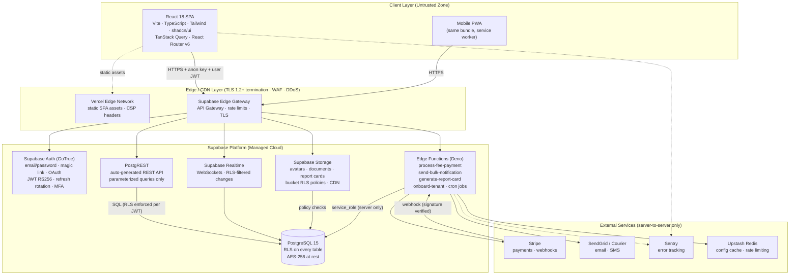
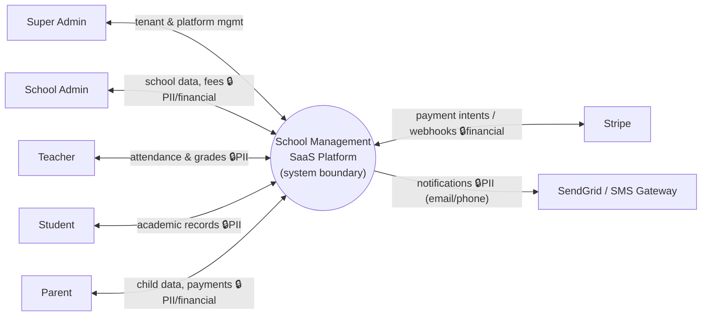
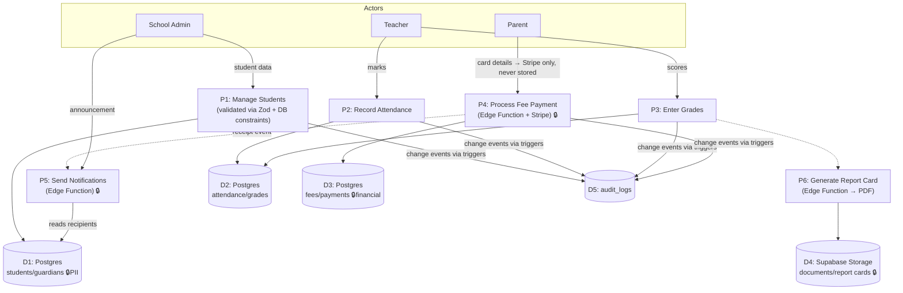
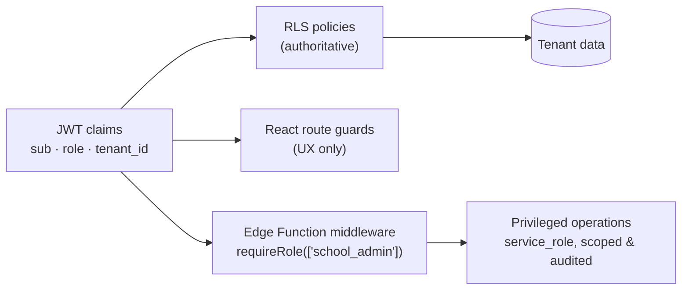
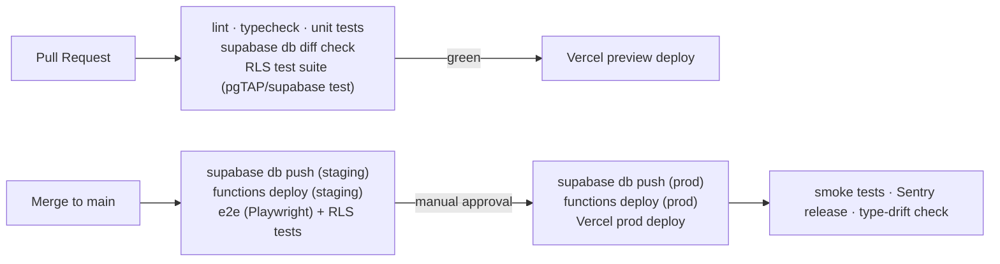
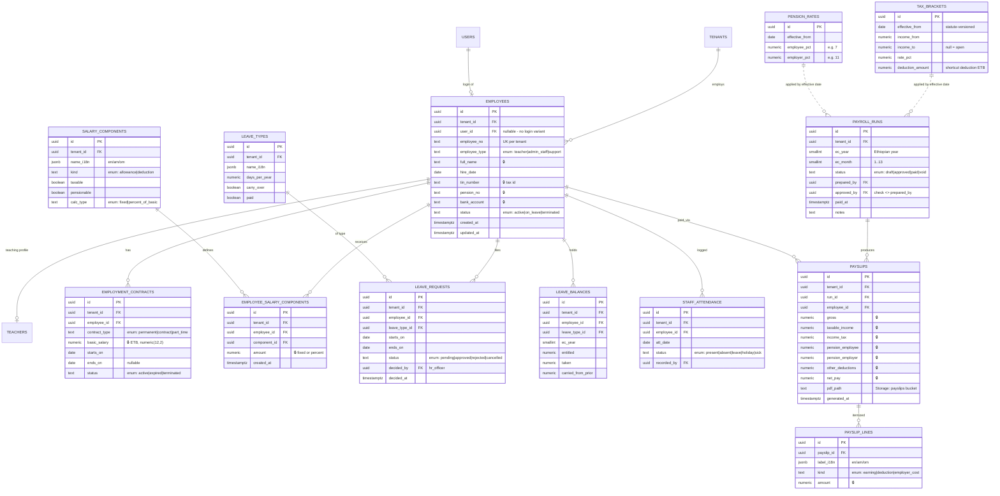
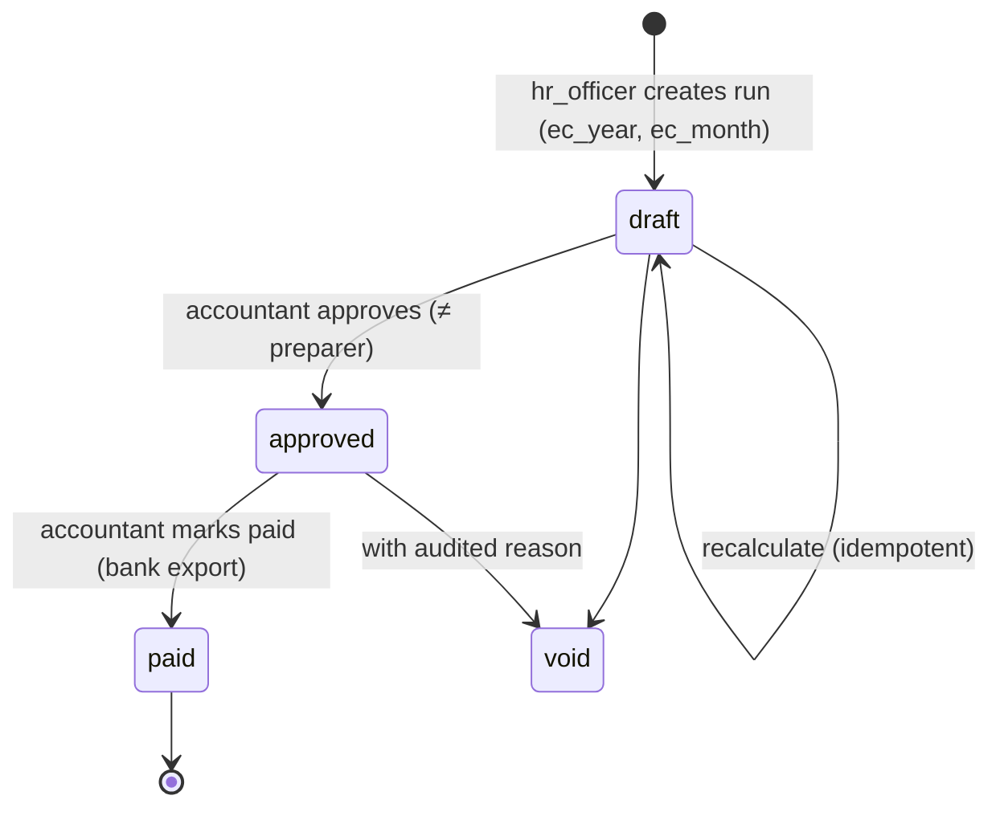

# System Architecture Design & Development Blueprint

## Multi-Tenant School Management System SaaS Platform

| Document Control | |
|---|---|
| **Document Title** | School Management SaaS — Architecture & Development Blueprint |
| **Version** | 1.0 |
| **Status** | Production-Ready Baseline |
| **Compliance Alignment** | INSA Web Application Security Testing Requirements (§4.2.1–4.2.5, §5 APIs), OWASP Top 10 (2021), NIST CSF 2.0, ISO/IEC 27001:2022 |
| **Mandatory Stack** | React 18 + TypeScript + Vite + Tailwind + shadcn/ui + TanStack Query · Supabase (Auth, Postgres, Storage, Edge Functions, Realtime) |
| **Audience** | Engineering, Security, DevOps, QA, Product |

---

## Table of Contents

1. [Executive Summary](#1-executive-summary)
2. [User Roles and Functional Modules](#2-user-roles-and-functional-modules)
3. [Architectural Design Principles](#3-architectural-design-principles)
4. [High-Level System Architecture](#4-high-level-system-architecture)
5. [Multi-Tenancy Strategy with Supabase](#5-multi-tenancy-strategy-with-supabase)
6. [Frontend Architecture & Routing](#6-frontend-architecture--routing)
7. [Backend & Database Architecture (Supabase)](#7-backend--database-architecture-supabase)
8. [API Design and Integration](#8-api-design-and-integration)
9. [Authentication and Authorization](#9-authentication-and-authorization)
10. [Security Architecture (INSA Security Functionality Document)](#10-security-architecture-insa-security-functionality-document)
11. [Scalability and Performance](#11-scalability-and-performance)
12. [Infrastructure and Deployment](#12-infrastructure-and-deployment)
13. [Monitoring, Logging, and Alerting](#13-monitoring-logging-and-alerting)
14. [Development Roadmap (Phased)](#14-development-roadmap-phased)
15. [Risk Assessment and Mitigation](#15-risk-assessment-and-mitigation)
16. [Appendices](#16-appendices)
    - A. Glossary
    - B. Sample `config.toml` & Edge Function Structure
    - C. Example Migration: `students` Table with RLS
    - D. INSA Testing Scope & Staging Test Accounts
    - E. Technical Stack & Features Inventory (INSA Phase 2)

---

# 1. Executive Summary

## 1.1 Product Overview

The **School Management System (SMS) SaaS** is a multi-tenant, cloud-native platform that digitizes the full academic and administrative lifecycle of K-12 and secondary schools. Each subscribing school operates as an isolated **tenant** with its own students, staff, academic calendar, fee structures, and branding — all served from a single shared infrastructure.

**Target users:**

- **Platform Owner (Super Admin):** operates the SaaS, onboards schools, manages subscriptions and platform health.
- **School Administrators:** manage enrollment, staff, timetables, fees, and communications for their school.
- **Teachers:** record attendance, enter grades, manage class resources, and communicate with parents.
- **Students & Parents:** view timetables, grades, attendance, fee balances; pay fees online; receive announcements.

**Value proposition:** replace fragmented spreadsheets and legacy desktop tools with one secure, always-available, mobile-friendly system — deployable for a new school in minutes, priced per-student, and compliant with modern security standards (INSA, OWASP, ISO 27001) out of the box.

## 1.2 Why This Stack

| Goal | How the mandated stack delivers |
|---|---|
| **Speed of development** | Supabase auto-generates a REST API (PostgREST) directly from the Postgres schema — no custom backend CRUD layer to build or maintain. shadcn/ui + Tailwind give production-quality UI primitives immediately. |
| **Scalability** | Supabase manages connection pooling (PgBouncer/Supavisor), read replicas, and a global CDN for Storage. The SPA is static and infinitely cacheable on Vercel's edge network. Edge Functions scale horizontally on demand. |
| **Cost efficiency** | Serverless pricing: near-zero cost at low tenant counts; no idle servers. One shared Postgres cluster serves all tenants via Row Level Security (RLS), avoiding per-tenant infrastructure. |
| **Security-first** | RLS enforces tenant isolation **inside the database engine**, so no client bug or bypassed API layer can leak cross-tenant data. Supabase Auth handles password hashing (bcrypt), token rotation, and MFA. |
| **Type safety end-to-end** | `supabase gen types typescript` produces TypeScript types from the live schema, consumed by TanStack Query hooks and validated at the boundary with Zod — one source of truth from column to component. |
| **Perceived performance** | TanStack Query caching + optimistic updates make attendance-taking and grade entry feel instant even on slow school networks. |

## 1.3 Architecture in One Paragraph

A React 18 SPA (Vite, TypeScript) talks **directly** to Supabase: PostgREST for CRUD (guarded entirely by RLS policies keyed on `tenant_id` and role), Supabase Auth for identity (JWT automatically attached to every request), Supabase Storage for files (avatars, documents, report cards), and Supabase Realtime for optional live updates. Anything sensitive or involving third parties — Stripe payments, bulk email/SMS via SendGrid, PDF report-card generation, scheduled jobs, tenant onboarding — runs in **Deno Edge Functions** using the `service_role` key server-side only. There is deliberately **no custom API server**: the database *is* the authorization layer.

---

# 2. User Roles and Functional Modules

## 2.1 User Roles & Permission Boundaries (INSA Actor Inventory)

| Role | Scope | Permission Boundary |
|---|---|---|
| **`super_admin`** | Platform-wide | Manage tenants, subscriptions, feature flags, platform config. **Bypasses tenant RLS** via a dedicated policy clause. Cannot impersonate users without an audited impersonation flow. |
| **`school_admin`** | Single tenant | Full CRUD on all school data: students, staff, classes, fees, timetable, announcements, settings. Cannot see other tenants. Cannot alter platform config. |
| **`teacher`** | Single tenant, assigned classes | Read students in assigned classes; write attendance & grades **only for own class/subject assignments**; read timetable; post class announcements. |
| **`student`** | Self | Read own profile, attendance, grades, timetable, fee balance, announcements. No write access except own profile fields whitelisted by policy. |
| **`parent`** | Linked children | Read data of linked children only (via `guardians` join table); pay fees; receive communications. |

## 2.2 Core Functional Modules

| Module | Key Capabilities | Primary Roles |
|---|---|---|
| **Student Information Management (SIS)** | Admissions, profiles, guardians, documents, enrollment history, class/section assignment | School Admin |
| **Attendance** | Daily & per-period marking, bulk class marking, statuses (present/absent/late/excused), monthly summaries, parent notifications | Teacher, Admin |
| **Timetable & Scheduling** | Period templates, room/teacher conflict detection, per-class and per-teacher views, substitutions | Admin, Teacher (view) |
| **Gradebook & Exams** | Exam definitions, grading scales, mark entry, weighted term averages, report cards | Teacher, Admin |
| **Fee Management & Payments** | Fee structures, invoices, discounts/scholarships, online payment (Stripe), receipts, arrears reports | Admin, Parent |
| **Communication Hub** | In-app announcements, targeted email/SMS via Edge Functions, delivery tracking | Admin, Teacher |
| **Reporting & Analytics** | Attendance trends, grade distributions, fee collection dashboards, CSV/PDF export | Admin, Super Admin |
| **Library** | Catalog, member checkouts, due dates, fines | Admin, Librarian (teacher variant) |
| **Transport (optional)** | Routes, stops, vehicle & driver registry, student route assignment | Admin |
| **Administrative Settings** | Academic years/terms, grading scales, tenant branding & configuration (JSONB), user management | School Admin |

---

# 3. Architectural Design Principles

1. **Security first, database-enforced.** Authorization lives in RLS policies, not application code. Every table carries `tenant_id`; every policy checks it. A compromised or buggy client cannot widen its own access.
2. **Serverless simplicity.** No servers to patch. PostgREST replaces the CRUD backend; Edge Functions exist only where business logic or secrets demand them (payments, notifications, PDFs, cron).
3. **Tenant isolation by RLS.** Shared schema + RLS is the isolation model (justified in §5). Isolation is testable, versioned in migrations, and enforced identically for REST, Realtime, and Storage.
4. **Offline-tolerant, optimistic UX.** TanStack Query caches per-tenant server state, retries on reconnect, and applies optimistic updates for attendance/grade entry with automatic rollback on error.
5. **Type safety from column to component.** Generated Supabase types + Zod schemas at every input boundary. No `any`, no unchecked casts of API payloads.
6. **Everything as code.** Schema, RLS policies, storage policies, seeds, and Edge Functions live in the repo; CI applies migrations and runs RLS tests before deploy.
7. **Least privilege everywhere.** The browser only ever holds the `anon` key + user JWT. `service_role` keys exist solely in Edge Function secrets. Teachers write only to their own class rows — enforced by policy, mirrored in UI.
8. **Fail closed, log richly.** RLS denies by default. Errors returned to clients are generic; full detail goes to structured server logs and the `audit_logs` table (no PII/passwords in logs).

---

# 4. High-Level System Architecture

## 4.1 System Architecture Diagram



**Security layers made explicit (INSA §4.2 architecture requirements):** TLS 1.2+ is terminated at Vercel and the Supabase API gateway; the gateway plus Vercel's edge act as the WAF/DDoS layer; PostgREST is the only path from clients to data and issues **parameterized queries exclusively**; RLS inside Postgres is the final, non-bypassable authorization boundary; `service_role` credentials never leave Edge Function secrets (the trusted zone).

## 4.2 How the SPA Talks to the Database (No Custom Backend)

1. User signs in via Supabase Auth → receives a short-lived **JWT (access token)** + rotating refresh token.
2. `@supabase/supabase-js` attaches the JWT to every PostgREST/Storage/Realtime request automatically.
3. PostgREST sets the Postgres session to the `authenticated` role with the JWT claims (`sub` = user id) available to SQL.
4. **RLS policies** resolve the caller's `tenant_id` and role from `public.users` (or JWT custom claims) and filter every row read/written. A query like "give me all students" physically cannot return another school's rows.
5. TanStack Query caches results under tenant-scoped keys, revalidates in the background, and reconciles optimistic updates.

Eliminating the custom API tier removes an entire class of vulnerabilities (broken object-level authorization in hand-written controllers) because **authorization is declared once, in SQL, next to the data**.

## 4.3 Authentication Flow

```mermaid
sequenceDiagram
    autonumber
    participant U as User (Browser)
    participant SPA as React SPA
    participant GA as Supabase Auth
    participant PR as PostgREST
    participant PG as Postgres (RLS)

    U->>SPA: Enter email/password (or magic link)
    SPA->>GA: POST /token (credentials over TLS)
    GA->>GA: bcrypt verify · rate limit · MFA check
    GA-->>SPA: access JWT (exp 60 min) + refresh token (rotating)
    Note over SPA: Session in memory + localStorage<br/>auto-refresh before expiry
    SPA->>PR: GET /rest/v1/students (Authorization: Bearer JWT)
    PR->>PG: SET role authenticated; claims → auth.uid()
    PG->>PG: RLS: tenant_id = get_tenant_id_for_user(auth.uid())
    PG-->>PR: Only caller's tenant rows
    PR-->>SPA: 200 OK (JSON)
    SPA->>SPA: TanStack Query cache ['tenant', tid, 'students']
```

## 4.4 Data Flow Diagrams (INSA Phase 1 Mandatory)

### DFD Level 0 — Context



### DFD Level 1 — Core Processes



**Flagged sensitive entry points (🔒) and their controls:** student PII (D1) — RLS + field-level column grants + Zod allow-list validation; financial flows (P4/D3) — card data never touches our system (Stripe Elements tokenization), webhook signatures verified, amounts recomputed server-side; documents (D4) — private buckets, MIME/extension whitelist, size caps, randomized object names; every mutation on sensitive tables is trigger-logged to D5.

---

# 5. Multi-Tenancy Strategy with Supabase

## 5.1 Chosen Model: Shared Schema + Row Level Security

| Model | Verdict | Rationale |
|---|---|---|
| Separate database per tenant | ❌ Rejected | One Supabase project per school → cost and migration overhead explodes; no cross-tenant analytics; onboarding is slow. |
| Separate schema per tenant | ❌ Rejected | PostgREST exposes one schema cleanly; per-tenant schemas break generated types, complicate migrations (N× DDL), and Supabase tooling (types, Studio, Realtime) assumes shared schema. |
| **Shared schema + RLS** | ✅ **Selected** | Single migration path, single generated type set, instant tenant onboarding (one row insert), and isolation enforced by the database engine on every access path (REST, Realtime, Storage). This is Supabase's canonical multi-tenant pattern. |

## 5.2 Isolation Mechanics

- **Every tenant-scoped table** has `tenant_id uuid not null references tenants(id)` with a composite index leading on `tenant_id`.
- A `security definer` helper resolves the caller's tenant once per statement:

```sql
-- Runs as owner; safe, read-only, and STABLE so the planner caches it per statement.
create or replace function public.get_tenant_id_for_user(user_id uuid)
returns uuid
language sql stable security definer set search_path = public as $$
  select tenant_id from public.users where id = user_id
$$;

create or replace function public.get_role_for_user(user_id uuid)
returns text
language sql stable security definer set search_path = public as $$
  select role::text from public.users where id = user_id
$$;
```

- **Standard policy shape** (fail-closed; `FORCE ROW LEVEL SECURITY` so even table owners obey it):

```sql
alter table public.students enable row level security;
alter table public.students force row level security;

create policy tenant_isolation_select on public.students
for select to authenticated
using (
  tenant_id = (select public.get_tenant_id_for_user(auth.uid()))
  or (select public.get_role_for_user(auth.uid())) = 'super_admin'
);
```

- **Super Admin bypass** is explicit in policies (never `bypassrls` role attributes), so it remains visible, versioned, and testable in migrations.

## 5.3 Tenant Onboarding (Edge Function `onboard-tenant`)

Classified **Internal** (callable only by an authenticated `super_admin`; verified inside the function):

1. Validate payload with Zod (school name, subdomain slug, admin email — allow-list regex).
2. In a single transaction via `service_role`: insert `tenants` row → create auth user (`supabase.auth.admin.createUser`, email invite) → insert `public.users` row with `role = 'school_admin'` and the new `tenant_id` → seed default `tenant_configs`, academic year, and grading scale.
3. Write `audit_logs` entry; send welcome email through `send-bulk-notification`.
4. Return `201` with tenant id; on any step failure, roll back and return a generic `500` (details logged server-side only).

## 5.4 Tenant-Level Customization

```sql
create table public.tenant_configs (
  tenant_id uuid primary key references public.tenants(id) on delete cascade,
  settings  jsonb not null default '{}'::jsonb,  -- branding, locale, feature flags
  updated_at timestamptz not null default now()
);
```

Validated at the edge with a Zod schema (e.g., `settings.branding.primaryColor` must match `^#[0-9a-fA-F]{6}$`); read by the SPA at bootstrap and cached in TanStack Query under `['tenant', tenantId, 'config']`; hot config optionally mirrored in Upstash Redis for Edge Functions.

---

# 6. Frontend Architecture & Routing

## 6.1 Feature-Based Folder Structure

```
src/
├── app/                      # App shell & composition root
│   ├── App.tsx
│   ├── router.tsx            # Route tree (React Router v6)
│   └── providers.tsx         # QueryClient, AuthProvider, Theme, Toaster
├── components/
│   ├── ui/                   # shadcn/ui primitives (button, dialog, table…)
│   └── layout/               # DashboardShell, Sidebar, Header, PageHeader
├── features/
│   ├── auth/                 # LoginPage, useSession, RequireAuth, RequireRole
│   ├── students/             # api.ts · hooks.ts · schemas.ts (Zod) · components/ · pages/
│   ├── attendance/
│   ├── timetable/
│   ├── gradebook/
│   ├── fees/
│   ├── communication/
│   ├── reports/
│   ├── library/
│   ├── transport/
│   └── settings/
├── hooks/                    # useTenant, useDebounce, useMediaQuery
├── lib/
│   ├── supabase.ts           # single typed client instance
│   ├── database.types.ts     # `supabase gen types typescript` output
│   ├── queryKeys.ts          # tenant-scoped key factory
│   └── utils.ts
└── stores/                   # minimal React context (UI-only state)
```

Each feature owns its data layer (`api.ts` — typed Supabase calls), query hooks (`hooks.ts`), Zod schemas (`schemas.ts`), and pages. Cross-feature imports are allowed only from `components/`, `hooks/`, `lib/`.

## 6.2 Routing with Role Guards

```tsx
// src/app/router.tsx
const router = createBrowserRouter([
  { path: "/login", element: <LoginPage /> },
  { path: "/accept-invite", element: <AcceptInvitePage /> },
  {
    element: <RequireAuth />,                 // redirects to /login if no session
    children: [
      {
        element: <DashboardShell />,          // Sidebar + Header + <Outlet/>
        children: [
          { index: true, element: <DashboardPage /> },
          {
            element: <RequireRole roles={["school_admin"]} />,
            children: [
              { path: "students", element: <StudentsListPage /> },
              { path: "students/:id", element: <StudentDetailPage /> },
              { path: "fees/*", element: <FeesRoutes /> },
              { path: "settings/*", element: <SettingsRoutes /> },
            ],
          },
          {
            element: <RequireRole roles={["teacher", "school_admin"]} />,
            children: [
              { path: "attendance", element: <AttendancePage /> },
              { path: "gradebook", element: <GradebookPage /> },
            ],
          },
          { path: "portal/*", element: <StudentParentPortal /> }, // student/parent
        ],
      },
    ],
  },
  {
    path: "/platform",                        // Super Admin console
    element: <RequireRole roles={["super_admin"]} />,
    children: [{ path: "tenants", element: <TenantsPage /> }],
  },
]);
```

`RequireRole` reads the profile from the `['session','profile']` query. **Route guards are UX only** — real enforcement is RLS; a tampered client that renders a forbidden page still receives zero rows.

## 6.3 Server State: TanStack Query Conventions

```ts
// lib/queryKeys.ts — every key is tenant-scoped to prevent cross-tenant cache bleed
export const qk = {
  students: (t: string) => ["tenant", t, "students"] as const,
  student:  (t: string, id: string) => ["tenant", t, "students", id] as const,
  attendance: (t: string, classId: string, date: string) =>
    ["tenant", t, "attendance", classId, date] as const,
};
```

- On sign-out or tenant switch: `queryClient.clear()` — mandatory, prevents stale cross-tenant data in memory.
- Defaults: `staleTime: 30_000`, `retry: 2`, `refetchOnWindowFocus: true`.
- **Optimistic updates** for attendance and grades (see §11.4).
- Mutations invalidate the narrowest key possible.

## 6.4 Forms: React Hook Form + Zod (INSA input validation, client side)

```tsx
// features/students/schemas.ts — strict allow-list validation
export const studentSchema = z.object({
  first_name: z.string().trim().min(1).max(80)
    .regex(/^[\p{L}\p{M}'\- ]+$/u, "Letters, apostrophes and hyphens only"),
  last_name:  z.string().trim().min(1).max(80).regex(/^[\p{L}\p{M}'\- ]+$/u),
  admission_no: z.string().regex(/^[A-Z0-9\-\/]{3,20}$/),
  date_of_birth: z.coerce.date().max(new Date()),
  gender: z.enum(["male", "female", "other"]),
  email: z.string().email().max(254).optional().or(z.literal("")),
  phone: z.string().regex(/^\+?[0-9]{7,15}$/).optional().or(z.literal("")),
  class_id: z.string().uuid(),
});
export type StudentInput = z.infer<typeof studentSchema>;
```

The same schemas are reused inside Edge Functions, and the database repeats the constraints (`CHECK`, enums, FKs) — **validation in depth**: client → edge → database.

## 6.5 UI System

- shadcn/ui exclusively for interactive primitives (`DataTable` on TanStack Table, `Dialog`, `Form`, `Toast`); Tailwind tokens themed per tenant from `tenant_configs` CSS variables.
- Reusable layout: `DashboardShell` (responsive sidebar + header + breadcrumb), `PageHeader`, `StatCard`, `EmptyState`, `ConfirmDialog`.
- **XSS discipline:** React escapes by default; `dangerouslySetInnerHTML` is banned by ESLint rule (`react/no-danger`). Announcement rich text is stored as a constrained schema and rendered through a whitelist renderer (no raw HTML persisted).

---

# 7. Backend & Database Architecture (Supabase)

## 7.1 Entity-Relationship Diagram

Sensitive fields are marked 🔒 (PII/financial — protected by RLS, column grants, and encrypted at rest via Supabase AES-256; passwords never stored in `public` — Supabase Auth stores bcrypt hashes in `auth.users`).

```mermaid
erDiagram
    TENANTS ||--o{ USERS : has
    TENANTS ||--o{ STUDENTS : has
    TENANTS ||--o{ TEACHERS : has
    TENANTS ||--o{ CLASSES : has
    TENANTS ||--|| TENANT_CONFIGS : configures
    USERS ||--o| TEACHERS : "profile of"
    USERS ||--o| STUDENTS : "portal login"
    USERS ||--o{ GUARDIANS : "parent login"
    STUDENTS ||--o{ GUARDIANS : "linked to"
    CLASSES ||--o{ STUDENTS : enrolls
    CLASSES ||--o{ TIMETABLE_SLOTS : scheduled
    SUBJECTS ||--o{ TIMETABLE_SLOTS : taught_in
    TEACHERS ||--o{ TIMETABLE_SLOTS : teaches
    TEACHERS ||--o{ CLASS_SUBJECT_TEACHERS : assigned
    CLASSES ||--o{ CLASS_SUBJECT_TEACHERS : has
    SUBJECTS ||--o{ CLASS_SUBJECT_TEACHERS : has
    STUDENTS ||--o{ ATTENDANCE : recorded
    STUDENTS ||--o{ GRADES : receives
    EXAMS ||--o{ GRADES : produces
    SUBJECTS ||--o{ GRADES : for
    STUDENTS ||--o{ FEE_INVOICES : billed
    FEE_STRUCTURES ||--o{ FEE_INVOICES : generates
    FEE_INVOICES ||--o{ PAYMENTS : settled_by
    TENANTS ||--o{ ANNOUNCEMENTS : publishes
    TENANTS ||--o{ AUDIT_LOGS : records

    TENANTS {
        uuid id PK
        text name
        text slug UK
        text status "enum: active|suspended|trial"
        timestamptz created_at
    }
    USERS {
        uuid id PK "= auth.users.id"
        uuid tenant_id FK "null only for super_admin"
        text role "enum user_role"
        text full_name
        text email "🔒 UK"
        text phone "🔒"
        timestamptz created_at
    }
    STUDENTS {
        uuid id PK
        uuid tenant_id FK
        uuid user_id FK "nullable portal login"
        uuid class_id FK
        text admission_no "UK per tenant"
        text first_name "🔒"
        text last_name "🔒"
        date date_of_birth "🔒"
        text gender "enum"
        text medical_notes "🔒"
        text avatar_path "Storage object"
        text status "enum: active|graduated|transferred"
    }
    GUARDIANS {
        uuid id PK
        uuid tenant_id FK
        uuid student_id FK
        uuid user_id FK "parent login"
        text relationship "enum"
        text phone "🔒"
        text email "🔒"
    }
    TEACHERS {
        uuid id PK
        uuid tenant_id FK
        uuid user_id FK
        text staff_no "UK per tenant"
        text qualification
        date hired_on
    }
    CLASSES {
        uuid id PK
        uuid tenant_id FK
        text name
        text section
        uuid academic_year_id FK
        uuid homeroom_teacher_id FK
    }
    SUBJECTS {
        uuid id PK
        uuid tenant_id FK
        text name
        text code "UK per tenant"
    }
    CLASS_SUBJECT_TEACHERS {
        uuid id PK
        uuid tenant_id FK
        uuid class_id FK
        uuid subject_id FK
        uuid teacher_id FK
    }
    TIMETABLE_SLOTS {
        uuid id PK
        uuid tenant_id FK
        uuid class_id FK
        uuid subject_id FK
        uuid teacher_id FK
        smallint day_of_week
        time starts_at
        time ends_at
        text room
    }
    ATTENDANCE {
        uuid id PK
        uuid tenant_id FK
        uuid student_id FK
        uuid class_id FK
        date attendance_date
        text status "enum: present|absent|late|excused"
        uuid recorded_by FK
        timestamptz recorded_at
    }
    EXAMS {
        uuid id PK
        uuid tenant_id FK
        text name
        uuid academic_term_id FK
        numeric max_score
        numeric weight
    }
    GRADES {
        uuid id PK
        uuid tenant_id FK
        uuid student_id FK
        uuid exam_id FK
        uuid subject_id FK
        numeric score "🔒 check 0..max"
        text remark
        uuid entered_by FK
    }
    FEE_STRUCTURES {
        uuid id PK
        uuid tenant_id FK
        text name
        numeric amount "🔒"
        text billing_cycle "enum"
        uuid class_id FK "nullable"
    }
    FEE_INVOICES {
        uuid id PK
        uuid tenant_id FK
        uuid student_id FK
        uuid fee_structure_id FK
        numeric amount_due "🔒"
        numeric amount_paid "🔒"
        date due_date
        text status "enum: pending|partial|paid|overdue"
    }
    PAYMENTS {
        uuid id PK
        uuid tenant_id FK
        uuid invoice_id FK
        numeric amount "🔒"
        text provider "enum: stripe|cash|bank"
        text provider_ref "🔒 Stripe PI id — never card data"
        text status "enum: succeeded|failed|refunded"
        timestamptz paid_at
    }
    ANNOUNCEMENTS {
        uuid id PK
        uuid tenant_id FK
        text title
        text body
        text audience "enum: all|staff|parents|class"
        uuid class_id FK "nullable"
        uuid created_by FK
        timestamptz published_at
    }
    AUDIT_LOGS {
        bigint id PK
        uuid tenant_id
        uuid actor_id
        text action "insert|update|delete"
        text table_name
        uuid row_id
        jsonb old_data "🔒 PII redacted"
        jsonb new_data "🔒 PII redacted"
        timestamptz created_at
    }
```



Additional supporting tables: `academic_years`, `academic_terms`, `library_books`, `library_checkouts`, `transport_routes`, `transport_stops`, `student_route_assignments`, `notification_log`, `tenant_configs` — all carrying `tenant_id` with identical RLS shape.

## 7.2 Postgres Conventions

| Concern | Standard |
|---|---|
| **Primary keys** | `uuid default gen_random_uuid()` (non-enumerable — mitigates IDOR probing) |
| **Indexes** | Composite, leading with tenant: `(tenant_id, class_id)`, `(tenant_id, attendance_date)`, `(tenant_id, admission_no)` unique, `(tenant_id, status)` on invoices |
| **Enums** | `user_role`, `attendance_status`, `invoice_status`, `payment_provider`, `gender` — DB-level allow-lists |
| **Money** | `numeric(12,2)`, `check (amount >= 0)`; totals recomputed by trigger, never trusted from client |
| **Timestamps** | `created_at/updated_at timestamptz default now()`; shared `set_updated_at()` trigger |
| **Deletes** | Soft-delete (`status`) for students; FK `on delete restrict` for financial rows |
| **Constraints** | `unique (tenant_id, admission_no)`, `unique (tenant_id, student_id, attendance_date, class_id)`, `check (score >= 0)` |

```sql
create or replace function public.set_updated_at()
returns trigger language plpgsql as $$
begin
  new.updated_at = now();
  return new;
end $$;
```

## 7.3 RLS Policy Examples — `students`

```sql
-- SELECT: admins see all tenant students; teachers only their classes;
-- students see self; parents see linked children; super_admin sees all.
create policy students_select on public.students
for select to authenticated using (
  (select public.get_role_for_user(auth.uid())) = 'super_admin'
  or (
    tenant_id = (select public.get_tenant_id_for_user(auth.uid()))
    and (
      (select public.get_role_for_user(auth.uid())) = 'school_admin'
      or exists (  -- teacher assigned to the student's class
        select 1 from public.class_subject_teachers cst
        join public.teachers t on t.id = cst.teacher_id
        where t.user_id = auth.uid() and cst.class_id = students.class_id
      )
      or students.user_id = auth.uid()                    -- the student
      or exists (                                          -- a linked parent
        select 1 from public.guardians g
        where g.student_id = students.id and g.user_id = auth.uid()
      )
    )
  )
);

-- INSERT/UPDATE/DELETE: school_admin only, always inside own tenant.
create policy students_write on public.students
for all to authenticated
using (
  tenant_id = (select public.get_tenant_id_for_user(auth.uid()))
  and (select public.get_role_for_user(auth.uid())) = 'school_admin'
)
with check (
  tenant_id = (select public.get_tenant_id_for_user(auth.uid()))
  and (select public.get_role_for_user(auth.uid())) = 'school_admin'
);
```

The `with check` clause blocks the classic escalation of inserting/moving a row into a foreign `tenant_id`. Equivalent scoped policies exist per table (e.g., `attendance_insert` additionally requires the teacher to be assigned to `class_id`, and a trigger stamps `recorded_by = auth.uid()` server-side).

## 7.4 File Storage (Supabase Storage)

| Bucket | Visibility | Path convention | Policy summary |
|---|---|---|---|
| `avatars` | private | `{tenant_id}/students/{student_id}/{uuid}.webp` | Read: same-tenant per role rules; write: school_admin |
| `documents` | private | `{tenant_id}/students/{student_id}/{uuid}.{ext}` | Read: admin + owning student/parent; write: admin |
| `report-cards` | private | `{tenant_id}/{term_id}/{student_id}/{uuid}.pdf` | Read: admin + owning student/parent; **write: service_role only** (Edge Function) |

```sql
create policy "tenant read avatars" on storage.objects
for select to authenticated
using (
  bucket_id = 'avatars'
  and (storage.foldername(name))[1] =
      (select public.get_tenant_id_for_user(auth.uid()))::text
);
```

**Upload hardening (INSA secure file upload):** extension + MIME whitelist (`webp/png/jpg/pdf`), 5 MB cap enforced client-side and by bucket file-size limit, randomized `uuid` object names (uploads are never served from a web root — Storage is object storage behind signed access), and short-lived **signed URLs** (60 s) for all reads of private objects.

## 7.5 Full-Text Search

```sql
alter table public.students add column search_vector tsvector
  generated always as (
    to_tsvector('simple',
      coalesce(first_name,'') || ' ' || coalesce(last_name,'') || ' ' ||
      coalesce(admission_no,''))
  ) stored;
create index students_fts on public.students using gin (search_vector);
```

Queried through PostgREST's `textSearch` (parameterized — no injection surface): `supabase.from('students').select().textSearch('search_vector', term)`. Same pattern on `announcements(title, body)`. RLS applies to FTS results identically.

---

# 8. API Design and Integration

## 8.1 Auto-Generated REST API (PostgREST)

The typed Supabase client is the data layer. PostgREST translates every call into a **parameterized SQL statement** (INSA SQL-injection control satisfied structurally — string concatenation into SQL is impossible from the client).

```ts
// features/students/api.ts
import { supabase } from "@/lib/supabase";

export async function listStudents(page: number, pageSize = 25, search?: string) {
  let q = supabase
    .from("students")
    .select("id, admission_no, first_name, last_name, status, class:classes(id, name, section)",
            { count: "exact" })
    .eq("status", "active")
    .order("last_name")
    .range(page * pageSize, page * pageSize + pageSize - 1);
  if (search) q = q.textSearch("search_vector", search, { type: "websearch" });
  const { data, error, count } = await q;
  if (error) throw error;                 // surfaced as generic toast; details to Sentry
  return { rows: data, count };
}
```

Note there is **no `.eq('tenant_id', …)` needed for security** — RLS injects tenant filtering server-side. We may still add it as a query hint for index selection, but correctness never depends on it.

Capabilities used throughout: filtering (`eq/in/gte/ilike`), nested selects (embedded FK joins), pagination (`range` + `count`), upserts for attendance grids, and `rpc()` for Postgres functions (e.g., `rpc('class_attendance_summary', { class_id, month })`).

## 8.2 Edge Functions — Endpoint Catalog (INSA §5)

All functions: JWT verified (`verify_jwt = true` except signed webhooks), role authorization middleware, Zod payload validation, rate limiting (Upstash token bucket keyed on user/tenant), generic client errors, structured server logs. **Category** per INSA endpoint classification.

| Function | Method | Category | Auth | Purpose |
|---|---|---|---|---|
| `process-fee-payment` | POST | **Private** | JWT (parent/school_admin) | Create Stripe PaymentIntent for an invoice (amount read from DB, never client) |
| `stripe-webhook` | POST | **Public** (signature-gated) | Stripe HMAC signature | Confirm payment, update `payments` + invoice status, emit receipt |
| `send-bulk-notification` | POST | **Private** | JWT (school_admin/teacher) | Fan out email/SMS via SendGrid; writes `notification_log` |
| `generate-report-card` | POST | **Private** | JWT (school_admin) | Aggregate grades → render PDF → upload to `report-cards` bucket → return signed URL |
| `onboard-tenant` | POST | **Internal** | JWT (super_admin) | Provision tenant + first admin (see §5.3) |
| `scheduled-invoice-run` | cron | **Internal** | pg_cron / scheduled trigger only | Monthly invoice generation, overdue flagging, reminder queue |
| `export-tenant-data` / `erase-user-data` | POST | **Internal** | JWT (super_admin/school_admin) | GDPR-style export & right-to-erasure |

### Reference implementation — `process-fee-payment`

```ts
// supabase/functions/process-fee-payment/index.ts
// [INSA category: PRIVATE] [AuthZ: parent-of-student OR school_admin, same tenant]
import Stripe from "npm:stripe@14";
import { createClient } from "npm:@supabase/supabase-js@2";
import { z } from "npm:zod@3";

const stripe = new Stripe(Deno.env.get("STRIPE_SECRET_KEY")!);       // secret: env only
const Payload = z.object({ invoice_id: z.string().uuid() });          // strict allow-list

Deno.serve(async (req) => {
  try {
    // 1. Authenticate: user-scoped client -> RLS applies to the lookup below
    const authHeader = req.headers.get("Authorization") ?? "";
    const userClient = createClient(
      Deno.env.get("SUPABASE_URL")!, Deno.env.get("SUPABASE_ANON_KEY")!,
      { global: { headers: { Authorization: authHeader } } },
    );
    const { data: { user } } = await userClient.auth.getUser();
    if (!user) return json({ error: "Unauthorized" }, 401);

    // 2. Validate input
    const body = Payload.safeParse(await req.json());
    if (!body.success) return json({ error: "Invalid request" }, 400);

    // 3. Authorize via RLS: if caller can't see this invoice, this returns null
    const { data: invoice } = await userClient
      .from("fee_invoices")
      .select("id, tenant_id, amount_due, amount_paid, status")
      .eq("id", body.data.invoice_id)
      .maybeSingle();
    if (!invoice || invoice.status === "paid") return json({ error: "Invalid request" }, 400);

    // 4. Server-derived amount (never trust client), idempotent per invoice
    const amountCents = Math.round((invoice.amount_due - invoice.amount_paid) * 100);
    const intent = await stripe.paymentIntents.create(
      { amount: amountCents, currency: "usd",
        metadata: { invoice_id: invoice.id, tenant_id: invoice.tenant_id } },
      { idempotencyKey: `inv-${invoice.id}-${invoice.amount_paid}` },
    );
    return json({ clientSecret: intent.client_secret }, 200);
  } catch (err) {
    console.error("process-fee-payment failed", { message: (err as Error).message }); // no PII
    return json({ error: "An unexpected error occurred" }, 500);      // generic to client
  }
});
const json = (b: unknown, s: number) =>
  new Response(JSON.stringify(b), { status: s, headers: { "Content-Type": "application/json" } });
```

### Sample request/response files (INSA §5 requirement)

```jsonc
// POST /functions/v1/process-fee-payment — 200 OK
{ "clientSecret": "pi_3PqX..._secret_9aB" }

// 400 Bad Request (validation / already paid)
{ "error": "Invalid request" }

// 401 Unauthorized (missing/expired JWT)
{ "error": "Unauthorized" }

// 429 Too Many Requests (rate limit)
{ "error": "Too many requests", "retry_after_seconds": 30 }

// 500 Internal Server Error (generic — details server-side only)
{ "error": "An unexpected error occurred" }
```

Webhook hardening: `stripe-webhook` verifies `stripe-signature` with `stripe.webhooks.constructEvent` against `STRIPE_WEBHOOK_SECRET`, checks event id uniqueness in a `webhook_events` table (replay protection), and only then updates `payments` via `service_role`.

## 8.3 API Documentation

- **Living types:** `supabase gen types typescript --project-id … > src/lib/database.types.ts`, regenerated in CI on every migration; drift fails the build.
- **OpenAPI:** PostgREST serves a full OpenAPI 3 spec at the REST root, exported per release as `docs/openapi-rest.json`. Edge Functions are documented in a hand-maintained `docs/openapi-functions.yaml` covering headers, auth, and all status codes above — together these satisfy INSA's API documentation requirement.

## 8.4 Rate Limiting

| Layer | Mechanism |
|---|---|
| Supabase gateway | Built-in abuse protection + Auth rate limits (OTP, sign-in attempts) |
| Edge Functions | Upstash Redis token bucket: `rl:{fn}:{user_id}` — e.g., payments 10/min, notifications 5/min/tenant; returns `429` with `Retry-After` |
| PostgREST | `db.max_rows = 1000` cap; statement timeout 8 s prevents pathological scans |

---

# 9. Authentication and Authorization

## 9.1 Supabase Auth Configuration

| Setting | Value |
|---|---|
| Methods | Email/password (min 12 chars, HIBP leaked-password check ON), magic link; OAuth (Google/Microsoft) and SAML SSO in a later phase |
| JWT | Asymmetric **RS256/ES256** signing keys, access token **exp 3600 s** with `iat`, rotating refresh tokens with reuse detection |
| Sessions | Inactivity timeout 30 min (enforced via refresh-token time-box), absolute lifetime 12 h for staff roles; session **regenerated on login** by design (fresh token pair) |
| MFA | TOTP available to all; **required** for `super_admin` and `school_admin` |
| Email | Invite-only user creation for staff (no open self-signup); parents/students onboarded via admin-issued invites |

Identity linkage: a trigger on `auth.users` inserts the matching `public.users` profile row; `role` and `tenant_id` live in `public.users` and are additionally mirrored into JWT **custom claims** via a Custom Access Token Hook so RLS can read `auth.jwt()->>'tenant_id'` without a lookup on hot paths (profile-table lookup remains the source of truth; claims refresh on token renewal, so role changes force a session refresh).

## 9.2 RBAC Model



Permission checks are centralized in SQL helper functions (`get_role_for_user`, `is_teacher_of_class(class_id)`, `is_guardian_of(student_id)`), reused across policies — one definition, uniform enforcement. Least privilege examples: teachers can `insert/update` attendance **only** where `is_teacher_of_class(class_id)` and only for today ± an admin-configurable correction window; students/parents have zero write policies on academic tables.

## 9.3 Defense-in-Depth Summary

| Layer | Enforces |
|---|---|
| React route guards | Navigation & UI affordances |
| Zod (client + edge) | Input shape/format allow-lists |
| Edge middleware | Role checks before privileged/service-role logic |
| **RLS (authoritative)** | Tenant isolation, row/role visibility, write scoping |
| Column grants | `revoke` on 🔒 columns (e.g., `medical_notes`) from roles that must never read them |
| DB constraints/enums/triggers | Data integrity regardless of caller |

---

# 10. Security Architecture (INSA Security Functionality Document)

This section doubles as the **Security Functionality Document** required by INSA Phase 4 — a narrative of exactly how each control is implemented in this stack.

## 10.1 Access Control (RBAC via RLS)

- **Enforcement point per endpoint:** every PostgREST route is guarded by the RLS policies of its underlying table (catalogued in migrations under `supabase/migrations/*_rls_*.sql`); every Edge Function passes through `requireRole()` middleware before touching `service_role`.
- Super Admin access is an explicit policy clause — auditable, testable, revocable in one migration.
- Field-level visibility: sensitive columns additionally protected by `REVOKE SELECT (medical_notes) ON students FROM authenticated` + a `students_safe` view for teacher-facing queries.

## 10.2 Input Validation Strategy (per module)

| Module | Validation rules (allow-list) |
|---|---|
| Students | Names Unicode-letter regex ≤80; admission no `^[A-Z0-9\-\/]{3,20}$`; DOB past date; gender/status enums; `class_id` UUID + FK |
| Attendance | Status enum; date within term bounds (`CHECK` + trigger); unique per student/day/class |
| Gradebook | `0 ≤ score ≤ exams.max_score` (trigger against exam row); exam/subject UUID FKs |
| Fees/Payments | Amounts `numeric(12,2) ≥ 0`; **charge amount derived server-side from invoice**; provider enum; Stripe ids pattern-checked |
| Communication | Title ≤150; body length caps; audience enum; recipients resolved server-side, never accepted as raw email lists from client |
| Files | Extension + MIME whitelist, 5 MB cap, randomized names, private buckets, signed URLs |

Each rule exists **three times**: Zod (client), Zod (edge), and Postgres constraint — the database version is the guarantee.

## 10.3 Session & Cookie/Token Logic

- Supabase Auth issues access JWT (60 min) + rotating refresh token with **reuse detection** (stolen refresh token invalidates the family).
- Inactivity timeout 30 min; absolute session cap 12 h (staff). Logout revokes refresh tokens and clears the TanStack Query cache.
- The SPA authenticates via `Authorization: Bearer` headers, **not cookies**, so classic cookie-borne CSRF does not apply to data calls; browsers cannot be forced to attach the token cross-site. Any cookie the app does set (e.g., theme) is `Secure; HttpOnly; SameSite=Lax`. Edge Functions reject requests lacking a valid JWT or (webhooks) a valid HMAC signature — the CSRF-equivalent control for each entry point.

## 10.4 Injection, XSS & Headers

- **SQLi:** PostgREST parameterizes everything; in-house SQL exists only in migrations/functions where inputs are typed parameters — string-built SQL is prohibited by review checklist and lint.
- **XSS:** React auto-escaping; `react/no-danger` ESLint error; no user HTML persisted; CSP (below) as backstop.
- **Headers (Vercel `vercel.json`):**

```
Content-Security-Policy: default-src 'self'; script-src 'self' https://js.stripe.com;
  connect-src 'self' https://*.supabase.co wss://*.supabase.co https://api.stripe.com https://*.sentry.io;
  img-src 'self' data: https://*.supabase.co; style-src 'self' 'unsafe-inline';
  frame-src https://js.stripe.com; frame-ancestors 'none'; base-uri 'self'; form-action 'self'
Strict-Transport-Security: max-age=63072000; includeSubDomains; preload
X-Content-Type-Options: nosniff
Referrer-Policy: strict-origin-when-cross-origin
Permissions-Policy: camera=(), microphone=(), geolocation=()
```

## 10.5 Encryption

- **In transit:** TLS 1.2+ enforced on every hop (Vercel, Supabase gateway, Stripe, SendGrid); HSTS preloaded; no plaintext listener exists anywhere in the design.
- **At rest:** Supabase encrypts database volumes, backups, and Storage objects with **AES-256**. Passwords are bcrypt-hashed by Supabase Auth (never in `public` schema). Card data never enters the system (Stripe Elements — SAQ-A scope). Secrets live in Supabase/Vercel encrypted secret stores; none in the repo or client bundle (the `anon` key is public by design; `service_role` is server-side only).

## 10.6 Audit Logging

```sql
create table public.audit_logs (
  id bigint generated always as identity primary key,
  tenant_id uuid, actor_id uuid, action text not null,
  table_name text not null, row_id uuid,
  old_data jsonb, new_data jsonb,
  created_at timestamptz not null default now()
);
alter table public.audit_logs enable row level security;  -- read: super_admin + tenant school_admin (own tenant); no update/delete policies → append-only

create or replace function public.audit_trigger()
returns trigger language plpgsql security definer as $$
declare redacted_old jsonb; redacted_new jsonb;
begin
  -- Redact PII columns before persisting (INSA: no sensitive data in logs)
  redacted_old := to_jsonb(old) - 'medical_notes' - 'phone' - 'email';
  redacted_new := to_jsonb(new) - 'medical_notes' - 'phone' - 'email';
  insert into public.audit_logs(tenant_id, actor_id, action, table_name, row_id, old_data, new_data)
  values (coalesce(new.tenant_id, old.tenant_id), auth.uid(), lower(tg_op), tg_table_name,
          coalesce(new.id, old.id), redacted_old, redacted_new);
  return coalesce(new, old);
end $$;

create trigger audit_students after insert or update or delete
on public.students for each row execute function public.audit_trigger();
-- likewise on grades, fee_invoices, payments, users, tenant_configs
```

**Logged:** logins & failures (Supabase Auth logs), role/permission changes, all mutations on sensitive tables, payment lifecycle, Edge Function errors. **Never logged:** passwords, tokens, card data, medical notes, raw contact PII.

## 10.7 Compliance Operations

- GDPR-style tooling via Edge Functions: `export-tenant-data` (JSON/CSV bundle to a signed URL) and `erase-user-data` (anonymize `public` rows + delete auth user), both audited.
- Data-retention policy per tenant config (e.g., purge graduated-student PII after N years) executed by the scheduled function.
- Maps to **ISO 27001** Annex A (A.5 policies, A.8 asset/data handling, A.9→access control via RLS, A.12 logging, A.14 secure development) and **NIST CSF** Identify/Protect/Detect functions; OWASP Top 10 mapping table maintained in `docs/security/owasp-matrix.md`.

---

# 11. Scalability and Performance

## 11.1 Database Scale

- Supabase-managed **Supavisor/PgBouncer** pooling absorbs SPA connection churn; Edge Functions use the pooled port.
- Vertical compute upgrades are zero-downtime on Supabase; **read replicas** (Pro+) for reporting/analytics queries routed via the replica endpoint.
- Composite `tenant_id`-leading indexes keep every hot query index-only for its tenant slice; `pg_stat_statements` reviewed monthly; partitioning of `attendance`/`audit_logs` by month once they exceed ~50 M rows.

## 11.2 Caching

| Tier | Strategy |
|---|---|
| Client | TanStack Query: `staleTime` per entity (config 10 min, students 30 s, dashboards 60 s), background revalidation, persisted cache (localStorage) for PWA cold-starts |
| Edge | Upstash Redis for tenant config & rate-limit counters (TTL 5 min, busted on config write) |
| CDN | SPA assets immutable-hashed on Vercel edge; Storage objects served via Supabase CDN with signed URLs |

## 11.3 Realtime (Optional Enhancements)

Supabase Realtime (Postgres logical replication → WebSocket, **RLS-filtered**) for: live attendance status on admin dashboards, instant announcement toasts, invoice status flip on payment webhook. Fallback is polling via TanStack Query `refetchInterval` — the app degrades gracefully if the socket drops.

## 11.4 Optimistic Updates (attendance example)

```ts
const mutation = useMutation({
  mutationFn: (marks: AttendanceMark[]) =>
    supabase.from("attendance").upsert(marks, { onConflict: "tenant_id,student_id,attendance_date,class_id" }),
  onMutate: async (marks) => {
    const key = qk.attendance(tenantId, classId, date);
    await queryClient.cancelQueries({ queryKey: key });
    const previous = queryClient.getQueryData(key);
    queryClient.setQueryData(key, (old: AttendanceRow[] = []) => mergeMarks(old, marks));
    return { previous };
  },
  onError: (_e, _v, ctx) => queryClient.setQueryData(qk.attendance(tenantId, classId, date), ctx?.previous), // rollback
  onSettled: () => queryClient.invalidateQueries({ queryKey: qk.attendance(tenantId, classId, date) }),
});
```

Grade entry uses the same pattern; both remain correct under RLS rejection (server denial rolls the cell back and surfaces a toast).

---

# 12. Infrastructure and Deployment

## 12.1 Environments

| Env | Frontend | Supabase | Data |
|---|---|---|---|
| Local | `vite dev` | `supabase start` (Docker) | Seeded fixtures |
| Staging | Vercel preview/staging | Dedicated staging project | Anonymized fixtures + **INSA test accounts (§Appendix D)** |
| Production | Vercel prod | Dedicated prod project | Live; PITR backups |

Feature flags in `tenant_configs.settings.flags` (and a platform-level `configs` table) allow per-tenant gradual rollout.

## 12.2 CI/CD (GitHub Actions)



- **IaC:** everything reproducible from the repo — `supabase/migrations/*.sql` (schema **and** RLS **and** storage policies), `supabase/config.toml`, `supabase/functions/*`, seed scripts. No console-only changes; drift check in CI.
- Secrets via `supabase secrets set` and Vercel encrypted env vars; rotated quarterly and on personnel change.
- Rollback: migrations authored with down-scripts where feasible; Vercel instant rollback; Supabase PITR (point-in-time recovery) for data incidents.

---

# 13. Monitoring, Logging, and Alerting

| Domain | Tooling | Key signals |
|---|---|---|
| Frontend | Sentry (source maps, release-tagged), Vercel Analytics | JS error rate, Core Web Vitals, failed-mutation rate |
| PostgREST/API | Supabase logs → Logflare/Datadog drain | p95 latency, 4xx/5xx ratio, `db.max_rows` truncations |
| Database | Supabase metrics + `pg_stat_statements` | CPU, connection pool saturation, slow queries, replication lag |
| Edge Functions | Function logs + Sentry Deno SDK | Invocation count, error rate, cold-start p95, per-function 429s |
| Auth | Supabase Auth logs | Failed-login bursts, MFA failures, refresh-token reuse events |
| Payments | Stripe dashboard + webhook table | Payment success rate, webhook retries/failures |
| **Security** | Log drain rules | **RLS denial spikes per user/tenant (possible probing/data-leak attempt)**, audit-log anomalies, 401/403 bursts |

**Alert thresholds (paged):** DB connections > 80% for 5 min; Edge Function error rate > 2% over 10 min; payment success < 95% hourly; RLS-denial anomaly > 5× baseline for any principal; auth failed-login > 50/min/tenant. Weekly automated report: top slow queries, storage growth, per-tenant usage.

---

# 14. Development Roadmap (Phased)

| Phase | Duration | Scope | Exit criteria |
|---|---|---|---|
| **1 — MVP** | Weeks 1–8 | Tenant model + RLS foundation, Auth + roles, SIS (students/guardians/staff/classes), manual attendance, basic grade entry, simple fee records, dashboard shell | RLS test suite green across all roles; 3 pilot schools onboarded via `onboard-tenant`; INSA docs v1 (DFD/ERD/SecDoc) |
| **2 — Money & Portals** | Weeks 9–16 | Timetable builder (conflict-detection algorithm + UI), Stripe integration (`process-fee-payment` + webhook), parent/student portals, invoice scheduler | End-to-end paid invoice in staging; webhook replay tests pass; portal RLS verified per role |
| **3 — Communication & Insight** | Weeks 17–24 | Bulk email/SMS with delivery tracking, PDF report cards (`generate-report-card`), analytics dashboards (Recharts on aggregate RPCs), **PWA offline attendance** (service worker + mutation queue replay) | Offline attendance syncs cleanly; report cards in Storage with signed-URL access; library module live |
| **4 — Intelligence & Ecosystem** | Weeks 25+ | Predictive analytics (at-risk flags via Postgres ML/pgvector), natural-language admin queries (Edge Function → LLM over aggregate views only, never raw PII), integration marketplace (per-tenant scoped API keys), SAML SSO | Security review of AI data paths; partner API rate-limited & audited |

---

# 15. Risk Assessment and Mitigation

| # | Risk | Likelihood | Impact | Mitigation |
|---|---|---|---|---|
| R1 | **RLS misconfiguration** → cross-tenant leak | Medium | Critical | Policy templates + code review checklist; **automated RLS test matrix in CI** (every table × every role × foreign tenant must return 0 rows); staging pen-test each release; RLS-denial anomaly alerting |
| R2 | Supabase outage | Low | High | TanStack Query serves cached data read-only; PWA offline queue for attendance; status-page monitor; PITR + daily off-platform encrypted backup export |
| R3 | Data leakage via query misuse (`maybeSingle()`, over-broad selects) | Medium | High | ESLint custom rules; narrow column selects mandated; periodic policy + query audits; column-level grants on 🔒 fields |
| R4 | Vendor lock-in | Medium | Medium | Core is standard Postgres + open-source Supabase — schema, RLS, and data portable via `pg_dump`; Edge Functions are standard Deno; exit runbook maintained |
| R5 | Payment fraud / webhook forgery | Low | High | Stripe signature verification, replay table, server-derived amounts, idempotency keys, refund audit trail |
| R6 | Credential compromise (admin) | Medium | High | Mandatory MFA for admin roles, leaked-password checks, refresh-token reuse detection, session anomaly alerts, audited impersonation only |
| R7 | Serverless cost spike / abuse | Medium | Medium | Rate limits per user/tenant, `max_rows` caps, spend alerts, per-tenant usage metering |
| R8 | Type drift between DB and client | Medium | Low | CI regenerates types on every migration; mismatch fails build |

---

# 16. Appendices

## Appendix A — Glossary

| Term | Definition |
|---|---|
| **Tenant** | A subscribing school; the unit of data isolation (`tenant_id`) |
| **RLS** | Row Level Security — Postgres row-visibility policies evaluated per statement |
| **PostgREST** | Supabase's auto-generated REST layer over Postgres (parameterized SQL) |
| **Edge Function** | Deno function on Supabase's edge runtime holding server-side logic/secrets |
| **anon / service_role** | Public client key (RLS applies) vs. server-only key (bypasses RLS; never shipped to browsers) |
| **JWT custom claims** | `role`/`tenant_id` embedded in tokens via Custom Access Token Hook |
| **Signed URL** | Time-limited URL granting access to a private Storage object |
| **PITR** | Point-in-time recovery of the Postgres cluster |
| **Guardian** | Parent/caretaker record linking a parent login to student rows |
| **SIS** | Student Information System module |

## Appendix B — Sample `config.toml` & Edge Function Structure

```toml
# supabase/config.toml (excerpt)
project_id = "school-saas"

[api]
enabled = true
port = 54321
schemas = ["public"]
max_rows = 1000

[db]
port = 54322
major_version = 15

[auth]
site_url = "https://app.schoolsaas.example"
additional_redirect_urls = ["http://localhost:5173"]
jwt_expiry = 3600
enable_signup = false                 # invite-only; onboarding via Edge Function
enable_refresh_token_rotation = true
refresh_token_reuse_interval = 10

[auth.email]
enable_confirmations = true

[auth.mfa.totp]
enroll_enabled = true
verify_enabled = true

[functions.process-fee-payment]
verify_jwt = true
[functions.stripe-webhook]
verify_jwt = false                    # HMAC signature verified in-code instead
[functions.onboard-tenant]
verify_jwt = true
```

```
supabase/
├── config.toml
├── migrations/
│   ├── 20260701000001_core_tables.sql
│   ├── 20260701000002_rls_policies.sql
│   ├── 20260701000003_audit_triggers.sql
│   └── 20260701000004_storage_policies.sql
├── seed.sql
├── tests/rls/                # pgTAP role-matrix tests (run by `supabase test db`)
└── functions/
    ├── _shared/              # zod schemas, requireRole(), rateLimit(), logger
    ├── process-fee-payment/index.ts
    ├── stripe-webhook/index.ts
    ├── send-bulk-notification/index.ts
    ├── generate-report-card/index.ts
    ├── onboard-tenant/index.ts
    └── scheduled-invoice-run/index.ts
```

## Appendix C — Example Migration: `students` with RLS

```sql
-- 20260701000010_students.sql
create type public.gender as enum ('male','female','other');
create type public.student_status as enum ('active','graduated','transferred');

create table public.students (
  id            uuid primary key default gen_random_uuid(),
  tenant_id     uuid not null references public.tenants(id) on delete restrict,
  user_id       uuid references public.users(id),
  class_id      uuid not null references public.classes(id),
  admission_no  text not null check (admission_no ~ '^[A-Z0-9\-/]{3,20}$'),
  first_name    text not null check (length(first_name) between 1 and 80),
  last_name     text not null check (length(last_name)  between 1 and 80),
  date_of_birth date not null check (date_of_birth < current_date),
  gender        public.gender not null,
  medical_notes text,                                   -- 🔒 column-grant restricted
  avatar_path   text,
  status        public.student_status not null default 'active',
  search_vector tsvector generated always as (
    to_tsvector('simple', coalesce(first_name,'')||' '||coalesce(last_name,'')||' '||coalesce(admission_no,''))
  ) stored,
  created_at    timestamptz not null default now(),
  updated_at    timestamptz not null default now(),
  unique (tenant_id, admission_no)
);

create index students_tenant_class_idx on public.students (tenant_id, class_id);
create index students_fts on public.students using gin (search_vector);

create trigger students_updated_at before update on public.students
for each row execute function public.set_updated_at();
create trigger audit_students after insert or update or delete on public.students
for each row execute function public.audit_trigger();

alter table public.students enable row level security;
alter table public.students force row level security;
revoke select (medical_notes) on public.students from authenticated;  -- field-level control

-- Policies: see §7.3 (students_select, students_write) — included verbatim in this migration.
```

## Appendix D — INSA Testing Scope & Staging Test Accounts (Phase 6)

| Asset | URL (staging) | Type | Exposure |
|---|---|---|---|
| Web SPA (all portals) | `https://staging.app.schoolsaas.example` | React SPA | Public |
| REST API (PostgREST) | `https://<staging-ref>.supabase.co/rest/v1` | Auto-generated API | Public (RLS-guarded) |
| Auth API | `https://<staging-ref>.supabase.co/auth/v1` | GoTrue | Public |
| Edge Functions | `https://<staging-ref>.supabase.co/functions/v1/*` | Deno APIs | Private/Internal per §8.2 |
| Storage | `https://<staging-ref>.supabase.co/storage/v1` | Object storage | Private buckets |
| Realtime | `wss://<staging-ref>.supabase.co/realtime/v1` | WebSocket | RLS-filtered |

**Audit test accounts — seeded in STAGING ONLY** (seed script asserts `env = staging`; passwords are placeholders rotated per audit engagement and delivered out-of-band; MFA enrollment codes provided separately):

| Account | Role | Tenant | Purpose |
|---|---|---|---|
| `audit-superadmin@staging.schoolsaas.example` | super_admin | — | Platform-level testing |
| `audit-admin-a@staging.schoolsaas.example` | school_admin | Tenant A | Full tenant privileges |
| `audit-teacher-a@staging.schoolsaas.example` | teacher | Tenant A | Class-scoped writes |
| `audit-parent-a@staging.schoolsaas.example` | parent | Tenant A | Child-scoped reads, payments (Stripe test mode) |
| `audit-student-a@staging.schoolsaas.example` | student | Tenant A | Self-scoped reads |
| `audit-admin-b@staging.schoolsaas.example` | school_admin | Tenant B | **Cross-tenant isolation testing vs Tenant A** |

## Appendix E — Technical Stack & Features Inventory (INSA Phase 2)

| Category | Details |
|---|---|
| **Frontend frameworks** | React 18.3+, TypeScript 5.x, Vite 5.x, React Router 6.24+, TanStack Query 5.x, React Hook Form 7.x, Zod 3.x, Tailwind CSS 3.4+, shadcn/ui (Radix UI), TanStack Table, Recharts, date-fns |
| **Backend platform** | Supabase: Postgres 15, PostgREST 12, GoTrue Auth, Storage, Edge Functions (Deno 1.4x), Realtime; `@supabase/supabase-js` v2 |
| **Third-party integrations** | Stripe (payments + webhooks), SendGrid/Courier (email/SMS), Upstash Redis (cache/rate limits), Sentry (errors), Vercel (hosting/CDN) |
| **Actor types** | super_admin, school_admin, teacher, student, parent (boundaries in §2.1) |
| **Security infrastructure** | Vercel edge + Supabase gateway (TLS 1.2+, WAF/DDoS layer), RLS (authorization core), Supabase Auth (bcrypt, MFA, token rotation), Upstash rate limiting, audit-log triggers, Logflare/Datadog SIEM drain, Sentry alerting |
| **Dependency hygiene** | Dependabot + `npm audit` in CI; lockfiles committed; Edge Function deps pinned by version |

---

*End of Blueprint — Version 1.0. This document, together with the migrations and OpenAPI exports it references, constitutes the INSA-ready technical documentation set (DFD, System Architecture, ERD, Security Functionality Document, API specification, and Testing Scope).*

---

# 16. Internationalization & Localization (Amharic · Afaan Oromoo · English)

The platform is **trilingual by design**: every UI string, notification, validation message, PDF, and tenant-defined label is translatable. All three languages are **LTR**, so no RTL work is required — the localization effort concentrates on script rendering (Ge'ez/Ethiopic), translation coverage, and locale-aware formatting.

## 16.1 Language Matrix

| Locale | Language | Script | Direction | Role |
|---|---|---|---|---|
| `en` | English | Latin | LTR | Fallback + default developer locale |
| `am` | አማርኛ (Amharic) | Ethiopic (Ge'ez) | LTR | Primary for most tenants |
| `om` | Afaan Oromoo | Latin (Qubee) | LTR | Primary for Oromia-region tenants |

## 16.2 Frontend i18n Stack

- **Libraries:** `react-i18next` + `i18next` + `i18next-icu` (ICU MessageFormat for plurals/gender) + `i18next-browser-languagedetector`.
- **Namespaces per feature** mirror the folder structure: `common`, `students`, `attendance`, `fees`, `hr`, `calendar`, … loaded lazily with the route chunk.

```ts
// lib/i18n.ts
import i18n from "i18next";
import ICU from "i18next-icu";
import { initReactI18next } from "react-i18next";

i18n.use(ICU).use(initReactI18next).init({
  supportedLngs: ["en", "am", "om"],
  fallbackLng: "en",
  defaultNS: "common",
  interpolation: { escapeValue: false },   // React already escapes (XSS-safe)
  returnEmptyString: false,                // missing key -> fallback, never blank UI
});
export default i18n;
```

```
src/locales/
├── en/{common,students,attendance,fees,hr,calendar,admissions,assignments,hostel,inventory,discipline,clinic,events,reporting}.json
├── am/{common,students,attendance,fees,hr,calendar,admissions,assignments,hostel,inventory,discipline,clinic,events,reporting}.json
└── om/{common,students,attendance,fees,hr,calendar,admissions,assignments,hostel,inventory,discipline,clinic,events,reporting}.json
```

- **Fonts:** `Noto Sans Ethiopic` (self-hosted, subset) loaded alongside the Latin UI font; Tailwind `font-sans` stack covers both scripts so mixed-script pages render consistently.
- **Zod messages:** `zod-i18n-map` wires validation errors to the active locale — the same schema yields Amharic errors for Amharic users.
- **Language switcher** in the header (shadcn `DropdownMenu`); choice persists to `public.users.locale` and to `localStorage` for pre-login screens.

## 16.3 Locale Resolution Order

1. `public.users.locale` (explicit user preference) →
2. `tenant_configs.settings.defaultLocale` (school default) →
3. Browser `Accept-Language` →
4. `en` fallback.

## 16.4 Translating Database Content (tenant-defined labels)

UI strings live in repo JSON; **tenant-authored entities** (subject names, fee structure names, leave types, announcement bodies) use a `jsonb` i18n column pattern:

```sql
-- Pattern applied to subjects, fee_structures, leave_types, announcements, events…
alter table public.subjects add column name_i18n jsonb not null
  default '{}'::jsonb;                      -- {"en":"Mathematics","am":"ሒሳብ","om":"Herrega"}

-- Helper: resolve a label in the caller's locale with en fallback
create or replace function public.t_field(field jsonb, locale text)
returns text language sql immutable as $$
  select coalesce(field->>locale, field->>'en', field->>'am', field->>'om')
$$;
```

Zod validates the shape at the edge (`z.record(z.enum(["en","am","om"]), z.string().max(150))`) and at least one language must be present. Announcements support per-language bodies; the notification fan-out picks each recipient's locale.

## 16.5 Locale-Aware Formatting

| Concern | Implementation |
|---|---|
| Numbers & currency | `Intl.NumberFormat(locale, { style: "currency", currency: "ETB" })` — Birr everywhere; Geez numerals optional per tenant (§17) |
| Dates | Ethiopian calendar primary (§17); Gregorian secondary; formatting through the `lib/ethiopian-date.ts` facade, never raw `Date.toLocaleDateString` |
| Sorting | Postgres ICU collation `am-x-icu` on Amharic name columns (`collate "am-x-icu"`) so student lists sort correctly in Ethiopic script |
| Full-text search | Existing `'simple'` FTS config is language-neutral and tokenizes Ethiopic correctly for exact/prefix matching |
| SMS/Email templates | One template per locale per event in `notification_templates(event, locale, subject, body)`; Edge Function selects by recipient locale |
| PDFs (report cards, payslips) | Ethiopic-capable font embedded in the PDF renderer; labels pulled from the same locale JSON via a shared Deno i18n util |

## 16.6 Translation Operations

- `i18next-parser` in CI extracts keys from source; **missing-key report fails the build** for `en`, warns for `am`/`om` until GA.
- Amharic and Afaan Oromoo strings go through professional review (education-domain terminology glossary maintained in `docs/i18n/glossary.md`).
- Pseudo-locale (`en-XA`) build in staging catches truncation/overflow in Ethiopic's taller glyphs.
- Tenant-level **label overrides** (e.g., a school calls "Section" "Stream") stored in `tenant_configs.settings.labelOverrides.{locale}` and merged into i18next at bootstrap.

---

# 17. Ethiopian Calendar Architecture (Primary Calendar)

The **Ethiopian calendar (EC)** is the primary calendar across the entire product — academic years, terms, attendance, exams, fees, payroll periods, reports, and PDFs. The Gregorian calendar (GC) remains available as a secondary toggle.

## 17.1 Library Selection

| Library | Verdict | Notes |
|---|---|---|
| **`kenat`** (npm) | ✅ **Selected** | TypeScript-native Ethiopian calendar library: EC↔GC conversion, EC date arithmetic, month/day names (Amharic & English), Ethiopian holidays, Geez numeral formatting. Pure JS — runs in the browser **and** in Deno Edge Functions via `npm:kenat` (needed for payslip/report-card PDFs). |
| `abushakir` (JS) | Alternative | Solid conversion core; smaller formatting/holiday surface. |
| `zemen` | Alternative | Mature conversions; less active, weaker TS types. |

**Rule:** application code never imports the library directly — everything goes through a thin facade, `lib/ethiopian-date.ts`, so the library is swappable and behavior is unit-tested in one place.

## 17.2 Canonical Storage Rule (non-negotiable)

> **Postgres stores Gregorian only** — `date` / `timestamptz` columns are the single canonical representation. Ethiopian dates are a *presentation* concern, converted at the edges (React components, Edge Function renderers). EC strings are **never** persisted, compared, or indexed.

This keeps every DB feature working unchanged: range queries, `date_trunc`, partitioning, constraint checks, PostgREST filters, and third-party integrations (Stripe/Chapa timestamps).

## 17.3 The Facade — `lib/ethiopian-date.ts`

```ts
// lib/ethiopian-date.ts — single abstraction over kenat (swap-safe, unit-tested)
import Kenat from "kenat";                       // exact calls per kenat docs

export interface EthDate { year: number; month: number; day: number } // month 1..13

export const toEthiopian = (g: Date): EthDate =>
  Kenat.fromGregorian(g.getFullYear(), g.getMonth() + 1, g.getDate()).getEthiopian();

export const toGregorian = (e: EthDate): Date =>
  new Kenat(\`\${e.year}/\${e.month}/\${e.day}\`).getGregorianDate();

export function formatEth(g: Date, locale: "en" | "am" | "om", opts?: { geez?: boolean }): string {
  const e = toEthiopian(g);
  const month = i18n.t(\`calendar:months.\${e.month}\`, { lng: locale });   // om names from locale files
  const day = opts?.geez ? Kenat.toGeez(e.day) : String(e.day);
  const year = opts?.geez ? Kenat.toGeez(e.year) : String(e.year);
  return \`\${month} \${day}, \${year} \${i18n.t("calendar:eraSuffix", { lng: locale })}\`; // e.g. መስከረም ፩, ፳፻፲፰ ዓ.ም
}

export const isEthLeapYear = (ey: number) => ey % 4 === 3;   // Pagume has 6 days
export const daysInEthMonth = (ey: number, m: number) => (m === 13 ? (isEthLeapYear(ey) ? 6 : 5) : 30);
```

Month names for `am`/`en` ship with kenat; **Afaan Oromoo month labels are maintained in `locales/om/calendar.json`** (reviewed with the glossary) so all three languages render from one code path.

## 17.4 `<EthDatePicker />` Component

A shadcn/ui-based replacement for the stock calendar, used everywhere a date is chosen:

- 13-month grid (12 × 30 days + **Pagume** with 5/6 days depending on `isEthLeapYear`).
- Header shows EC month/year (localized); footer shows the live Gregorian equivalent ("= 21 Sep 2026").
- Emits a **Gregorian `Date`** to React Hook Form — forms, Zod, and PostgREST never see EC values.
- Dual-calendar toggle (EC ⇄ GC) honoring `tenant_configs.settings.calendar.secondaryVisible`.
- Keyboard + screen-reader accessible; Geez numeral display optional per tenant.

Display-only dates use a shared `<EthDate value={date} />` component wrapping `formatEth` — banning ad-hoc date formatting via ESLint (`no-restricted-syntax` on `toLocaleDateString`).

## 17.5 Academic Years, Terms & Domain Dates in EC

```sql
alter table public.academic_years
  add column ec_year smallint not null,            -- e.g. 2018 (ዓ.ም)
  add column label_i18n jsonb not null default '{}'::jsonb;  -- {"am":"2018 ዓ.ም","en":"2018 E.C."}
-- starts_on/ends_on remain Gregorian dates (canonical), e.g. 2025-09-11 → 2026-07-07
```

- Academic year begins **Meskerem** (EC new year ≈ Sep 11, Sep 12 after an EC leap year) — onboarding seeds the current EC year automatically from `toEthiopian(now())`.
- Terms, exam windows, fee due dates, and timetable effective ranges are entered via `EthDatePicker` and stored as GC.
- **Payroll periods are EC months** (§18): `payroll_runs(ec_year, ec_month)` with a check constraint `ec_month between 1 and 13`; the run derives its Gregorian date span through the facade.

## 17.6 Holidays & Attendance

- Kenat's holiday API (fixed + movable feasts: Enkutatash, Meskel, Gena, Timket, Fasika, Eid al-Fitr, Eid al-Adha, national days) seeds a per-tenant `calendar_events` table each academic year; admins can add school-specific closures.
- Attendance marking blocks holiday/closure dates (DB trigger checks `calendar_events`), and monthly attendance summaries compute **school days** net of holidays.

## 17.7 Server-Side (Deno Edge Functions)

`generate-report-card`, `generate-payslip-pdf`, and `scheduled-invoice-run` import the same facade via `npm:kenat` — PDFs print EC dates ("ቀን: መስከረም ፩ ፳፻፲፰ ዓ.ም") with GC in parentheses, and the invoice cron computes "first day of next EC month" through `toGregorian({year, month, day: 1})`.

## 17.8 Edge-Case Checklist (unit-tested in `lib/__tests__/ethiopian-date.test.ts`)

- [x] Pagume 5 vs 6 days (`ey % 4 === 3` leap rule)
- [x] EC new year lands Sep 11 **or Sep 12** (year after EC leap)
- [x] Round-trip property test: `toGregorian(toEthiopian(d)) === d` for ±100 years
- [x] Month-13 arithmetic (adding 1 month to Pagume dates)
- [x] Geez numeral rendering (፩…፼) and font fallback
- [x] DB comparisons/filters always on GC values (lint rule: no EC strings in `api.ts` files)

---

# 18. HR & Payroll Management Module

Full staff lifecycle for each school: employee records, contracts, leave, staff attendance, and an **Ethiopian statutory payroll engine** (income tax + pension) with payslip generation. Payroll data is the most sensitive in the system after student medical data and is locked down accordingly.

## 18.1 Roles & Access (extends §2.1)

| Role | Boundary |
|---|---|
| **`hr_officer`** | Single tenant. CRUD on employees, contracts, leave; prepares payroll runs. Cannot approve own runs. Cannot see other tenants. |
| **`accountant`** | Single tenant. Read payroll; **approve/mark-paid** payroll runs; fee/finance reports. Segregation of duties: preparer ≠ approver enforced by a DB check (`approved_by <> prepared_by`). |
| **`registrar`** | Single tenant. Admissions pipeline + student records; no finance/HR access. |
| Employee (any staff role) | Reads **own** payslips, leave balance, contract summary only. |

## 18.2 HR & Payroll ERD



`teachers` gains `employee_id uuid references employees(id)` — the HR record is the staff master; the teaching profile hangs off it. All tables carry `tenant_id` with the standard policy shape (§5.2), **except** `tax_brackets`/`pension_rates`, which are platform-global statutory tables (read-all, write `super_admin` only, effective-dated).

## 18.3 Ethiopian Statutory Engine (configuration, not code)

Tax and pension rules are **effective-dated data**, never hardcoded — when the law changes, a migration inserts new rows with a new `effective_from`; historical payslips remain reproducible against the rules in force at their run date.

```sql
-- Seed example: Federal Income Tax Proclamation 979/2016 monthly schedule (ETB).
-- ⚠️ Verify against the proclamation currently in force before go-live —
-- the employment income tax schedule was revised in 2025 (higher tax-free
-- threshold); apply the current schedule as a new effective_from row set.
insert into public.tax_brackets (effective_from, income_from, income_to, rate_pct, deduction_amount) values
  ('2016-07-08',     0.00,   600.00,  0,    0.00),
  ('2016-07-08',   600.01,  1650.00, 10,   60.00),
  ('2016-07-08',  1650.01,  3200.00, 15,  142.50),
  ('2016-07-08',  3200.01,  5250.00, 20,  302.50),
  ('2016-07-08',  5250.01,  7800.00, 25,  565.00),
  ('2016-07-08',  7800.01, 10900.00, 30,  955.00),
  ('2016-07-08', 10900.01,     null, 35, 1500.00);

insert into public.pension_rates (effective_from, employee_pct, employer_pct)
values ('2011-06-24', 7, 11);   -- Private Org. Employees Pension Proc. 715/2011
```

**Per-employee calculation (executed inside `run-payroll`):**

1. `gross = basic_salary + Σ allowances` (fixed or `percent_of_basic`).
2. `taxable_income = basic_salary + Σ taxable allowances` (non-taxable allowances excluded per component flag).
3. `income_tax = taxable_income × rate − deduction` using the bracket row where `income_from ≤ taxable ≤ income_to` and `effective_from` is the latest ≤ run date.
4. `pension_employee = pensionable_base × employee_pct`; `pension_employer = pensionable_base × employer_pct` (employer cost line — not deducted from net).
5. `net_pay = gross − income_tax − pension_employee − Σ other deductions` (loans, unpaid-leave days from `staff_attendance`).
6. Every figure `numeric(12,2)`, rounded half-up at each line; run totals recomputed by trigger and cross-checked.

## 18.4 Payroll Run Lifecycle & `run-payroll` Edge Function



```ts
// supabase/functions/run-payroll/index.ts
// [INSA category: INTERNAL] [AuthZ: hr_officer OR school_admin, same tenant]
// 1. verify JWT + requireRole(['hr_officer','school_admin'])
// 2. Zod: { ec_year: z.number().int().min(2010).max(2100), ec_month: z.number().int().min(1).max(13) }
// 3. resolve GC period span via lib/ethiopian-date (toGregorian)
// 4. service_role transaction: lock run row -> load active contracts + components
//    -> compute per §18.3 with effective-dated brackets -> upsert payslips + lines
// 5. audit_logs entry; generic errors to client; details to server logs (no salary values in logs)
```

**Sample request/response (INSA §5):**

```jsonc
// POST /functions/v1/run-payroll  { "ec_year": 2018, "ec_month": 1 }
// 200 OK
{ "run_id": "9f2c…", "employees": 42, "gross_total": "512340.00", "status": "draft" }
// 400 { "error": "Invalid request" }        // bad month / run already approved
// 401 { "error": "Unauthorized" }
// 403 { "error": "Forbidden" }              // role check failed
// 500 { "error": "An unexpected error occurred" }
```

`generate-payslip-pdf` (**Private**, hr_officer/accountant + employee-self) renders the payslip with EC period labels and trilingual line labels (`label_i18n`), uploads to the private `payslips` bucket (`{tenant_id}/{ec_year}/{ec_month}/{employee_id}/{uuid}.pdf`), and returns a 60 s signed URL.

## 18.5 Payroll Hardening (RLS + column grants)

```sql
-- Read payslips: HR/accountant/admin of the tenant, or the employee themself.
create policy payslips_select on public.payslips
for select to authenticated using (
  tenant_id = (select public.get_tenant_id_for_user(auth.uid()))
  and (
    (select public.get_role_for_user(auth.uid())) in ('school_admin','hr_officer','accountant')
    or exists (select 1 from public.employees e
               where e.id = payslips.employee_id and e.user_id = auth.uid())
  )
);
-- Writes: service_role only (Edge Function) — no client-writable policy exists at all.
revoke select (tin_number, pension_no, bank_account) on public.employees from authenticated;
-- re-granted via an hr-only view; teachers/students can never read colleagues' identifiers
```

Additional controls: payslip mutations occur **only** through `run-payroll` (no PostgREST write path); `approved_by <> prepared_by` check constraint (segregation of duties); every run transition audited; salary figures excluded from `audit_logs` redaction list only for HR-readable entries; RLS-denial alerting (§13) extended with a dedicated `payslips` probe alarm.

## 18.6 Leave Management Flow

Employee files request (`EthDatePicker`, EC dates) → RLS lets employees insert only their own rows → `hr_officer` approves/rejects (`decided_by` stamped by trigger) → approval trigger updates `leave_balances(ec_year)` and writes `staff_attendance` status `leave` for the span → unpaid-leave days feed payroll deductions automatically. Notifications go out in the employee's locale.

---

# 19. Extended Module & Page Inventory

## 19.1 New Modules (v2.0 additions)

| Module | Key Capabilities | Primary Roles | Audit Table |
|---|---|---|---|
| **HR & Payroll** (§18) | Employee registry, contracts, leave, staff attendance, EC-period payroll, trilingual payslips | HR Officer, Accountant, Admin | employees, payroll_runs, payslips |
| **Admissions & Enrollment** | Public online application form (per-tenant link), document upload (Storage), review pipeline (applied → shortlisted → offered → registered), auto-conversion to `students` with guardian import | Registrar, Admin | admission_applications |
| **Assignments & Learning Resources** | Homework posting per class/subject (EC due dates), file submissions (Storage), marking + feedback, resource library | Teacher, Student | assignments, submissions |
| **Hostel / Dormitory** | Buildings, rooms, bed allocation, boarder registry, visitor & leave-out log | Admin | hostel_allocations, visitor_logs |
| **Inventory & Fixed Assets** | Item catalog, stock in/out movements, purchase records, asset register with custodian assignment | Admin, Accountant | inventory_movements, asset_register |
| **Discipline & Behavior** | Incident log (form: infraction + witness + evidence upload), actions taken, merit/demerit points, guardian notification | Teacher, Admin | discipline_incidents |
| **Clinic / Health Records** | Visit log, medications administered, guardian alerts, allergy/condition registry — inherits `medical_notes`-grade column protection | Admin, Nurse | clinic_visits |
| **ID Cards & Certificates** | Templated PDF generation (student/staff IDs with QR, transcripts, completion certificates) with bulk batch processing | Admin, Registrar | id_card_batches |
| **Events & Academic Calendar** | EC calendar of terms, exams, holidays (kenat-seeded §17.6), school events, assessment dates; feeds attendance blocking & payroll calendaring | Admin (all read) | calendar_events |
| **MoE / Regional Reporting** | Standardized enrollment & performance exports (CSV/PDF) per Ministry of Education census formats (Ethiopian Education Statistics) | Admin, Super Admin | moe_exports, moe_submissions |

Each module follows the established pattern: `tenant_id` + standard RLS shape, Zod × 2 + DB constraints, `name_i18n` labels (especially for *assignment*, *leave type*, *discipline action*, *hostel building* names which schools customize), audit triggers on sensitive tables, and feature-folder frontend (`features/hr`, `features/admissions`, `features/hostel`, …).

## 19.2 Page / Route Inventory

Full routing map across all portals, with EC-date pickers and locale-aware forms embedded throughout:

| Portal | Route | Page | Component | Roles | EC Interaction |
|---|---|---|---|---|---|
| Admin | `/` | Dashboard | `DashboardPage` (KPIs: attendance %, fees collected, payroll pending, upcoming EC events, hostel capacity) | school_admin | Calendar widget EC |
| Admin | `/students` | Student list | `StudentListPage` (Zod filter: name, class, admission_no; FTS search) | school_admin, registrar | — |
| Admin | `/students/:id` | Student 360° | `StudentDetailPage` (tabs: profile · guardians · enrollment history · attendance · grades · fees · documents · discipline · health) | school_admin, registrar, teacher (read-only) | Birth date EthDatePicker, enrollment EC dates |
| Admin | `/admissions` | Application pipeline | `AdmissionsKanbanPage` (Kanban columns: applied · shortlisted · offered · registered) with form modals, document viewer (Storage) | registrar, school_admin | Application date, admission date EthDatePicker |
| Admin | `/admissions/form/:tenantSlug` | Online form | `PublicAdmissionFormPage` (public; rate-limited 10 req/min/IP; Zod validation + CAPTCHA on submit; creates `admission_applications` row) | anonymous | DOB EthDatePicker, expected start EC year selector |
| Admin | `/hr/employees` | Employee list | `EmployeeListPage` (filter: employee_type, status, hire_date range) | hr_officer, school_admin | Hire date EthDatePicker range |
| Admin | `/hr/employees/:id` | Employee profile | `EmployeeDetailPage` (tabs: personal · contract · salary components · attendance · leave · payslips) | hr_officer, school_admin | Hire/contract dates EthDatePicker |
| Admin | `/hr/leave` | Leave approvals | `LeaveApprovalsPage` (queue: pending requests; modal to approve/reject; balance summary per EC year) | hr_officer, school_admin | Leave request date ranges EthDatePicker; balance driven by EC year |
| Admin | `/hr/payroll` | Payroll runs | `PayrollRunsPage` (list: year/month/status; link to detail) | hr_officer, accountant | Run period EC year/month selector; batch recalc button; approval modal |
| Admin | `/hr/payroll/:runId` | Run detail | `PayrollRunDetailPage` (pre-approve: edit employee list; post-approve: view-only payslips; PDF download link per payslip) | hr_officer, accountant | EC period in header; payslip lines show component labels in locale |
| Admin | `/classes` | Class setup | `ClassesPage` (CRUD: name, section, academic year, homeroom teacher) | school_admin | Academic year EC year selector; term assignment EC month range |
| Admin | `/subjects` | Subject catalog | `SubjectsPage` (CRUD: i18n name_i18n, code, grading scale) | school_admin | — |
| Admin | `/timetable` | Builder | `TimetableEditorPage` (weekly grid per class/teacher; drag-drop slot creation; constraint solver for conflicts; EC-aware — timetable valid for academic year) | school_admin, teacher (view) | EC academic year scoped; term-aware slot validation |
| Admin | `/attendance` | Overview | `AttendanceOverviewPage` (school-wide roll; per-class totals; monthly summaries net of EC holidays) | school_admin | Date range picker EthDatePicker; month view EC month selector; holiday row annotation |
| Admin | `/exams` | Setup | `ExamsPage` (CRUD: exam name, dates EthDatePicker, max_score, weight, term) | school_admin | Exam window start/end EthDatePicker |
| Admin | `/report-cards` | Generation | `ReportCardBatchPage` (batch select classes; queue PDF gen; monitor job; download/email links) | school_admin | Term/year selector EC; PDF footer shows EC date |
| Admin | `/fees/*` | Fee module | `FeeStructuresPage`, `InvoicesPage`, `PaymentsPage` (Chapa/Telebirr/Stripe/cash; receipt + SMS) | school_admin, accountant | Invoice due date EthDatePicker; payment date auto-set; Chapa webhooks run in GC internally |
| Admin | `/communication` | Hub | `AnnouncementsPage` (per-language bodies i18n; schedule publish via EC date; recipient targeting: all/staff/parents/class) | school_admin | Publish date EthDatePicker (EC form, GC storage) |
| Admin | `/admissions/*` | Detail | `AdmissionDetailPage` (tabs: application · documents · test scores · offer letter generator) | registrar, school_admin | Timeline shows application/decision/enrollment EC dates |
| Admin | `/assignments` | Teacher hub | `AssignmentsTeacherPage` (list: class, due date EC, status; create modal) | teacher | Due date EthDatePicker; grade-input grid with student names |
| Admin | `/hostel` | Management | `HostelPage` (buildings, rooms, allocations; occupancy report; visitor log) | school_admin | Allocation start date EthDatePicker; visitor leave-date EthDatePicker |
| Admin | `/inventory` | Tracking | `InventoryPage` (catalog, stock levels, movements log, asset register with custodian) | school_admin, accountant | Movement date EthDatePicker; asset purchase date EthDatePicker |
| Admin | `/discipline` | Incidents | `DisciplineIncidentsPage` (log incident form: type/witness/evidence upload; action taken; notification) | teacher, school_admin | Incident date EthDatePicker; demerit effective span EthDatePicker range |
| Admin | `/clinic` | Records | `ClinicPage` (visit log, medications, allergy registry; parent alerts) | admin (nurse role variant), school_admin | Visit date EthDatePicker; allergy/condition effective dates |
| Admin | `/library` | Module | `LibraryPage` (catalog, checkouts, fines, member registry) | librarian (teacher variant), school_admin | Checkout/due dates EthDatePicker; overdue computed daily |
| Admin | `/transport` | Routes | `TransportPage` (routes, stops, assignments, daily log) | school_admin | Route assignment EC year |
| Admin | `/events` | Calendar | `EventsCalendarPage` (EC calendar view; term/exam/holiday blocks; school events CRUD) | school_admin | All dates EC; toggle GC view per tenant config |
| Admin | `/reports` | Analytics | `ReportsPage` (dashboards: attendance %, grade distributions, fee collection; MoE export wizard) | school_admin | Date range pickers EthDatePicker; export template selects MoE-compliant format |
| Admin | `/id-cards` | Generation | `IDCardBatchPage` (select students/staff; template customization; batch process; QR verification endpoint) | school_admin, registrar | Issue date EthDatePicker; QR embeds enrollment/hire date |
| Admin | `/settings/*` | Configuration | `AcademicYearsPage` (create EC year with auto-derived GC span), `GradingScalesPage`, `BrandingPage` (logo, colors, i18n label overrides), `UsersPage` (staff + admins, roles, invite), `CalendarPreferencesPage` (Geez numerals toggle, GC secondary toggle) | school_admin | EC year setup with GC start/end auto-fill |
| Teacher | `/attendance` | Class marking | `AttendanceMarkingPage` (grid: EC date header, student rows; per-cell status; optimistic, offline-queue) | teacher | Date selector EthDatePicker; block holidays auto-populated from `calendar_events` |
| Teacher | `/gradebook` | Exam entry | `GradebookPage` (filter by exam/subject; student rows, score cells; bulk upload CSV) | teacher | Exam date EthDatePicker; term view EC month range |
| Teacher | `/assignments` | Create/mark | `AssignmentFormPage` (subject, class, description, due date EthDatePicker, rubric; submission viewer) | teacher | Due date EthDatePicker (EC) |
| Teacher | `/my/timetable` | Schedule | `MyTimetablePage` (personal week view in EC; filter by term/class) | any staff | Period dates EthDatePicker; term scoped to EC month range |
| Teacher | `/my/leave` | Requests | `MyLeavePage` (file request EthDatePicker range; view balance per EC year; approval status) | any staff | Leave date range EthDatePicker (EC) |
| Teacher | `/my/payslips` | Download | `MyPayslipsPage` (per-payroll-run; filtered by EC year/month; download link) | any staff | Payslip EC month in header; run date EC period |
| Student | `/portal` | Dashboard | `StudentPortalPage` (EC timetable today; fees due; announcements; links to detail pages) | student | Today's EC date banner; assignment due dates EC |
| Student | `/portal/timetable` | Schedule | `StudentTimetablePage` (EC week view; class subject period duration; exam windows highlighted) | student | EC week view; toggle GC equivalent per config |
| Student | `/portal/grades` | Transcript | `StudentGradesPage` (per-exam scores; term average; report card download link) | student | Exam date EC; term EC month range label |
| Student | `/portal/attendance` | Record | `StudentAttendancePage` (monthly summary net of holidays; per-day status EC date-stamped) | student | Month selector EC; holiday annotations |
| Student | `/portal/assignments` | Submissions | `StudentAssignmentsPage` (per-subject; due date EC; submission status; marks + feedback) | student | Due date EC; submission timestamp GC internally |
| Parent | `/portal` | Dashboard | `ParentPortalPage` (linked children selector; child-specific timetable/grades/fees) | parent | Multi-child dropdown; shared EC widgets |
| Parent | `/portal/child/:id/…` | Child views | `ParentChildPage` (read-only tabs: timetable, grades, attendance, fees, announcements targeted to parents) | parent | All dates EC; fee due/paid dates EC display |
| Parent | `/portal/pay` | Payment | `ParentPaymentPage` (invoice list; Telebirr/Chapa integration; receipt SMS in parent locale) | parent | Invoice date/due date EC; payment confirmation SMS locale-aware |
| Public | `/apply/:tenantSlug` | Admissions | `PublicAdmissionFormPage` (§19.2 above) | anonymous | DOB + start year EthDatePicker |
| Public | `/verify/:code` | ID verify | `IDVerificationPage` (QR scan or manual code entry; displays student/staff ID card data; verification timestamp) | anonymous | ID issuance date displayed EC |
| Platform | `/platform/tenants` | Tenant ops | `TenantsManagementPage` (list, create, suspend, subscription management; impersonate for support) | super_admin | Tenant creation date; trial end date EthDatePicker |
| Platform | `/platform/billing` | Subscriptions | `BillingPage` (invoice history, payment method, usage metrics per plan) | super_admin | Invoice dates GC (global); no EC override here |
| Platform | `/platform/statutory` | Tax/Pension | `StatutoryConfigPage` (view/upload new tax brackets & pension rates; effective-from date; audit trail) | super_admin | Effective date EthDatePicker (GC storage, EC display); version history |

---

# 20. Data Models & Migrations Summary

## 20.1 New Tables (beyond §7.1)

All new tables follow the tenant-isolation + audit pattern. Additional seed constraints:

```sql
-- Academic calendar tables (core to EC integration)
create table public.academic_years (
  id uuid primary key default gen_random_uuid(),
  tenant_id uuid not null references public.tenants(id),
  ec_year smallint not null,
  label_i18n jsonb not null default '{}'::jsonb,
  starts_on date not null,    -- Gregorian (canonical)
  ends_on date not null,
  status text not null check (status in ('draft','active','closed')),
  unique (tenant_id, ec_year),
  check (starts_on < ends_on)
);

create table public.academic_terms (
  id uuid primary key default gen_random_uuid(),
  tenant_id uuid not null references public.tenants(id),
  academic_year_id uuid not null references public.academic_years(id),
  name_i18n jsonb not null,      -- e.g. {"am":"ፍ/ኢ ሩብ","en":"First Quarter"}
  term_no smallint not null check (term_no between 1 and 4),
  starts_on date not null,
  ends_on date not null,
  unique (tenant_id, academic_year_id, term_no),
  check (starts_on < ends_on)
);

create table public.calendar_events (
  id uuid primary key default gen_random_uuid(),
  tenant_id uuid not null references public.tenants(id),
  academic_year_id uuid not null references public.academic_years(id),
  event_date date not null,      -- Gregorian
  name_i18n jsonb not null,      -- e.g. Enkutatash, Meskel
  event_type text check (event_type in ('holiday','exam_window','custom','national')),
  created_at timestamptz not null default now()
);

create index calendar_events_yd on public.calendar_events (tenant_id, event_date);

-- Employees & Payroll core (see §18.2 for full ERD)
create table public.employees (
  id uuid primary key default gen_random_uuid(),
  tenant_id uuid not null references public.tenants(id),
  user_id uuid references public.users(id) on delete set null,
  employee_no text not null,
  employee_type text not null check (employee_type in ('teacher','admin_staff','support')),
  full_name text not null,
  hire_date date not null,
  tin_number text,      -- 🔒
  pension_no text,      -- 🔒
  bank_account text,    -- 🔒
  status text not null default 'active' check (status in ('active','on_leave','terminated')),
  unique (tenant_id, employee_no),
  created_at timestamptz not null default now(),
  updated_at timestamptz not null default now()
);
-- ... etc (full migrations in supabase/migrations/)
```

## 20.2 Tenant Config Extensions (§5.4)

```sql
alter table public.tenant_configs add column settings jsonb
-- with Zod schema enforcing:
-- {
--   locale: "en" | "am" | "om",
--   defaultLocale: "en" | "am" | "om",
--   calendar: { secondaryVisible: bool, geezNumerals: bool },
--   branding: { primaryColor: "#XXXXXX", logoPath?: "str" },
--   labelOverrides: { "en|am|om": { "subject": "...", "class": "..." } },
--   payroll: { pensionableIncome: "basic" | "all" },
--   flags: { enableAssignments: bool, enableHostel: bool, ... }
-- }
```

